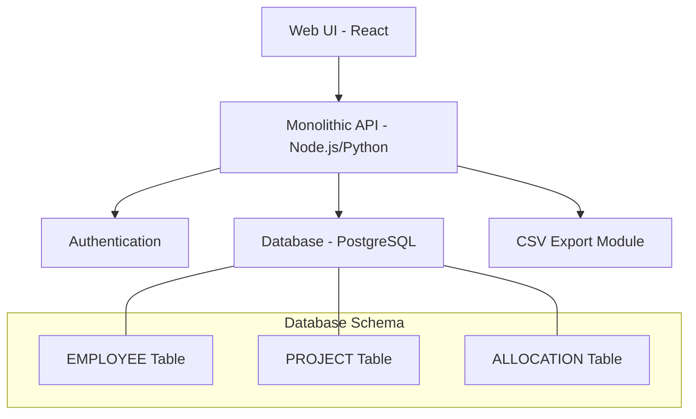
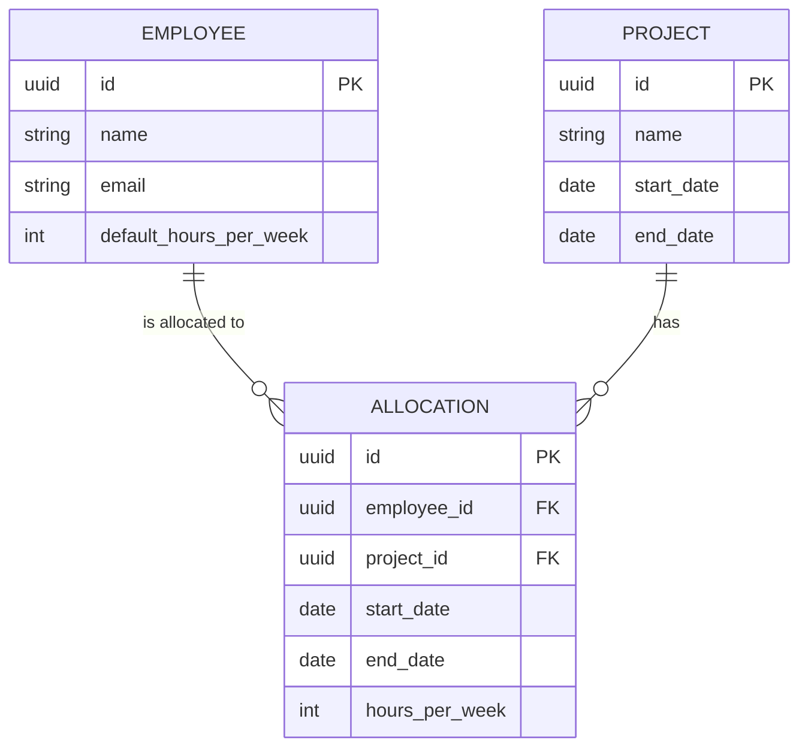

# MVP PRD — Resource Planning Tool

**Purpose:** To guide the development team in building the core, viable product. This document is intentionally focused and stripped of all non-essential features.

## 1\. Executive Summary

This PRD defines the Minimum Viable Product (MVP) for a web-based resource planning tool. The singular goal of this MVP is to provide a centralized, intuitive alternative to spreadsheet-based planning. It focuses on the essential user loop: creating employees and projects, allocating time, and viewing the resulting schedule.

## 2\. User Persona: "Alex the Planner"

  * **Role:** Team Lead or Project Manager
  * **Core Problem:** "My spreadsheets are a mess. I just need to see who is working on what, when they're working on it, and who is overworked so I can make quick decisions."

## 3\. MVP Scope & Prioritization

  * ✅ **IN SCOPE:**
      * Basic employee profiles (name, email, default hours/week).
      * Basic project creation (name, start/end date).
      * Direct, hours-per-week allocation of an employee to a project.
      * A simple visual warning for when an employee's total allocated hours exceed their default.
      * A weekly grid view showing all employees and their project assignments.
      * A basic CSV export of the allocation data.
  * ❌ **OUT OF SCOPE:**
      * **Everything else.** This includes skills management, scenario planning, plan vs. actuals, budget tracking, API integrations (including Finnish holidays), role templates, and advanced reporting.

## 4\. MVP Success Criteria

  * **Adoption:** 75% of planners actively use the tool for weekly planning within 4 weeks of launch.
  * **Task Completion:** Users can successfully create a complete resource plan (add employees, projects, and allocations) in under 10 minutes.
  * **Satisfaction:** Achieve a user satisfaction score of 3.5/5.0 for the core feature set.

## 5\. MVP Technical Architecture

The MVP architecture is a simplified monolith designed for speed of development and deployment.

**System Diagram:**

**Data Model:**

### 6\. MVP Epics & User Stories

**Epic 1: Core Entity Management**

  * **Story 1.1:** As a Planner, I want to create, view, edit, and delete employee profiles so I can manage my team roster.
      * *AC:* Profile must contain name, email, and default hours per week.
  * **Story 1.2:** As a Planner, I want to create, view, edit, and delete projects so I can define the work that needs to be resourced.
      * *AC:* Project must contain a name, start date, and end date.

**Epic 2: Core Allocation Workflow**

  * **Story 2.1:** As a Planner, I want to assign an employee to a project for a specific number of hours per week within a date range so that I can create a resource plan.
      * *AC:* An allocation links one employee to one project.
      * *AC:* Allocation requires hours/week, start date, and end date.
  * **Story 2.2:** As a Planner, I want to see a clear visual warning on the schedule when an employee's total allocated hours in a given week exceed their default capacity.
      * *AC:* The sum of all allocations for an employee is calculated weekly.
      * *AC:* A red highlight or icon appears if `sum(allocations.hours) > employee.default_hours`.

**Epic 3: Basic Visibility & Reporting**

  * **Story 3.1:** As a Planner, I want to see a weekly schedule grid view with employees as rows and weeks as columns so I can understand my team's workload over time.
      * *AC:* The grid must show which projects an employee is assigned to each week.
  * **Story 3.2:** As a Planner, I want to export the raw allocation data to a CSV file so I can share it with stakeholders or use it in other systems.
      * *AC:* The CSV must contain `Employee Name`, `Project Name`, `Hours per Week`, `Start Date`, `End Date`.