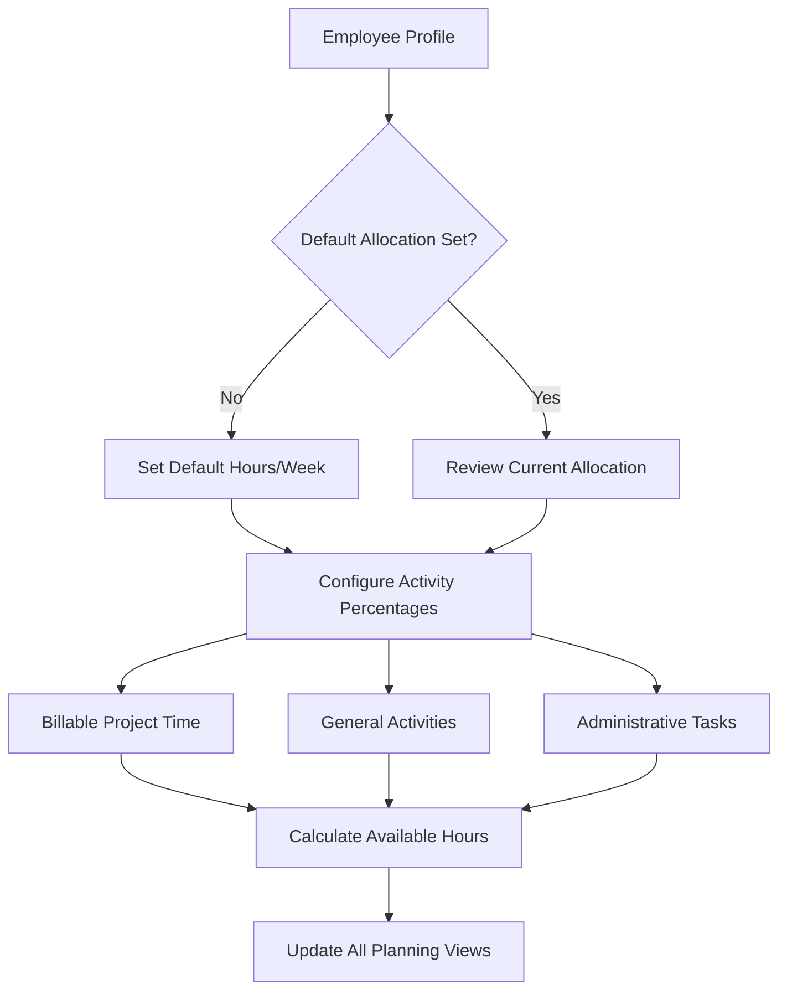
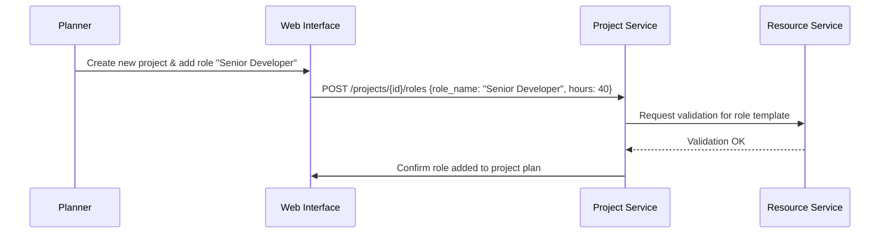
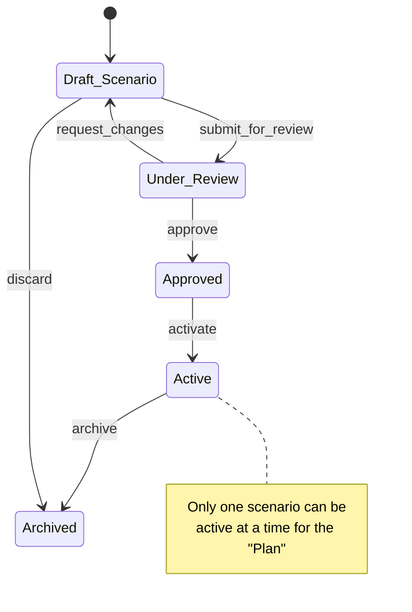
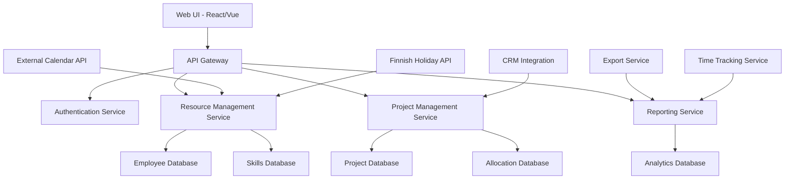
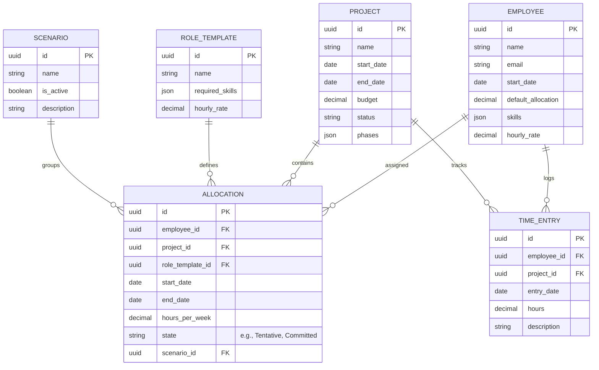

# Document 3: V2.0+ Features Specification & Technical Backlog

**Purpose:** This document is a living repository of detailed specifications for features to be built **after** the initial MVP. It is not a prioritized plan but rather a detailed backlog that defines the "what" and "how" of future functionality. The Product Manager and development team will pull from this document to create focused PRDs for future releases as outlined in the **Product Vision & Roadmap**.

-----

## Epic 1: Enhanced Employee & Schedule Management

### Story 1.1: Comprehensive Employee Directory

**As a** Planner, **I want to** maintain a central employee directory with comprehensive information (name, role, skills, start/end dates, hourly rates), **so that** I can have a single source of truth for my team with all relevant planning data.

**Acceptance Criteria:**

  - Employee profiles include all necessary fields for financial and skills-based planning.
  - Skills are selectable from a predefined list with proficiency levels.
  - Start/end dates validate against project assignments to prevent data errors.
  - Hourly rates support different currencies and can be role-specific.
  - Employee data integrates with all planning, financial, and reporting views.
  - Support for employee photos and contact information for a richer directory.

**Gherkin Scenarios:**

```gherkin
Feature: Comprehensive Employee Directory Management

  Scenario: Add new employee with full details
    Given I am logged in as a Planner
    When I navigate to the employee directory and click "Add Employee"
    And I fill in the employee details:
      | Field           | Value                  |
      | Name            | Jane Smith             |
      | Email           | jane.smith@company.com |
      | Start Date      | 2025-02-01             |
      | Default Hours   | 40                     |
      | Hourly Rate     | 95                     |
    And I select skills: "Python (Advanced), SQL (Expert), AWS (Intermediate)"
    And I click "Save"
    Then the employee "Jane Smith" should be added to the directory
    And I should see a success message.

  Scenario: Update employee skills and proficiency
    Given I have an employee "John Doe" in the directory
    When I navigate to John's profile
    And I change his "React" skill proficiency from "Intermediate" to "Advanced"
    And I click "Save"
    Then the skill should be updated on John's profile
    And this change should be reflected in skills-based allocation views.
```

### Story 1.2: Default Work Week Allocation

**As a** Planner, **I want to** set each employee's default work week allocation (e.g., 80% billable time, 20% non-billable), **so that** I can account for varying work arrangements and internal tasks.

**Process Flow:**



### Story 1.3: Finnish Public Holidays Integration

**As a** Planner, **I want** the system to automatically include Finnish public holidays in the schedule, **so that** I don't have to manually account for official holidays in my planning.

**Gherkin Scenarios:**

```gherkin
Feature: Finnish Public Holidays Integration

  Scenario: Automatic holiday blocking in calendar
    Given it is November 2025
    When I view the planning calendar for December 2025 in Kirkkonummi
    Then I should see December 6 (Independence Day) marked as a public holiday
    And December 25 (Christmas Day) marked as a public holiday
    And employee capacity for those weeks should be automatically reduced.

  Scenario: Holiday impact on capacity planning
    Given a project requires 160 hours in a month with 2 public holidays
    When I view the capacity report for that month
    Then the system should show available capacity is reduced by 16 hours per employee
    And warn me if the project is at risk due to the reduced capacity.
```

### Story 1.4: Advanced Employee Absence Management

**As a** Planner, **I want to** log individual employee vacation days and sick leave with different categories, **so that** I can accurately track actual availability and its impact on projects.

**Gherkin Scenarios:**

```gherkin
Feature: Employee Absence Management

  Scenario: Log approved vacation and notify stakeholders
    Given employee "Emma" is scheduled for project work from Jan 15-30
    When I mark the dates Jan 20-24 as "Approved Vacation" for Emma
    Then Emma's availability for that week should become zero
    And the relevant Project Managers should receive a notification about the resource conflict
    And the project plan should show an under-allocation warning for that week.

  Scenario: Handle emergency sick leave
    Given Emma is allocated 8 hours to Project Alpha today
    When I mark today as "Sick Leave" for Emma
    Then Project Alpha should immediately show a capacity shortage of 8 hours for today
    And the system should suggest alternative available employees with matching skills.
```

## Epic 2: Project & Role-Based Planning

### Story 2.1: Placeholder Role Creation

**As a** Planner, **I want to** create project plans using placeholder roles (e.g., "Senior Developer") before knowing which specific employees will be available, **so that** I can plan future projects and forecast resource demand.

**Sequence Diagram:**



### Story 2.2: Intelligent Employee Assignment to Roles

**As a** Planner, **I want to** assign specific employees to placeholder roles, with the system providing smart suggestions, **so that** I can staff my projects efficiently.

**Gherkin Scenarios:**

```gherkin
Feature: Employee Assignment to Project Roles

  Scenario: Assign available employee to a role with skill matching
    Given Project Gamma has a placeholder "Frontend Developer" role requiring "React (Advanced)"
    And the system identifies 3 available employees
    When I click "Assign Employee" on the role
    Then the system should present the 3 employees, ranked by their skill match percentage
    And I can select the best fit, "David," to fill the role.

  Scenario: Handle assignment conflicts with resolution options
    Given "David" is already allocated 30 hours/week to Project Alpha
    When I try to assign him to a 20 hours/week role on Project Beta
    Then the system should show an alert: "David will be over-allocated by 10 hours."
    And present options: [Reduce allocation on Project Alpha], [Find alternative for Project Beta], [Proceed Anyway].
```

### Story 2.3: Project Phases and Milestones

**As a** Planner, **I want to** define project phases and milestones with associated resource requirements, **so that** I can track progress and manage resource needs throughout the project lifecycle.

### Story 2.4: Project Budget and Rate Management

**As a** Planner, **I want to** set project budgets and hourly rates by role, **so that** I can track planned vs. actual project costs and profitability.

**Gherkin Scenarios:**

```gherkin
Feature: Project Budget and Rate Management

  Scenario: Track budget vs. actual costs in real-time
    Given Project Echo has a budget of €50,000
    And the project is 50% complete based on timeline
    And the total cost of logged hours (actuals) is €30,000
    When I view the project's financial dashboard
    Then I should see:
      - Budget Health: "At Risk" (color-coded red)
      - Variance: +€5,000 (20% over budget for this stage)
      - Projected Final Cost: €60,000
      - A warning is displayed: "Project is trending to be 20% over budget."
```

## Epic 3: Data States & Scenarios

### Story 3.1: Plan vs. Actuals Differentiation

**As a** Planner, **I want to** distinguish between **Plan** data (initial allocations) and **Actuals** data (logged time), **so that** I can compare what was planned versus what actually happened.

**Gherkin Scenarios:**

```gherkin
Feature: Plan vs. Actuals Tracking

  Scenario: Compare planned vs. actual hours for a project
    Given Project Omega was planned with Alice allocated 30 hours/week
    And in Week 1, Alice logged 35 hours of actual time
    When I view the Plan vs. Actuals report for Week 1
    Then I should see:
      - Alice (Plan): 30 hours
      - Alice (Actual): 35 hours
      - Variance: +5 hours (highlighted in red)
```

### Story 3.2: Tentative vs. Committed Allocations

**As a** Planner, **I want to** mark allocations as **Tentative** (soft-booked) or **Committed** (hard-booked), **so that** I can manage unconfirmed projects without creating conflicts for confirmed work.

### Story 3.3: Multiple Scenario Creation

**As a** Planner, **I want to** create multiple planning **Scenarios** for the same time period, **so that** I can compare different resource allocation strategies and choose the best option.

**Gherkin Scenarios:**

```gherkin
Feature: Scenario Planning and Comparison

  Scenario: Create alternative resource allocation scenarios for a new project
    Given I have a new project requiring 200 hours of development work
    When I create Scenario A "Conservative":
      - Allocate 2 senior developers (4 weeks, Cost: €19,000)
    And I create Scenario B "Aggressive":
      - Allocate 4 junior developers (2 weeks, Cost: €13,000)
    Then I should be able to view a comparison dashboard showing the impact on Timeline, Cost, and Risk for each scenario.

  Scenario: Activate the chosen scenario as the live plan
    Given I have evaluated 3 scenarios and management has approved "Scenario B"
    When I click "Activate Scenario B"
    Then all tentative allocations within that scenario should become the new "Plan" data
    And the other scenarios should be archived for reference.
```

**Scenario Management Workflow:**



## Epic 4: Advanced Reporting & Forecasting

### Story 4.1: Resource Utilization Forecasting

**As a** Planner, **I want to** see a statistical forecast view of resource utilization for the next 3-6 months, **so that** I can anticipate capacity issues and hiring needs.

**Capacity Forecasting Flow:**

```mermaid
flowchart TD
    A[Historical Data] --> B[Utilization Analysis]
    C[Current Allocations] --> B
    D[Project Pipeline from CRM] --> B
    B --> F[Forecasting Engine]
    F --> G[Utilization Predictions (Dashboard)]
    F --> H[Capacity Warnings (Alerts)]
    F --> I[Resource Gap Analysis (Reports)]
```

### Story 4.2: Project Performance Reports

**As a** Planner, **I want to** generate reports comparing planned hours and costs vs. actual hours and costs, **so that** I can improve future planning accuracy.

### Story 4.3: Proactive Conflict & Shortage Alerts

**As a** Planner, **I want to** receive proactive alerts when skills are in short supply or deadlines are at risk, **so that** I can address problems before they impact delivery.

**Gherkin Scenarios:**

```gherkin
Feature: Proactive Conflict Detection and Alerts

  Scenario: Skill shortage early warning
    Given upcoming projects in the pipeline require 80 hours/week of Python development
    And my team's total available capacity for Python is only 60 hours/week
    When the system analyzes the 30-day forecast
    Then I should receive an alert in my dashboard: "Warning: Python skill shortage detected for next month. Shortfall of 20 hours/week."
```

-----

## Appendix A: Target End-State Architecture

This microservices-based architecture is the target for the mature V2.0+ product.



## Appendix B: Target End-State Data Model



## Appendix C: Full API Specification

This is the comprehensive list of endpoints for the mature V2.0+ product.

```yaml
# Employee & Skills Management
GET    /api/v1/employees
POST   /api/v1/employees
GET    /api/v1/employees/{id}
PUT    /api/v1/employees/{id}
POST   /api/v1/employees/{id}/absence
GET    /api/v1/skills
POST   /api/v1/employees/{id}/skills

# Project, Roles & Phases Management  
GET    /api/v1/projects
POST   /api/v1/projects
GET    /api/v1/projects/{id}
PUT    /api/v1/projects/{id}
GET    /api/v1/projects/{id}/phases
POST   /api/v1/projects/{id}/phases
GET    /api/v1/role-templates
POST   /api/v1/role-templates

# Allocation & Scenario Management
GET    /api/v1/allocations
POST   /api/v1/allocations
PUT    /api/v1/allocations/{id}
GET    /api/v1/scenarios
POST   /api/v1/scenarios
POST   /api/v1/scenarios/{id}/duplicate
POST   /api/v1/scenarios/{id}/activate

# Time Tracking & Actuals
GET    /api/v1/time-entries
POST   /api/v1/time-entries
PUT    /api/v1/time-entries/{id}

# Reporting, Forecasting & Integrations
GET    /api/v1/reports/utilization
GET    /api/v1/reports/forecast
GET    /api/v1/reports/project-performance
POST   /api/v1/reports/export
GET    /api/v1/calendar/holidays?country=FI
GET    /api/v1/alerts/capacity
```