> NOTE: Legacy reference focused on Employee Management. Superseded by `docs/architectural-solutions.md` for the Resource Management Platform. Keep for historical context.

## 🏗️ System Architecture (Legacy)

The Employee Management System follows a modern 3-tier architecture with clean separation of concerns, scalable design patterns, and comprehensive testing strategies.

## 🎯 Architecture Principles

- **Separation of Concerns**: Clear boundaries between presentation, business logic, and data layers
- **Scalability**: Horizontal scaling capabilities with stateless services
- **Maintainability**: Modular design with well-defined interfaces
- **Testability**: Comprehensive testing at all layers
- **Security**: Defense in depth with multiple security layers
- **Performance**: Optimized queries, caching, and lazy loading

## 📊 High-Level Architecture

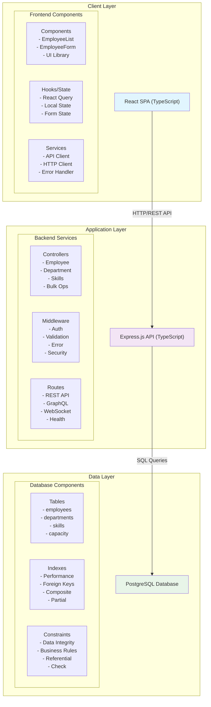

## 🔧 Component Architecture

### Frontend Layer (React + TypeScript)

#### Component Hierarchy

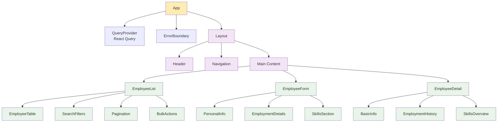

#### State Management
- **React Query**: Server state, caching, and synchronization
- **React Hook Form**: Form state and validation
- **Context API**: Global application state
- **Local State**: Component-specific state

#### Key Features
- **TypeScript**: Full type safety across the application
- **Responsive Design**: Mobile-first approach with Tailwind CSS
- **Accessibility**: WCAG 2.1 AA compliance
- **Performance**: Code splitting, lazy loading, virtualization

### Backend Layer (Express.js + TypeScript)

#### Service Architecture

```mermaid
graph TD
    ExpressApp[Express App] --> MiddlewareStack[Middleware Stack]
    ExpressApp --> RouteHandlers[Route Handlers]
    ExpressApp --> BusinessLogic[Business Logic]

    MiddlewareStack --> Security[Security<br/>- Helmet<br/>- CORS<br/>- Rate Limiting]
    MiddlewareStack --> Authentication[Authentication<br/>- JWT<br/>- Sessions]
    MiddlewareStack --> Validation[Validation<br/>- Zod<br/>- Express Validator]
    MiddlewareStack --> Logging[Logging<br/>- Winston]
    MiddlewareStack --> ErrorHandling[Error Handling]

    RouteHandlers --> AuthRoutes[Authentication<br/>/auth]
    RouteHandlers --> EmployeeRoutes[Employees<br/>/employees]
    RouteHandlers --> DepartmentRoutes[Departments<br/>/departments]
    RouteHandlers --> SkillRoutes[Skills<br/>/skills]
    RouteHandlers --> SearchRoutes[Search<br/>/search]
    RouteHandlers --> BulkRoutes[Bulk Operations<br/>/bulk]

    BusinessLogic --> Controllers[Controllers<br/>Request/Response handling]
    BusinessLogic --> Services[Services<br/>Business logic]
    BusinessLogic --> Models[Models<br/>Data access layer]
    BusinessLogic --> Utilities[Utilities<br/>Helpers, validation]

    classDef middleware fill:#ffcccb
    classDef routes fill:#98fb98
    classDef business fill:#87ceeb

    class MiddlewareStack,Security,Authentication,Validation,Logging,ErrorHandling middleware
    class RouteHandlers,AuthRoutes,EmployeeRoutes,DepartmentRoutes,SkillRoutes,SearchRoutes,BulkRoutes routes
    class BusinessLogic,Controllers,Services,Models,Utilities business
```

#### API Design Principles
- **RESTful**: Standard HTTP methods and status codes
- **Consistent**: Uniform response formats and error handling
- **Versioned**: API versioning strategy for backward compatibility
- **Documented**: OpenAPI/Swagger documentation
- **Secure**: Authentication, authorization, and input validation

### Database Layer (PostgreSQL)

#### Schema Design

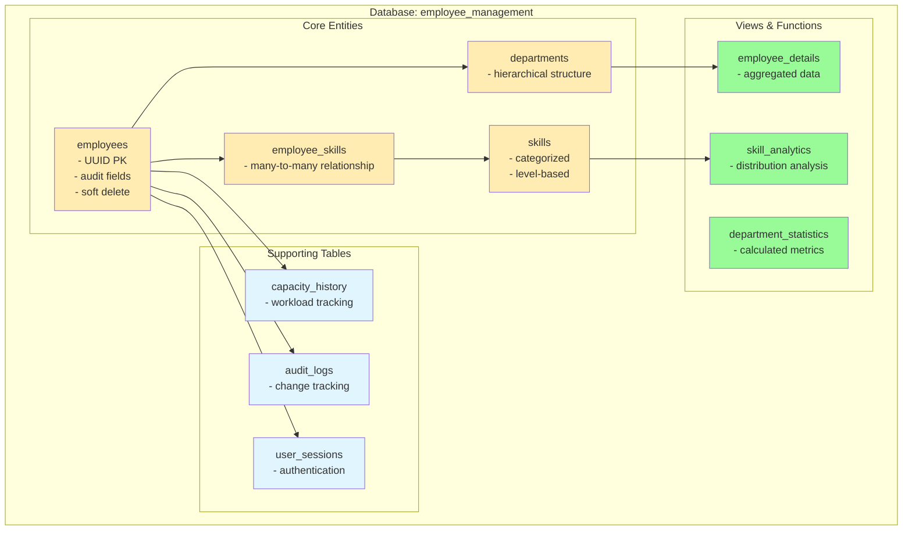

#### Data Architecture Features
- **ACID Compliance**: Full transaction support
- **Referential Integrity**: Foreign key constraints
- **Audit Trail**: Created/updated/deleted tracking
- **Soft Delete**: Data recovery capabilities
- **Performance**: Strategic indexing and query optimization

## 🔄 Data Flow Architecture

### Request Flow

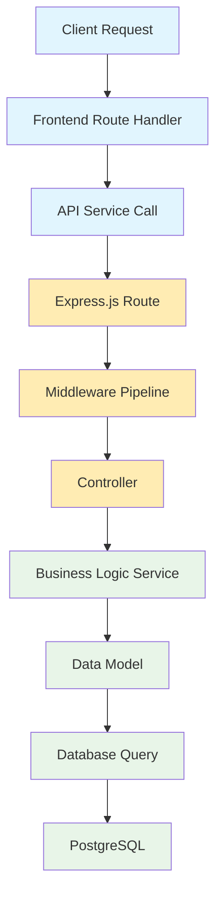

### Response Flow

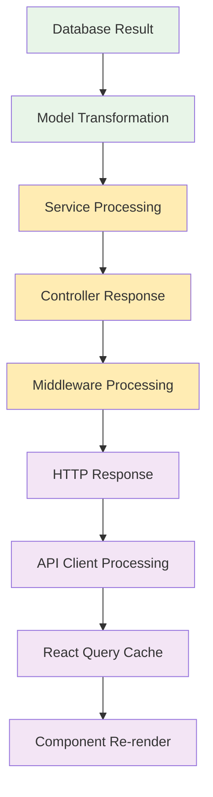

## 🛡️ Security Architecture

### Multi-Layer Security

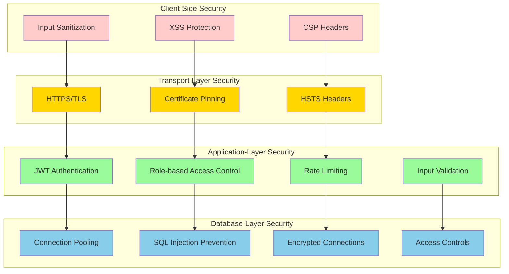

### Security Features
- **Authentication**: JWT-based authentication with refresh tokens
- **Authorization**: Role-based access control (RBAC)
- **Input Validation**: Server-side validation with Zod schemas
- **SQL Injection Prevention**: Parameterized queries and ORM
- **XSS Protection**: Content Security Policy and input sanitization
- **CSRF Protection**: SameSite cookies and CSRF tokens

## 📈 Performance Architecture

### Caching Strategy

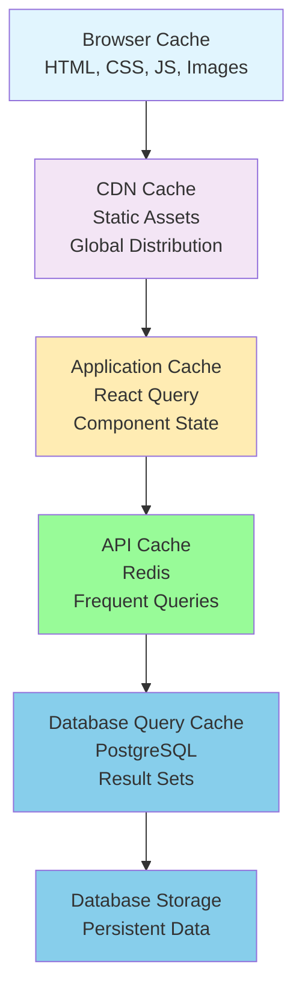

### Performance Optimizations
- **Frontend**: Code splitting, lazy loading, virtualization, memoization
- **Backend**: Connection pooling, query optimization, compression, pagination
- **Database**: Indexing strategy, query analysis, partitioning, read replicas
- **Network**: CDN, caching headers, compression, HTTP/2

## 🔄 Detailed Process Flows

### Employee Onboarding Process Flow

```mermaid
flowchart TD
    subgraph "User Interface"
        HR[HR Manager<br/>Creates New Employee]
        EF[Employee Form<br/>(React)]
        VP[Validation<br/>& Processing]
    end

    subgraph "API Layer"
        AR[API Request<br/>(POST /employees)]
        CV[Controller<br/>Validation]
        ES[Employee<br/>Service]
    end

    subgraph "Data Layer"
        DB[Database<br/>Transaction]
        EM[Employee<br/>Model]
        RG[Response<br/>Generation]
    end

    subgraph "Notification Layer"
        NS[Notification<br/>Service]
        ESN[Email/Slack<br/>Notification]
        RQC[React Query<br/>Cache Update]
    end

    HR --> EF
    EF --> VP
    VP --> AR
    AR --> CV
    CV --> ES
    ES --> DB
    DB --> EM
    EM --> RG
    RG --> NS
    NS --> ESN
    NS --> RQC

    classDef ui fill:#e1f5fe
    classDef api fill:#f3e5f5
    classDef data fill:#ffecb3
    classDef notification fill:#98fb98

    class HR,EF,VP ui
    class AR,CV,ES api
    class DB,EM,RG data
    class NS,ESN,RQC notification
```

### Resource Allocation Process Flow

```mermaid
flowchart TD
    subgraph "User Interface"
        PM[Project Manager<br/>Requests Resources]
        AF[Allocation Form<br/>(React)]
        VE[Validation Engine<br/>(Business Rules)]
    end

    subgraph "AI Layer"
        SMA[Skill Matching<br/>Algorithm]
        SMS[Matching Service<br/>(AI-Powered)]
    end

    subgraph "Business Logic"
        CDS[Conflict Detection<br/>& Warning System]
        CRS[Conflict Resolution<br/>Service]
    end

    subgraph "Data Layer"
        DBU[Database<br/>Update]
        AS[Allocation<br/>Service]
        NS[Notification<br/>Service]
    end

    PM --> AF
    AF --> VE
    VE --> SMA
    SMA --> SMS
    SMS --> CDS
    CDS --> CRS
    CRS --> DBU
    DBU --> AS
    AS --> NS

    classDef ui fill:#e1f5fe
    classDef ai fill:#f3e5f5
    classDef logic fill:#ffecb3
    classDef data fill:#98fb98

    class PM,AF,VE ui
    class SMA,SMS ai
    class CDS,CRS logic
    class DBU,AS,NS data
```

## 📋 Sequence Diagrams

### Employee Creation Sequence

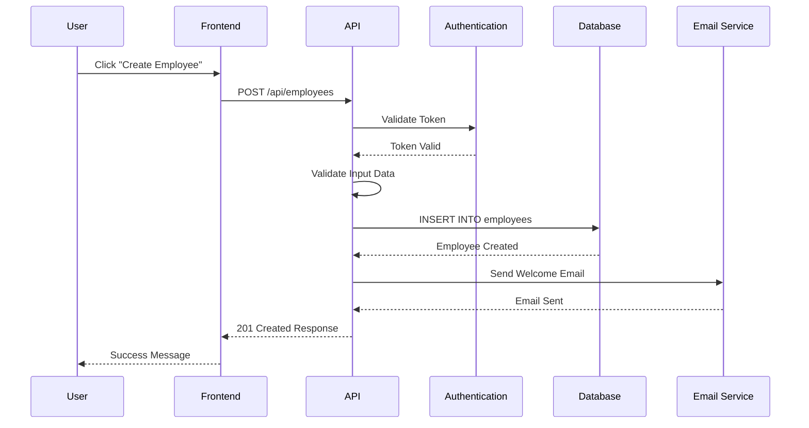

### Resource Allocation Sequence

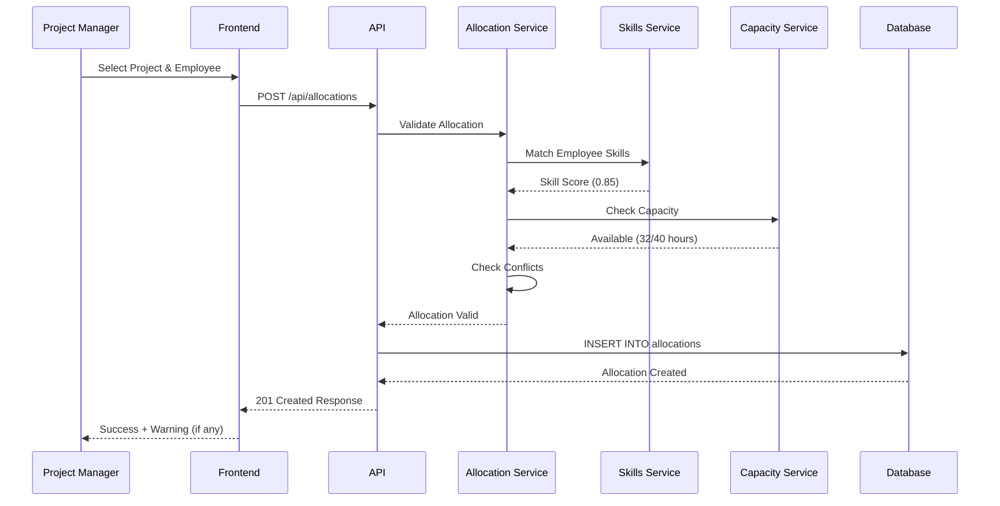

### Authentication Flow Sequence

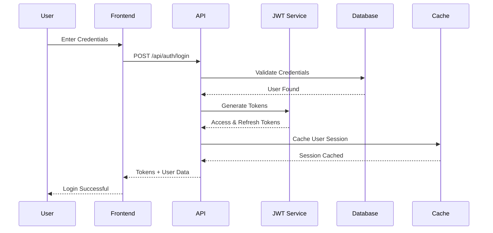

## 🗄️ Database Schema Architecture

### Core Entity Relationships

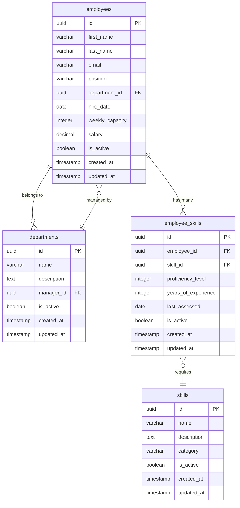

### Allocation System Schema

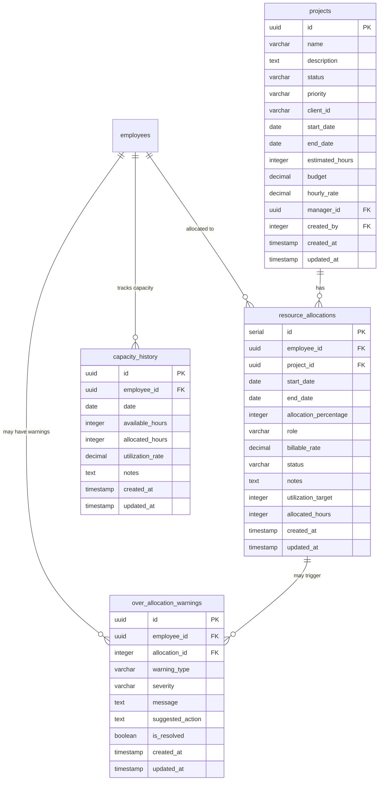

## 🔧 Service Architecture Details

### Service Dependency Graph

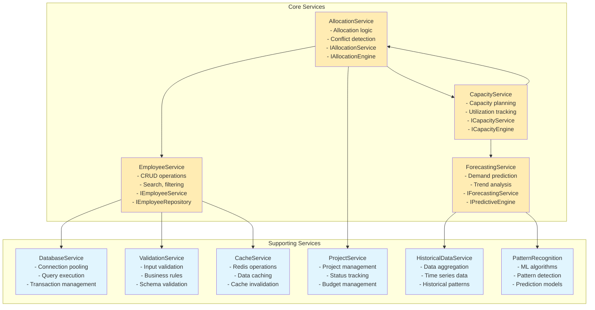

### Middleware Pipeline Architecture

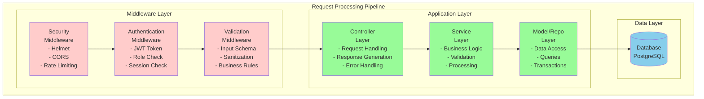

## 🧠 AI/ML Integration Architecture

### Machine Learning Pipeline

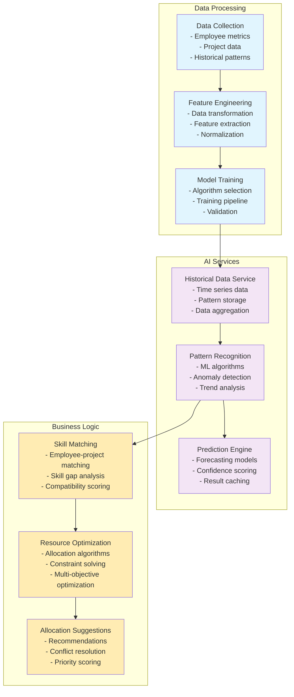

### TensorFlow.js Integration

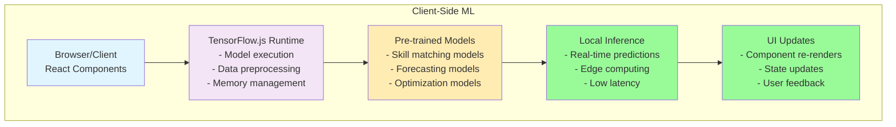

## 📊 Analytics and Reporting Architecture

### Data Pipeline for Analytics

```mermaid
flowchart TD
    subgraph "Data Sources"
        RDS[Raw Data Sources<br/>- Employee metrics<br/>- Project data<br/>- System logs<br/>- User interactions]
        ETL[ETL Process<br/>(Transform)<br/>- Data cleaning<br/>- Normalization<br/>- Enrichment]
        DW[Data Warehouse<br/>(Aggregated)<br/>- Structured data<br/>- Historical records<br/>- Performance metrics]
    end

    subgraph "Processing Layer"
        RTA[Real-time Analytics<br/>- Stream processing<br/>- Event correlation<br/>- Live dashboards]
        BP[Batch Processing<br/>- Scheduled jobs<br/>- Data aggregation<br/>- Report generation]
        DG[Dashboard Generation<br/>- Chart creation<br/>- Metric calculation<br/>- Export functionality]
    end

    RDS --> ETL --> DW
    DW --> RTA
    DW --> BP
    DW --> DG

    classDef sources fill:#e1f5fe
    classDef processing fill:#f3e5f5
    classDef storage fill:#ffecb3

    class RDS,ETL sources
    class DW storage
    class RTA,BP,DG processing
```

### Metrics Collection Points
- **Application Metrics**: Response times, error rates, throughput
- **Business Metrics**: User engagement, feature usage, conversion rates
- **System Metrics**: CPU, memory, disk usage, network traffic
- **Security Metrics**: Failed logins, suspicious activities

## 🛠️ Development and Deployment Architecture

### Development Environment Architecture

```mermaid
graph TB
    subgraph "Developer Workstation"
        subgraph "Development Tools"
            IDE[VS Code/Cursor<br/>- Code editor<br/>- Debugging tools<br/>- Extensions]
            Git[Git/GitHub<br/>- Version control<br/>- Code repository<br/>- Collaboration]
            Docker[Docker Desktop<br/>- Container runtime<br/>- Local containers<br/>- Development environment]
        end

        subgraph "Local Services"
            FrontendDev[Frontend Dev Server<br/>- Vite<br/>- Hot reload<br/>- Development build]
            BackendDev[Backend Dev Server<br/>- Nodemon<br/>- Auto-restart<br/>- Debug mode]
            Database[Database<br/>- PostgreSQL<br/>- Test data<br/>- Migrations]
        end

        subgraph "Testing & Quality"
            TestRunner[Testing Environment<br/>- Unit tests<br/>- Integration tests<br/>- E2E tests]
            CodeQuality[Code Quality Tools<br/>- ESLint<br/>- Prettier<br/>- TypeScript checker]
        end
    end

    IDE --> FrontendDev
    IDE --> BackendDev
    IDE --> Database
    Git --> FrontendDev
    Git --> BackendDev
    Git --> Database
    Docker --> FrontendDev
    Docker --> BackendDev
    Docker --> Database

    FrontendDev --> TestRunner
    BackendDev --> TestRunner
    Database --> TestRunner
    IDE --> CodeQuality
    Git --> CodeQuality

    classDef tools fill:#ffecb3
    classDef services fill:#e1f5fe
    classDef testing fill:#98fb98

    class IDE,Git,Docker tools
    class FrontendDev,BackendDev,Database services
    class TestRunner,CodeQuality testing
```

### CI/CD Pipeline Architecture

```mermaid
flowchart LR
    subgraph "Pipeline Stages"
        direction LR

        subgraph "Source"
            SC[Source Code<br/>- Frontend<br/>- Backend<br/>- Config Files]
        end

        subgraph "Build"
            BS[Build Stage<br/>- TypeScript compilation<br/>- Dependencies installation<br/>- Asset bundling<br/>- Docker image creation]
        end

        subgraph "Test"
            TS[Test Stage<br/>- Unit tests<br/>- Integration tests<br/>- E2E tests<br/>- Performance tests]
        end

        subgraph "Security"
            SS[Security Scan<br/>- Vulnerability scanning<br/>- Dependency checks<br/>- License compliance<br/>- SAST/DAST]
        end

        subgraph "Deploy"
            DS[Deploy Stage<br/>- Staging environment<br/>- Integration testing<br/>- Performance validation<br/>- Quality gates]
        end

        subgraph "Production"
            PROD[Production<br/>- Load balancer<br/>- Auto scaling<br/>- Monitoring<br/>- Health checks]
        end
    end

    SC --> GitHubActions[GitHub Actions<br/>Trigger Pipeline]
    GitHubActions --> BS
    BS --> TS
    TS --> SS
    SS --> DS
    DS --> PROD

    classDef source fill:#e1f5fe
    classDef build fill:#f3e5f5
    classDef test fill:#ffecb3
    classDef security fill:#ffcccb
    classDef deploy fill:#98fb98
    classDef production fill:#87ceeb

    class SC source
    class BS build
    class TS test
    class SS security
    class DS deploy
    class PROD production
    class GitHubActions build
```

## 🔒 Security Architecture Deep Dive

### Authentication Flow Details

```mermaid
flowchart TD
    subgraph "User Interface"
        LF[Login Form<br/>(React)<br/>- Username/Email<br/>- Password<br/>- Remember me]
    end

    subgraph "API Layer"
        AE[API Endpoint<br/>/auth/login<br/>- Input validation<br/>- Rate limiting<br/>- Request logging]
        PH[Password Hashing<br/>- bcrypt<br/>- Salt rounds<br/>- Hash comparison]
        TG[Token Generation<br/>- JWT creation<br/>- Access token<br/>- Refresh token]
    end

    subgraph "Data Layer"
        DBUL[Database User Lookup<br/>- Query user by email<br/>- Fetch hashed password<br/>- Get user permissions]
    end

    subgraph "Security"
        SH[Secure Headers<br/>- HSTS<br/>- CSP<br/>- Secure cookies]
        SS[Session Storage<br/>- Cache user session<br/>- Set expiration<br/>- Store refresh token]
        RG[Response Generation<br/>- Format user data<br/>- Include tokens<br/>- Error handling]
    end

    LF --> AE
    AE --> DBUL
    DBUL --> PH
    PH --> TG
    TG --> SH
    TG --> SS
    TG --> RG

    classDef ui fill:#e1f5fe
    classDef api fill:#f3e5f5
    classDef data fill:#ffecb3
    classDef security fill:#ffcccb

    class LF ui
    class AE,PH,TG api
    class DBUL data
    class SH,SS,RG security
```

### Authorization Matrix

```mermaid
graph TD
    subgraph "Permission Matrix"
        subgraph "admin"
            Admin1[View Employees: ✅]
            Admin2[Create Employee: ✅]
            Admin3[Edit Employee: ✅]
            Admin4[Delete Employee: ✅]
            Admin5[View Reports: ✅]
            Admin6[System Settings: ✅]
        end

        subgraph "manager"
            Manager1[View Employees: ✅]
            Manager2[Create Employee: ❌]
            Manager3[Edit Employee: ✅]
            Manager4[Delete Employee: ❌]
            Manager5[View Reports: ✅]
            Manager6[System Settings: ❌]
        end

        subgraph "hr"
            HR1[View Employees: ✅]
            HR2[Create Employee: ✅]
            HR3[Edit Employee: ✅]
            HR4[Delete Employee: ❌]
            HR5[View Reports: ✅]
            HR6[System Settings: ❌]
        end

        subgraph "employee"
            Employee1[View Employees: ✅]
            Employee2[Create Employee: ❌]
            Employee3[Edit Employee: ❌]
            Employee4[Delete Employee: ❌]
            Employee5[View Reports: ❌]
            Employee6[System Settings: ❌]
        end
    end

    Admin1 -.-> Manager1
    Admin1 -.-> HR1
    Admin1 -.-> Employee1

    Admin2 -.-> Manager2
    Admin2 -.-> HR2
    Admin2 -.-> Employee2

    Admin3 -.-> Manager3
    Admin3 -.-> HR3
    Admin3 -.-> Employee3

    Admin4 -.-> Manager4
    Admin4 -.-> HR4
    Admin4 -.-> Employee4

    Admin5 -.-> Manager5
    Admin5 -.-> HR5
    Admin5 -.-> Employee5

    Admin6 -.-> Manager6
    Admin6 -.-> HR6
    Admin6 -.-> Employee6

    classDef admin fill:#ffecb3
    classDef manager fill:#e1f5fe
    classDef hr fill:#f3e5f5
    classDef employee fill:#98fb98

    class Admin1,Admin2,Admin3,Admin4,Admin5,Admin6 admin
    class Manager1,Manager2,Manager3,Manager4,Manager5,Manager6 manager
    class HR1,HR2,HR3,HR4,HR5,HR6 hr
    class Employee1,Employee2,Employee3,Employee4,Employee5,Employee6 employee
```

## 📈 Monitoring and Observability Architecture

### Metrics Collection Architecture

```mermaid
flowchart TD
    subgraph "Data Sources"
        AM[Application Metrics<br/>- Response times<br/>- Error rates<br/>- Throughput<br/>- API endpoints]
        SM[System Metrics<br/>- CPU usage<br/>- Memory consumption<br/>- Disk I/O<br/>- Network traffic]
        BM[Business Metrics<br/>- User engagement<br/>- Feature usage<br/>- Conversion rates<br/>- Performance indicators]
        SecM[Security Metrics<br/>- Failed logins<br/>- Suspicious activities<br/>- Access patterns<br/>- Threat detection]
    end

    subgraph "Collection Layer"
        MC[Metrics Collection<br/>(Prometheus)<br/>- Pull-based scraping<br/>- Service discovery<br/>- Metric exposition]
        LA[Log Aggregation<br/>(Fluentd)<br/>- Log parsing<br/>- Filtering<br/>- Routing]
    end

    subgraph "Storage Layer"
        TSDB[Time Series Database<br/>(Prometheus)<br/>- High-performance storage<br/>- Efficient querying<br/>- Long-term retention]
        LS[Log Storage<br/>(Elasticsearch)<br/>- Full-text search<br/>- Structured data<br/>- Analytics capabilities]
    end

    subgraph "Visualization & Alerting"
        V[Visualization<br/>(Grafana)<br/>- Dashboards<br/>- Charts and graphs<br/>- Real-time monitoring]
        AS[Alerting System<br/>- Threshold-based alerts<br/>- Notification channels<br/>- Escalation rules]
        D[Dashboard<br/>(Grafana)<br/>- Custom dashboards<br/>- Business intelligence<br/>- Reporting]
    end

    AM --> MC
    SM --> MC
    BM --> MC
    SecM --> MC

    AM --> LA
    SM --> LA
    BM --> LA
    SecM --> LA

    MC --> TSDB --> V
    LA --> LS --> V

    TSDB --> AS
    LS --> AS

    V --> D
    AS --> D

    classDef sources fill:#e1f5fe
    classDef collection fill:#f3e5f5
    classDef storage fill:#ffecb3
    classDef visualization fill:#98fb98

    class AM,SM,BM,SecM sources
    class MC,LA collection
    class TSDB,LS storage
    class V,AS,D visualization
```

## 🧪 Testing Architecture

### Testing Pyramid

```mermaid
graph TD
    subgraph "END-TO-END TESTS<br/>(Playwright)"
        E2E1[User workflows<br/>Complete user journeys<br/>Business scenarios]
        E2E2[Cross-browser testing<br/>Chrome, Firefox, Safari<br/>Responsive design]
        E2E3[Visual regression testing<br/>Screenshot comparison<br/>UI consistency]
        E2E4[Performance testing<br/>Load testing<br/>Stress testing]
        E2E5[Accessibility testing<br/>WCAG compliance<br/>Screen reader support]
    end

    subgraph "INTEGRATION TESTS<br/>(Vitest + Supertest)"
        INT1[API contracts<br/>Request/response validation<br/>Status codes]
        INT2[Database operations<br/>CRUD testing<br/>Transaction handling]
        INT3[Service integration<br/>Component interaction<br/>Data flow]
        INT4[Component integration<br/>Props and state<br/>Event handling]
    end

    subgraph "UNIT TESTS<br/>(Jest + RTL)"
        UNIT1[Service logic testing<br/>Business rules<br/>Validation logic]
        UNIT2[Component testing<br/>React Testing Library<br/>User interactions]
        UNIT3[Utility function testing<br/>Pure functions<br/>Helper methods]
        UNIT4[Hook testing<br/>Custom hooks<br/>State management]
    end

    E2E1 --> INT1
    E2E2 --> INT2
    E2E3 --> INT3
    E2E4 --> INT4

    INT1 --> UNIT1
    INT2 --> UNIT2
    INT3 --> UNIT3
    INT4 --> UNIT4

    classDef e2e fill:#ffecb3
    classDef integration fill:#f3e5f5
    classDef unit fill:#e1f5fe

    class E2E1,E2E2,E2E3,E2E4,E2E5 e2e
    class INT1,INT2,INT3,INT4 integration
    class UNIT1,UNIT2,UNIT3,UNIT4 unit
```

### Test Coverage Strategy

```mermaid
graph TD
    subgraph "BACKEND TESTS"
        B1[99.94% Coverage<br/>Comprehensive test suite]
        B2[Service Logic<br/>Business rules<br/>Validation logic]
        B3[API Contracts<br/>Request/response validation<br/>Status codes]
        B4[Database Operations<br/>CRUD testing<br/>Transaction handling]
    end

    subgraph "FRONTEND TESTS"
        F1[Component Testing<br/>React Testing Library<br/>User interactions]
        F2[Integration Testing<br/>Component interaction<br/>Data flow]
        F3[Accessibility Testing<br/>WCAG compliance<br/>Screen reader support]
        F4[User Flow Testing<br/>Navigation paths<br/>Feature workflows]
    end

    subgraph "FULL STACK TESTS"
        FS1[E2E Workflows<br/>Complete user journeys<br/>Business scenarios]
        FS2[Performance Testing<br/>Load testing<br/>Response times]
        FS3[Load Testing<br/>Concurrent users<br/>Stress testing]
        FS4[Security Testing<br/>Vulnerability scanning<br/>Penetration testing]
    end

    B1 --> F1
    B2 --> F2
    B3 --> F3
    B4 --> F4

    F1 --> FS1
    F2 --> FS2
    F3 --> FS3
    F4 --> FS4

    classDef backend fill:#ffecb3
    classDef frontend fill:#f3e5f5
    classDef fullstack fill:#e1f5fe

    class B1,B2,B3,B4 backend
    class F1,F2,F3,F4 frontend
    class FS1,FS2,FS3,FS4 fullstack
```

## 📊 Data Architecture

### Data Flow Patterns

```mermaid
flowchart TD
    subgraph "READ OPERATIONS"
        RO1[Employee List<br/>User requests data]
        RO2[React Query Cache<br/>Client-side caching<br/>Background updates]
        RO3[API Layer<br/>Request processing<br/>Authentication]
        RO4[Service Layer<br/>Business logic<br/>Data transformation]
        RO5[Database<br/>Query execution<br/>Result retrieval]
    end

    subgraph "REAL-TIME OPERATIONS"
        WS[WebSocket Connection<br/>Bi-directional communication<br/>Live updates]
        FC[Frontend Components<br/>Real-time rendering<br/>State updates]
        RT[Real-time Updates<br/>Live data synchronization<br/>Instant notifications]
    end

    subgraph "ANALYTICS OPERATIONS"
        AD[Analytics Data<br/>Metrics collection<br/>Performance data]
        AS[Aggregation Service<br/>Data processing<br/>Calculations]
        DB[Dashboard<br/>Data visualization<br/>Report generation]
    end

    subgraph "WRITE OPERATIONS"
        WO1[Form Submission<br/>User input validation<br/>Data preparation]
        WO2[API Processing<br/>Request validation<br/>Security checks]
        WO3[Service Processing<br/>Business rules<br/>Data transformation]
        WO4[Transaction<br/>Database operations<br/>Consistency checks]
    end

    subgraph "BULK OPERATIONS"
        BO[Bulk Operations<br/>Batch processing<br/>Import/export]
        QP[Queue Processing<br/>Background jobs<br/>Async processing]
        BU[Batch Updates<br/>Mass data operations<br/>Bulk inserts/updates]
    end

    subgraph "SYNC OPERATIONS"
        RTS[Real-time Sync<br/>Event-driven updates<br/>State synchronization]
        EP[Event Publishing<br/>Message broadcasting<br/>Notification system]
        SU[Subscriber Updates<br/>Live data sync<br/>Multi-client updates]
    end

    RO1 --> RO2 --> RO3 --> RO4 --> RO5
    RO5 --> WS --> FC --> RT
    AD --> AS --> DB

    WO1 --> WO2 --> WO3 --> WO4
    BO --> QP --> BU
    RTS --> EP --> SU

    classDef read fill:#e1f5fe
    classDef realtime fill:#f3e5f5
    classDef analytics fill:#ffecb3
    classDef write fill:#98fb98
    classDef bulk fill:#87ceeb
    classDef sync fill:#ffcccb

    class RO1,RO2,RO3,RO4,RO5 read
    class WS,FC,RT realtime
    class AD,AS,DB analytics
    class WO1,WO2,WO3,WO4 write
    class BO,QP,BU bulk
    class RTS,EP,SU sync
```

### Database Design Patterns

```mermaid
graph TB
    subgraph "NORMALIZATION<br/>Relational Integrity"
        subgraph "Employee Relationships"
            EMP[employees<br/>- Employee data<br/>- Personal info<br/>- Employment details]
            DEPT[departments<br/>- Department info<br/>- Organizational structure]
            ESKILLS[employee_skills<br/>- Skill assignments<br/>- Proficiency levels<br/>- Experience tracking]
            SKILLS[skills<br/>- Skill catalog<br/>- Categories<br/>- Requirements]
        end

        subgraph "Project Relationships"
            PROJ[projects<br/>- Project details<br/>- Timeline<br/>- Budget]
            ALLOC[resource_allocations<br/>- Assignment details<br/>- Time allocation<br/>- Cost tracking]
            CAPHIST[capacity_history<br/>- Utilization tracking<br/>- Performance metrics<br/>- Historical data]
        end

        subgraph "Audit System"
            AUDIT[audit_log<br/>- Change tracking<br/>- User actions<br/>- System events]
        end
    end

    subgraph "DENORMALIZATION<br/>Performance Optimization"
        EMPDET[employee_details_view<br/>- Aggregated employee data<br/>- Department info included<br/>- Skills summary]
        DEPTSTATS[department_statistics<br/>- Pre-calculated metrics<br/>- Employee counts<br/>- Budget summaries]
        SKILLANALYTICS[skill_analytics_view<br/>- Skill distribution analysis<br/>- Gap identification<br/>- Training recommendations]
    end

    EMP --> DEPT
    EMP --> ESKILLS
    ESKILLS --> SKILLS
    PROJ --> ALLOC
    ALLOC --> CAPHIST
    EMP --> EMPDET
    DEPT --> DEPTSTATS
    SKILLS --> SKILLANALYTICS

    EMP -.-> AUDIT
    DEPT -.-> AUDIT
    PROJ -.-> AUDIT
    ALLOC -.-> AUDIT

    classDef normalized fill:#ffecb3
    classDef denormalized fill:#f3e5f5

    class EMP,DEPT,ESKILLS,SKILLS,PROJ,ALLOC,CAPHIST,AUDIT normalized
    class EMPDET,DEPTSTATS,SKILLANALYTICS denormalized
```

## 🔄 Integration Patterns

### External System Integration

```mermaid
graph LR
    subgraph "CRM INTEGRATIONS"
        subgraph "Jira Integration"
            JIRA[Jira Projects<br/>- Issue tracking<br/>- Sprint planning<br/>- Time tracking]
            RA1[Resource Allocation<br/>- Team assignment<br/>- Capacity planning<br/>- Workload distribution]
            TA[Team Assignment<br/>- Employee matching<br/>- Skill alignment<br/>- Availability checking]
        end

        subgraph "Asana Integration"
            ASANA[Asana Tasks<br/>- Task management<br/>- Project planning<br/>- Progress tracking]
            CP[Capacity Planning<br/>- Resource forecasting<br/>- Timeline planning<br/>- Dependency management]
            WB[Workload Balancing<br/>- Resource optimization<br/>- Conflict resolution<br/>- Priority management]
        end

        subgraph "Trello Integration"
            TRELLO[Trello Boards<br/>- Visual project management<br/>- Team collaboration<br/>- Progress visualization]
            PT[Project Tracking<br/>- Milestone monitoring<br/>- Status updates<br/>- Completion tracking]
            PM[Progress Monitoring<br/>- Real-time updates<br/>- Performance metrics<br/>- Delivery tracking]
        end
    end

    subgraph "NOTIFICATION SYSTEMS"
        subgraph "Email Integration"
            EMAIL[Email Service<br/>- SMTP gateway<br/>- Template engine<br/>- Delivery tracking]
            EN[Employee Notifications<br/>- Welcome emails<br/>- Status updates<br/>- Reminder notifications]
        end

        subgraph "Chat Integration"
            SLACK[Slack Webhook<br/>- Real-time messaging<br/>- Channel integration<br/>- Bot interactions]
            RTA[Real-time Alerts<br/>- Instant notifications<br/>- Team alerts<br/>- Escalation notifications]
        end

        subgraph "Collaboration Tools"
            TEAMS[Teams Integration<br/>- Chat bot<br/>- Meeting integration<br/>- File sharing]
            IN[Interactive Notifications<br/>- Action buttons<br/>- Quick responses<br/>- Workflow triggers]
        end
    end

    JIRA --> RA1 --> TA
    ASANA --> CP --> WB
    TRELLO --> PT --> PM

    EMAIL --> EN
    SLACK --> RTA
    TEAMS --> IN

    classDef crm fill:#ffecb3
    classDef notification fill:#f3e5f5

    class JIRA,ASANA,TRELLO,RA1,CP,PT,TA,WB,PM crm
    class EMAIL,SLACK,TEAMS,EN,RTA,IN notification
```

### API Integration Architecture

```mermaid
flowchart TD
    subgraph "API GATEWAY"
        LB[Load Balancer<br/>- Traffic distribution<br/>- Health monitoring<br/>- Failover handling]
        RL[Rate Limiting<br/>- Request throttling<br/>- Quota management<br/>- Abuse prevention]
        AUTH[Authentication<br/>- JWT validation<br/>- Token refresh<br/>- Session management]
        ROUTING[Routing<br/>- Request forwarding<br/>- Service discovery<br/>- Load distribution]
        RL1[Request Logging<br/>- Access logging<br/>- Audit trails<br/>- Compliance tracking]
        MC[Metrics Collection<br/>- Performance monitoring<br/>- Usage analytics<br/>- Health metrics]
        EH[Error Handling<br/>- Global error handling<br/>- Fallback responses<br/>- Error transformation]
    end

    subgraph "SERVICE MESH"
        SD[Service Discovery<br/>- Service registry<br/>- Health checks<br/>- Dynamic routing]
        LB2[Load Balancing<br/>- Traffic distribution<br/>- Weighted routing<br/>- Session persistence]
        CB[Circuit Breaking<br/>- Failure detection<br/>- Traffic isolation<br/>- Automatic recovery]
        RETRY[Retry Logic<br/>- Exponential backoff<br/>- Failure recovery<br/>- Idempotency handling]
        TIMEOUT[Timeout Handling<br/>- Request timeouts<br/>- Deadline management<br/>- Resource protection]
        FALLBACK[Fallback Mechanisms<br/>- Graceful degradation<br/>- Default responses<br/>- Circuit breaker fallback]
    end

    LB --> RL --> AUTH --> ROUTING
    RL1 --> MC --> EH

    ROUTING --> SD --> LB2 --> CB
    CB --> RETRY --> TIMEOUT --> FALLBACK

    classDef gateway fill:#ffecb3
    classDef mesh fill:#f3e5f5

    class LB,RL,AUTH,ROUTING,RL1,MC,EH gateway
    class SD,LB2,CB,RETRY,TIMEOUT,FALLBACK mesh
```

## 📈 Scalability Patterns

### Horizontal Scaling Strategy

```mermaid
graph TB
    subgraph "WEB TIER<br/>Stateless Frontend"
        subgraph "Frontend Layer"
            FA["Frontend App (N)<br/>- Multiple instances<br/>- Auto scaling<br/>- Load distribution"]
            LB[Load Balancer<br/>- Traffic distribution<br/>- Health checks<br/>- SSL termination]
            CDN[CDN<br/>- Global distribution<br/>- Static asset caching<br/>- Edge locations]
            EC[Edge Caching<br/>- Reduced latency<br/>- Bandwidth optimization<br/>- Global performance]
        end

        subgraph "API Layer"
            AG["API Gateway (N)<br/>- Multiple instances<br/>- Rate limiting<br/>- Request routing"]
            SD[Service Discovery<br/>- Service registry<br/>- Health monitoring<br/>- Dynamic routing]
            BS[Backend Services<br/>- Microservices<br/>- Independent scaling<br/>- Fault isolation]
        end
    end

    subgraph "APPLICATION TIER<br/>Business Logic"
        subgraph "Backend Services"
            BES["Backend Services (N)<br/>- Horizontal scaling<br/>- Service mesh<br/>- Load balancing"]
            MQ[Message Queue<br/>- Async processing<br/>- Event-driven architecture<br/>- Decoupling]
            WP[Worker Processes<br/>- Background jobs<br/>- Batch processing<br/>- Resource intensive tasks]
        end

        subgraph "Data Layer"
            CC[Cache Cluster (N)<br/>- Redis cluster<br/>- Session storage<br/>- Data caching]
            DRR[Database Read Replicas (N)<br/>- Read scaling<br/>- Geographic distribution<br/>- Failover capability]
        end
    end

    FA --> LB --> CDN --> EC
    AG --> SD --> BS
    BES --> MQ --> WP
    CC --> DRR

    classDef web fill:#ffecb3
    classDef application fill:#f3e5f5

    class FA,LB,CDN,EC,AG,SD,BS web
    class BES,MQ,WP,CC,DRR application
```

### Performance Optimization Patterns

```mermaid
flowchart TD
    subgraph "QUERY OPTIMIZATION<br/>Database Performance"
        subgraph "Database Layer"
            DI[Database Indexing<br/>- Strategic indexing<br/>- Query performance<br/>- Storage optimization]
            QP[Query Planning<br/>- Query optimization<br/>- Execution plans<br/>- Cost analysis]
            EA[Execution Analysis<br/>- Performance monitoring<br/>- Slow query identification<br/>- Bottleneck detection]
        end

        subgraph "Connection Management"
            CP[Connection Pooling<br/>- Resource management<br/>- Connection reuse<br/>- Performance optimization]
            SC[Statement Caching<br/>- Prepared statements<br/>- Query plan caching<br/>- Execution efficiency]
            RC[Result Caching<br/>- Query result caching<br/>- Cache invalidation<br/>- Memory management]
        end
    end

    subgraph "APPLICATION OPTIMIZATION<br/>Frontend Performance"
        subgraph "Code Optimization"
            CS[Code Splitting<br/>- Bundle optimization<br/>- Lazy loading<br/>- Reduced initial load]
            LL[Lazy Loading<br/>- Component loading<br/>- Route-based loading<br/>- Resource optimization]
            VS[Virtual Scrolling<br/>- Large list performance<br/>- Memory efficiency<br/>- Smooth scrolling]
        end

        subgraph "Runtime Optimization"
            MEM[Memoization<br/>- Component memoization<br/>- Expensive calculation caching<br/>- Re-render prevention]
            DEB[Debouncing<br/>- Input optimization<br/>- API call reduction<br/>- Performance improvement]
            RD[Request Deduplication<br/>- Duplicate request prevention<br/>- Race condition handling<br/>- Network optimization]
        end
    end

    DI --> QP --> EA
    CP --> SC --> RC

    CS --> LL --> VS
    MEM --> DEB --> RD

    classDef query fill:#ffecb3
    classDef app fill:#f3e5f5

    class DI,QP,EA,CP,SC,RC query
    class CS,LL,VS,MEM,DEB,RD app
```

## 🔧 Operational Architecture

### Deployment Pipeline

```mermaid
flowchart TD
    subgraph "DEVELOPMENT<br/>Feature Development"
        subgraph "Version Control"
            FB[Feature Branch<br/>- Feature development<br/>- Local testing<br/>- Code review]
            PR[Pull Request<br/>- Code review<br/>- Quality checks<br/>- Approval workflow]
            CR[Code Review<br/>- Security review<br/>- Architecture review<br/>- Testing review]
            MERGE[Merge<br/>- Main branch integration<br/>- Conflict resolution<br/>- Branch cleanup]
        end

        subgraph "Testing"
            AT[Automated Tests<br/>- Unit tests<br/>- Integration tests<br/>- Quality gates]
            IT[Integration Tests<br/>- Component integration<br/>- API integration<br/>- Database integration]
            E2E[E2E Tests<br/>- User workflows<br/>- Cross-browser testing<br/>- Performance testing]
        end
    end

    subgraph "STAGING<br/>Pre-Production"
        subgraph "Environment"
            EP[Environment Provisioning<br/>- Infrastructure setup<br/>- Service configuration<br/>- Network setup]
            SD[Service Deployment<br/>- Application deployment<br/>- Configuration deployment<br/>- Database migrations]
            TEST[Testing<br/>- Integration testing<br/>- User acceptance testing<br/>- Performance validation]
        end

        subgraph "Quality Assurance"
            PT[Performance Testing<br/>- Load testing<br/>- Stress testing<br/>- Scalability testing]
            SS[Security Scanning<br/>- Vulnerability scanning<br/>- Dependency analysis<br/>- Compliance checking]
            APPROVAL[Approval<br/>- Business approval<br/>- Security approval<br/>- Quality approval]
        end
    end

    subgraph "PRODUCTION<br/>Live Environment"
        subgraph "Deployment"
            BGD[Blue/Green Deployment<br/>- Zero-downtime deployment<br/>- Traffic switching<br/>- Rollback capability]
            HC[Health Checks<br/>- Service health monitoring<br/>- Database connectivity<br/>- External dependencies]
            TS[Traffic Switch<br/>- Gradual traffic migration<br/>- Load balancer updates<br/>- DNS changes]
        end

        subgraph "Operations"
            MON[Monitoring<br/>- Application metrics<br/>- System metrics<br/>- Business metrics]
            ALERT[Alerting<br/>- Threshold-based alerts<br/>- Incident notification<br/>- Escalation procedures]
            RB[Rollback (if needed)<br/>- Quick rollback capability<br/>- Data consistency checks<br/>- Service restoration]
        end
    end

    FB --> PR --> CR --> MERGE
    MERGE --> AT --> IT --> E2E

    EP --> SD --> TEST
    TEST --> PT --> SS --> APPROVAL

    BGD --> HC --> TS
    TS --> MON --> ALERT --> RB

    classDef dev fill:#ffecb3
    classDef staging fill:#f3e5f5
    classDef prod fill:#e1f5fe

    class FB,PR,CR,MERGE,AT,IT,E2E dev
    class EP,SD,TEST,PT,SS,APPROVAL staging
    class BGD,HC,TS,MON,ALERT,RB prod
```

### Backup and Recovery

```mermaid
flowchart TD
    subgraph "BACKUP STRATEGY<br/>Data Protection"
        subgraph "Database Backups"
            DBS[Database Snapshots<br/>- Full backups<br/>- Point-in-time recovery<br/>- Consistent state]
            IB[Incremental Backups<br/>- Differential backups<br/>- Storage optimization<br/>- Faster recovery]
            PIT[Point-in-Time Recovery<br/>- Granular recovery<br/>- Transaction log backups<br/>- Time-based restoration]
        end

        subgraph "Configuration Backups"
            CB[Configuration Backups<br/>- Application config<br/>- Infrastructure config<br/>- Environment variables]
            DS[Document Storage<br/>- Documentation<br/>- Knowledge base<br/>- Operational procedures]
            ARCHIVE[Archive<br/>- Long-term storage<br/>- Compliance requirements<br/>- Historical data]
        end
    end

    subgraph "RECOVERY PROCESS<br/>Disaster Recovery"
        subgraph "Detection & Isolation"
            DD[Disaster Detection<br/>- Monitoring alerts<br/>- Health check failures<br/>- Performance degradation]
            SI[Service Isolation<br/>- Traffic redirection<br/>- Service quarantine<br/>- Impact assessment]
            DR[Data Restoration<br/>- Backup restoration<br/>- Data consistency<br/>- Integrity verification]
        end

        subgraph "Recovery & Validation"
            CR[Configuration Recovery<br/>- Config restoration<br/>- Environment setup<br/>- Dependency verification]
            SR[Service Restoration<br/>- Service startup<br/>- Health verification<br/>- Integration testing]
            VAL[Validation<br/>- Functionality testing<br/>- Performance validation<br/>- User acceptance]
        end
    end

    DBS --> IB --> PIT
    CB --> DS --> ARCHIVE

    DD --> SI --> DR
    DR --> CR --> SR --> VAL

    classDef backup fill:#ffecb3
    classDef recovery fill:#f3e5f5

    class DBS,IB,PIT,CB,DS,ARCHIVE backup
    class DD,SI,DR,CR,SR,VAL recovery
```

## 📋 Implementation Roadmap

### Phase 1: Core Architecture (✅ Completed)
- [x] Database schema design and implementation
- [x] Basic CRUD operations for employees
- [x] Authentication and authorization system
- [x] Core API endpoints and services

### Phase 2: Advanced Features (✅ Completed)
- [x] Resource allocation system
- [x] Capacity planning and management
- [x] Skill matching and optimization
- [x] Real-time notifications and alerts

### Phase 3: Intelligence Layer (🔄 In Progress)
- [x] AI-powered forecasting and predictions
- [x] Advanced analytics and reporting
- [ ] Machine learning model training pipeline
- [ ] Predictive resource optimization

### Phase 4: Enterprise Features (⏳ Planned)
- [ ] Multi-tenant architecture
- [ ] Advanced security and compliance
- [ ] Integration APIs and webhooks
- [ ] Advanced reporting and BI

### Phase 5: Scale and Performance (⏳ Planned)
- [ ] Microservices architecture
- [ ] Event-driven architecture
- [ ] Advanced caching strategies
- [ ] Global deployment and CDN

## 🎯 Architecture Decision Records

### ADR-001: Database Choice - PostgreSQL
**Decision**: Use PostgreSQL as primary database
**Rationale**: ACID compliance, advanced features, JSON support, UUID primary keys
**Alternatives Considered**: MySQL, MongoDB, SQLite

### ADR-002: Frontend Framework - React
**Decision**: React with TypeScript for frontend
**Rationale**: Large ecosystem, type safety, component reusability, performance
**Alternatives Considered**: Vue.js, Angular, Svelte

### ADR-003: Authentication - JWT
**Decision**: JWT-based authentication with refresh tokens
**Rationale**: Stateless, scalable, industry standard, mobile-friendly
**Alternatives Considered**: Session-based, OAuth-only, custom tokens

### ADR-004: API Architecture - REST
**Decision**: RESTful API design with JSON responses
**Rationale**: Simple, widely adopted, good tooling support
**Alternatives Considered**: GraphQL, gRPC, custom protocol

## 📚 References and Standards

### Technical Standards
- [REST API Design Guidelines](https://restfulapi.net/)
- [JSON API Specification](https://jsonapi.org/)
- [OpenAPI 3.0 Specification](https://swagger.io/specification/)
- [Semantic Versioning](https://semver.org/)

### Security Standards
- [OWASP Top 10](https://owasp.org/www-project-top-ten/)
- [JWT Best Practices](https://tools.ietf.org/html/rfc7519)
- [Password Storage Guidelines](https://cheatsheetseries.owasp.org/cheatsheets/Password_Storage_Cheat_Sheet.html)

### Performance Standards
- [Web Performance Guidelines](https://web.dev/performance/)
- [Database Performance Best Practices](https://wiki.postgresql.org/wiki/Performance_Optimization)
- [API Performance Guidelines](https://restfulapi.net/api-performance/)

## 📞 Support and Maintenance

### Architecture Governance
- **Architecture Review Board**: Technical leads and senior developers
- **Change Management**: RFC process for significant architectural changes
- **Technical Debt Tracking**: Quarterly reviews and prioritization
- **Performance Monitoring**: Continuous monitoring and optimization

### Documentation Maintenance
- **Architecture Document**: Updated with each major release
- **API Documentation**: Auto-generated from code annotations
- **Deployment Guides**: Updated with infrastructure changes
- **Troubleshooting Guides**: Maintained by support team

---

**Architecture Version**: 2.0
**Last Updated**: September 22, 2025
**Architect**: System Architecture Team
**Status**: Production Ready, Enhancement Phase
**Next Review**: December 2025

### Containerization Strategy

```mermaid
graph TB
    subgraph "PRODUCTION ENVIRONMENT<br/>Docker Containers"
        subgraph "Load Balancing Layer"
            LB[Load Balancer<br/>- Nginx<br/>- SSL termination<br/>- Health checks<br/>- Load distribution]
        end

        subgraph "Application Layer"
            subgraph "Frontend Services"
                FC[Frontend Container<br/>- Static files<br/>- React SPA<br/>- Asset serving<br/>- CDN integration]
            end

            subgraph "API Services"
                AG[API Gateway/Reverse Proxy<br/>- Request routing<br/>- Rate limiting<br/>- Authentication<br/>- Request logging]
                BC[Backend Container<br/>- Express.js API<br/>- Business logic<br/>- Database connections<br/>- Service mesh]
            end
        end

        subgraph "Data Layer"
            subgraph "Database Services"
                DBC[Database Container<br/>- PostgreSQL<br/>- Data persistence<br/>- Connection pooling<br/>- Backup/restore]
            end

            subgraph "Cache Services"
                CC[Cache Container<br/>- Redis<br/>- Session storage<br/>- Data caching<br/>- Performance optimization]
            end
        end

        subgraph "Infrastructure"
            MON[Monitoring<br/>- Health checks<br/>- Metrics collection<br/>- Log aggregation]
            LOG[Logging<br/>- Centralized logging<br/>- Log aggregation<br/>- Error tracking]
        end
    end

    LB --> FC
    LB --> AG --> BC
    BC --> DBC
    BC --> CC
    FC -.-> MON
    AG -.-> MON
    BC -.-> MON
    DBC -.-> MON
    CC -.-> MON

    MON --> LOG

    classDef loadbalancer fill:#ffecb3
    classDef frontend fill:#e1f5fe
    classDef api fill:#f3e5f5
    classDef data fill:#ffcccb
    classDef infra fill:#98fb98

    class LB loadbalancer
    class FC frontend
    class AG,BC api
    class DBC,CC data
    class MON,LOG infra
```

### Infrastructure Components
- **Container Orchestration**: Docker Compose (dev), Kubernetes (prod)
- **Service Discovery**: Built-in Docker networking
- **Load Balancing**: Nginx reverse proxy
- **Monitoring**: Prometheus, Grafana, ELK stack
- **CI/CD**: GitHub Actions, automated testing and deployment

## 🔮 Scalability Considerations

### Horizontal Scaling
- **Stateless Services**: API servers can be replicated
- **Database Scaling**: Read replicas, connection pooling
- **Caching**: Distributed Redis cluster
- **Load Balancing**: Multiple API server instances

### Performance Bottlenecks
- **Database Queries**: Monitor and optimize slow queries
- **API Endpoints**: Rate limiting and caching strategies
- **Frontend Bundle Size**: Code splitting and lazy loading
- **Network Latency**: CDN and edge caching

## 📊 Monitoring & Observability

### Application Metrics
- **Performance**: Response times, throughput, error rates
- **Business**: User engagement, feature usage, conversion rates
- **System**: CPU, memory, disk usage, network traffic
- **Security**: Failed login attempts, suspicious activities

### Logging Strategy
- **Structured Logging**: JSON format with correlation IDs
- **Log Levels**: Error, warn, info, debug
- **Log Aggregation**: Centralized logging with ELK stack
- **Alerting**: Real-time notifications for critical issues

## 🔧 Development Workflow

### Local Development

```mermaid
graph TD
    subgraph "DEVELOPER MACHINE<br/>Local Environment"
        subgraph "Development Servers"
            FDS[Frontend Dev Server<br/>- Vite<br/>- Hot module replacement<br/>- Development build<br/>- Port 3000]
            BDS[Backend Dev Server<br/>- Nodemon<br/>- Auto-restart<br/>- Debug mode<br/>- Port 3001]
            DB[Database<br/>- Docker PostgreSQL<br/>- Test data<br/>- Migration scripts<br/>- Port 5432]
        end

        subgraph "Development Tools"
            TE[Testing Environment<br/>- Jest/Vitest<br/>- React Testing Library<br/>- Playwright E2E<br/>- Test runners]
            CQT[Code Quality Tools<br/>- ESLint<br/>- Prettier<br/>- TypeScript<br/>- Code formatters]
            DBTOOLS[Database Tools<br/>- pgAdmin<br/>- Migration tools<br/>- Seed scripts<br/>- Query tools]
        end
    end

    subgraph "DEVELOPMENT WORKFLOW"
        subgraph "Code Changes"
            CC[Code Changes<br/>- Feature development<br/>- Bug fixes<br/>- Refactoring]
            CT[Continuous Testing<br/>- Unit tests<br/>- Integration tests<br/>- Automated checks]
            CQ[Code Quality<br/>- Linting<br/>- Formatting<br/>- Type checking]
        end

        subgraph "Database Operations"
            MIG[Database Migrations<br/>- Schema changes<br/>- Data migrations<br/>- Rollback capability]
            SEED[Database Seeding<br/>- Test data<br/>- Sample data<br/>- Development data]
            TESTDB[Test Database<br/>- Isolated testing<br/>- Clean state<br/>- Fixture data]
        end
    end

    FDS --> CC --> CT --> CQ
    BDS --> CC --> CT --> CQ
    DB --> MIG --> SEED --> TESTDB

    FDS -.-> TE
    BDS -.-> TE
    DB -.-> DBTOOLS

    classDef servers fill:#ffecb3
    classDef tools fill:#f3e5f5
    classDef workflow fill:#e1f5fe

    class FDS,BDS,DB servers
    class TE,CQT,DBTOOLS tools
    class CC,CT,CQ,MIG,SEED,TESTDB workflow
```

### CI/CD Pipeline

```mermaid
flowchart TD
    subgraph "TRIGGER<br/>Pipeline Activation"
        GP[Git Push<br/>- Feature branch<br/>- Main branch<br/>- Release branch]
        GHA[GitHub Actions<br/>- Workflow trigger<br/>- Branch protection<br/>- Automated execution]
    end

    subgraph "BUILD<br/>Compilation & Packaging"
        subgraph "Frontend Build"
            FEB[Frontend Build<br/>- TypeScript compilation<br/>- Asset bundling<br/>- Optimization]
            FED[Frontend Dependencies<br/>- npm install<br/>- Package resolution<br/>- Security audit]
            FEIMG[Frontend Image<br/>- Docker image creation<br/>- Multi-stage build<br/>- Artifact generation]
        end

        subgraph "Backend Build"
            BEB[Backend Build<br/>- TypeScript compilation<br/>- Source compilation<br/>- Binary generation]
            BED[Backend Dependencies<br/>- npm install<br/>- Package installation<br/>- Dependency resolution]
            BEIMG[Backend Image<br/>- Docker image creation<br/>- Layer optimization<br/>- Security scanning]
        end
    end

    subgraph "TEST<br/>Quality Assurance"
        UT[Unit Tests<br/>- Service logic testing<br/>- Component testing<br/>- Function testing]
        IT[Integration Tests<br/>- API integration<br/>- Database integration<br/>- Service interaction]
        E2ET[E2E Tests<br/>- User workflows<br/>- Cross-browser testing<br/>- Performance testing]
        PERF[Performance Tests<br/>- Load testing<br/>- Stress testing<br/>- Scalability testing]
    end

    subgraph "SECURITY<br/>Security Validation"
        VULN[Vulnerability Scan<br/>- Dependency vulnerabilities<br/>- Security advisories<br/>- License compliance]
        SAST[SAST Analysis<br/>- Static code analysis<br/>- Security scanning<br/>- Code quality checks]
        DAST[DAST Testing<br/>- Dynamic security testing<br/>- Penetration testing<br/>- Runtime analysis]
    end

    subgraph "DEPLOY<br/>Environment Deployment"
        STAGING[Deploy to Staging<br/>- Pre-production environment<br/>- Integration testing<br/>- User acceptance testing]
        INTTEST[Integration Tests<br/>- Cross-service testing<br/>- End-to-end validation<br/>- Performance validation]
        PROD[Deploy to Production<br/>- Production environment<br/>- Zero-downtime deployment<br/>- Traffic switching]
    end

    subgraph "MONITOR<br/>Operations"
        HC[Health Checks<br/>- Service health monitoring<br/>- Database connectivity<br/>- External dependencies]
        MON[Monitoring<br/>- Application metrics<br/>- System metrics<br/>- Business KPIs]
        ALERTS[Alerts<br/>- Threshold monitoring<br/>- Incident notification<br/>- Escalation procedures]
    end

    GP --> GHA --> FEB --> FED --> FEIMG
    GHA --> BEB --> BED --> BEIMG

    FEIMG --> UT --> IT --> E2ET --> PERF
    BEIMG --> UT --> IT --> E2ET --> PERF

    UT --> VULN --> SAST --> DAST

    DAST --> STAGING --> INTTEST --> PROD --> HC --> MON --> ALERTS

    classDef trigger fill:#ffecb3
    classDef build fill:#f3e5f5
    classDef test fill:#e1f5fe
    classDef security fill:#ffcccb
    classDef deploy fill:#98fb98
    classDef monitor fill:#87ceeb

    class GP,GHA trigger
    class FEB,FED,FEIMG,BEB,BED,BEIMG build
    class UT,IT,E2ET,PERF test
    class VULN,SAST,DAST security
    class STAGING,INTTEST,PROD deploy
    class HC,MON,ALERTS monitor
```

## 📚 Technology Stack Summary

### Frontend
- **Framework**: React 18+ with TypeScript
- **State Management**: React Query, Context API
- **UI Library**: Radix UI, Tailwind CSS
- **Build Tool**: Vite
- **Testing**: Vitest, React Testing Library, Playwright

### Backend
- **Runtime**: Node.js 18+
- **Framework**: Express.js with TypeScript
- **Database**: PostgreSQL with connection pooling
- **Cache**: Redis
- **Testing**: Vitest, Supertest

### Infrastructure
- **Containerization**: Docker, Docker Compose
- **Reverse Proxy**: Nginx
- **Monitoring**: Prometheus, Grafana
- **CI/CD**: GitHub Actions
- **Cloud**: AWS/Azure/GCP ready

---

**Architecture Version**: 1.0
**Last Updated**: September 4, 2025
**Architect**: System Architecture Designer
**Status**: Implementation Complete, Integration Pending
