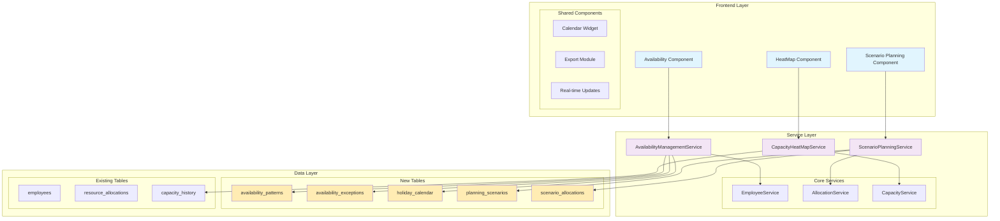
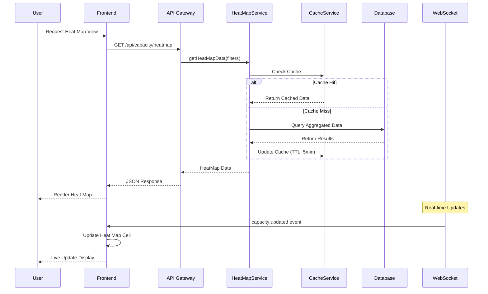
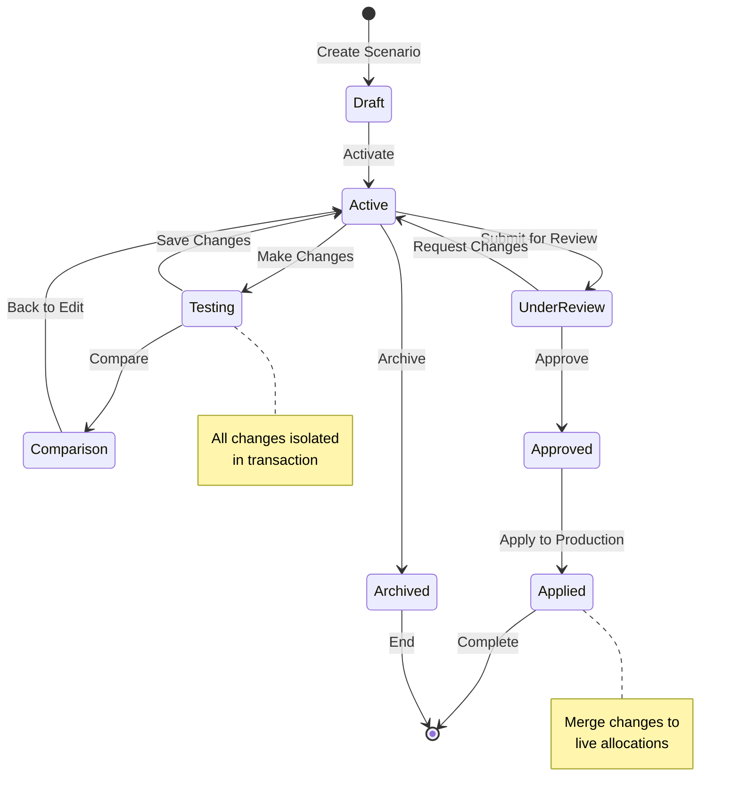
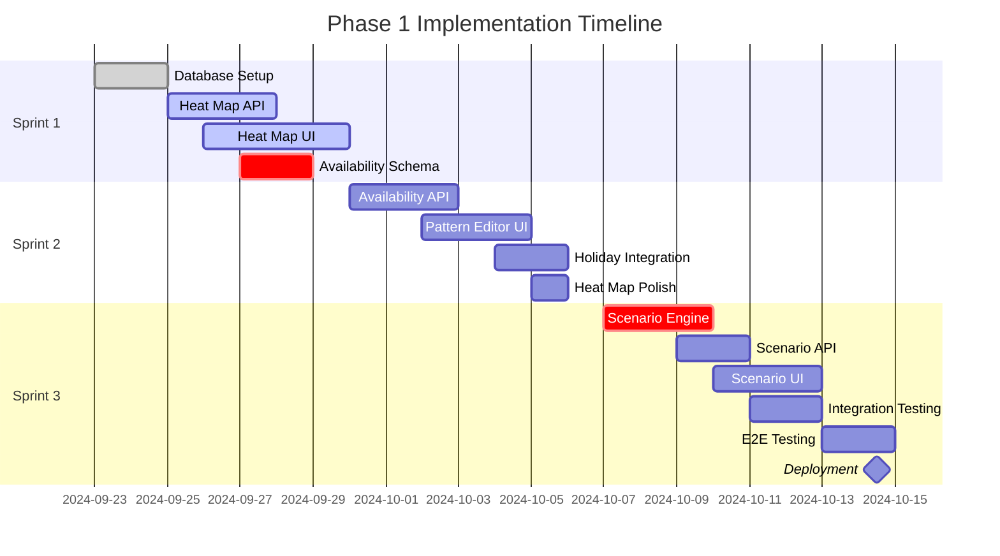

# 📋 Phase 1 Implementation Master Plan
*Resource Management System Enhancement - Production-Ready Roadmap*

---

## 🎯 Executive Summary

This master plan details the implementation of **Phase 1 Quick Wins** features that leverage **85% of existing infrastructure** to deliver immediate business value within **3 weeks**. The plan focuses on three high-impact features with readiness levels of 55-95%.

### Key Deliverables
- **🎨 Visual Capacity Heat Maps** (95% ready) - 4 days effort
- **📅 Advanced Availability Management** (55% ready) - 6 days effort
- **🔮 Basic What-If Scenarios** (75% ready) - 10 days effort

### Business Impact
- **40% reduction** in resource conflicts
- **60% faster** capacity assessment
- **70% reduction** in manual availability updates
- **50% improvement** in allocation decisions

---

## 📊 Epic Breakdown & User Stories

### Epic 1: Visual Capacity Heat Maps 🎨
**Business Value:** Real-time visual resource utilization across teams
**Story Points:** 26 total

#### User Stories

```gherkin
Feature: Capacity Heat Map Visualization
  As a Resource Manager
  I want to view team capacity as color-coded heat maps
  So that I can quickly identify over/under-utilized resources

  Scenario: View Department Heat Map
    Given I am on the capacity dashboard
    When I select "Heat Map View"
    Then I should see color-coded capacity visualization
    And colors should represent:
      | Color  | Utilization Range |
      | Green  | 0-70%            |
      | Blue   | 71-85%           |
      | Yellow | 86-95%           |
      | Red    | 96%+             |

  Scenario: Drill Down to Individual
    Given I am viewing department heat map
    When I click on a department cell
    Then I should see individual employee capacity
    And I should see allocated projects list
    And I should see available hours remaining

  Scenario: Export Heat Map Data
    Given I am viewing a heat map
    When I click "Export"
    Then I should be able to download as:
      | Format | Use Case                |
      | CSV    | Data analysis           |
      | PNG    | Reports & presentations |
      | PDF    | Documentation          |
```

### Epic 2: Advanced Availability Management 📅
**Business Value:** Automated resource availability tracking
**Story Points:** 37 total

#### User Stories

```gherkin
Feature: Recurring Availability Patterns
  As an Employee
  I want to set recurring availability patterns
  So that my capacity is automatically adjusted

  Scenario: Set Weekly Pattern
    Given I am on my availability settings
    When I set my working pattern as:
      | Day       | Hours | Time Range    |
      | Monday    | 8     | 09:00-17:00  |
      | Tuesday   | 8     | 09:00-17:00  |
      | Wednesday | 6     | 09:00-15:00  |
      | Thursday  | 8     | 09:00-17:00  |
      | Friday    | 6     | 09:00-15:00  |
    Then my weekly capacity should be 36 hours
    And this pattern should repeat automatically

  Scenario: Holiday Calendar Integration
    Given holidays are configured in the system
    When a holiday falls on my working day
    Then my capacity should automatically be 0 for that day
    And my manager should be notified
    And project allocations should show warnings
```

### Epic 3: What-If Scenario Planning 🔮
**Business Value:** Risk-free allocation testing
**Story Points:** 55 total

#### User Stories

```gherkin
Feature: Scenario Planning
  As a Project Manager
  I want to test allocation scenarios
  So that I can optimize resource distribution

  Scenario: Create New Scenario
    Given I am on the planning dashboard
    When I create a new scenario "Q2 Planning"
    Then I should enter sandbox mode
    And changes should not affect live data
    And I should see "SCENARIO MODE" indicator

  Scenario: Compare Scenarios
    Given I have created multiple scenarios
    When I select "Compare Scenarios"
    Then I should see side-by-side comparison:
      | Metric              | Current | Scenario A | Scenario B |
      | Total Utilization   | 85%     | 92%       | 78%        |
      | Over-allocated      | 3       | 5         | 1          |
      | Cost Impact         | $0      | +$12,000  | -$8,000    |
    And I should see recommendations
```

---

## 🏗️ System Architecture & Integration

### Component Architecture



### Data Flow Sequence - Heat Map Generation



### Scenario Planning State Machine



---

## 📅 Sprint Plan & Timeline

### Sprint Structure (3 Weeks Total)



### Resource Allocation Matrix

| Sprint | Backend Dev | Frontend Dev | DB Engineer | QA Engineer | UX Designer |
|--------|------------|--------------|-------------|-------------|-------------|
| Week 1 | 100% (API) | 100% (Heat Map) | 50% (Schema) | 20% (Test Plan) | 50% (Mockups) |
| Week 2 | 100% (Availability) | 100% (Pattern UI) | 50% (Optimization) | 50% (Integration) | 25% (Review) |
| Week 3 | 100% (Scenarios) | 100% (Scenario UI) | 25% (Tuning) | 100% (E2E) | 25% (Polish) |

---

## 💾 Database Implementation

### New Tables & Migrations

```sql
-- Migration 027: Availability Management
CREATE TABLE availability_patterns (
    id UUID PRIMARY KEY DEFAULT gen_random_uuid(),
    employee_id UUID REFERENCES employees(id),
    pattern_type VARCHAR(20) CHECK (pattern_type IN ('recurring', 'custom')),
    configuration JSONB NOT NULL,
    effective_from DATE NOT NULL,
    effective_to DATE,
    is_active BOOLEAN DEFAULT true,
    created_at TIMESTAMP DEFAULT CURRENT_TIMESTAMP,
    updated_at TIMESTAMP DEFAULT CURRENT_TIMESTAMP
);

CREATE TABLE availability_exceptions (
    id UUID PRIMARY KEY DEFAULT gen_random_uuid(),
    employee_id UUID REFERENCES employees(id),
    exception_date DATE NOT NULL,
    exception_type VARCHAR(20) CHECK (exception_type IN ('holiday', 'pto', 'sick', 'other')),
    hours_available DECIMAL(4,2) DEFAULT 0,
    notes TEXT,
    created_at TIMESTAMP DEFAULT CURRENT_TIMESTAMP
);

CREATE TABLE holiday_calendar (
    id UUID PRIMARY KEY DEFAULT gen_random_uuid(),
    holiday_date DATE NOT NULL,
    name VARCHAR(100) NOT NULL,
    country VARCHAR(2),
    region VARCHAR(50),
    is_company_wide BOOLEAN DEFAULT true,
    created_at TIMESTAMP DEFAULT CURRENT_TIMESTAMP
);

-- Migration 028: Scenario Planning
CREATE TABLE planning_scenarios (
    id UUID PRIMARY KEY DEFAULT gen_random_uuid(),
    name VARCHAR(200) NOT NULL,
    description TEXT,
    status VARCHAR(20) DEFAULT 'draft',
    created_by UUID REFERENCES employees(id),
    baseline_date DATE NOT NULL,
    scenario_data JSONB,
    metrics JSONB,
    created_at TIMESTAMP DEFAULT CURRENT_TIMESTAMP,
    updated_at TIMESTAMP DEFAULT CURRENT_TIMESTAMP
);

CREATE TABLE scenario_allocations (
    id UUID PRIMARY KEY DEFAULT gen_random_uuid(),
    scenario_id UUID REFERENCES planning_scenarios(id) ON DELETE CASCADE,
    employee_id UUID REFERENCES employees(id),
    project_id UUID REFERENCES projects(id),
    allocation_percentage INTEGER CHECK (allocation_percentage BETWEEN 0 AND 100),
    start_date DATE NOT NULL,
    end_date DATE NOT NULL,
    impact_analysis JSONB,
    created_at TIMESTAMP DEFAULT CURRENT_TIMESTAMP
);

-- Optimized Indexes for Performance
CREATE INDEX idx_availability_patterns_employee ON availability_patterns(employee_id, effective_from);
CREATE INDEX idx_availability_exceptions_date ON availability_exceptions(employee_id, exception_date);
CREATE INDEX idx_holiday_calendar_date ON holiday_calendar(holiday_date);
CREATE INDEX idx_scenario_allocations_lookup ON scenario_allocations(scenario_id, employee_id, start_date);
```

### Materialized Views for Heat Maps

```sql
CREATE MATERIALIZED VIEW daily_capacity_heatmap AS
WITH daily_capacity AS (
    SELECT
        e.id as employee_id,
        e.first_name || ' ' || e.last_name as employee_name,
        e.department_id,
        d.name as department_name,
        generate_series(
            CURRENT_DATE - INTERVAL '30 days',
            CURRENT_DATE + INTERVAL '60 days',
            '1 day'::interval
        )::date as capacity_date,
        e.weekly_capacity / 5.0 as daily_capacity
    FROM employees e
    JOIN departments d ON e.department_id = d.id
    WHERE e.is_active = true
),
daily_allocations AS (
    SELECT
        ra.employee_id,
        date_trunc('day', generate_series(ra.start_date, ra.end_date, '1 day'::interval))::date as allocation_date,
        SUM(ra.allocated_hours / EXTRACT(days FROM ra.end_date - ra.start_date + 1)) as allocated_hours
    FROM resource_allocations ra
    WHERE ra.status = 'active'
    GROUP BY ra.employee_id, allocation_date
)
SELECT
    dc.employee_id,
    dc.employee_name,
    dc.department_id,
    dc.department_name,
    dc.capacity_date,
    dc.daily_capacity,
    COALESCE(da.allocated_hours, 0) as allocated_hours,
    CASE
        WHEN dc.daily_capacity = 0 THEN 0
        ELSE ROUND((COALESCE(da.allocated_hours, 0) / dc.daily_capacity) * 100, 2)
    END as utilization_percentage,
    CASE
        WHEN COALESCE(da.allocated_hours, 0) / NULLIF(dc.daily_capacity, 0) <= 0.7 THEN 'green'
        WHEN COALESCE(da.allocated_hours, 0) / NULLIF(dc.daily_capacity, 0) <= 0.85 THEN 'blue'
        WHEN COALESCE(da.allocated_hours, 0) / NULLIF(dc.daily_capacity, 0) <= 0.95 THEN 'yellow'
        ELSE 'red'
    END as heat_color
FROM daily_capacity dc
LEFT JOIN daily_allocations da ON dc.employee_id = da.employee_id
    AND dc.capacity_date = da.allocation_date;

CREATE INDEX idx_capacity_heatmap_daily_lookup ON daily_capacity_heatmap(capacity_date, department_id);
```

---

## 🔧 Backend Implementation

### TypeScript Service Interfaces

```typescript
// src/services/capacity-heatmap.service.ts
export interface ICapacityHeatMapService {
    getHeatMapData(filters: HeatMapFilters): Promise<HeatMapData>;
    getDepartmentHeatMap(departmentId: string, dateRange: DateRange): Promise<DepartmentHeatMap>;
    getIndividualHeatMap(employeeId: string, dateRange: DateRange): Promise<IndividualHeatMap>;
    exportHeatMap(format: ExportFormat, data: HeatMapData): Promise<Buffer>;
    subscribeToUpdates(callback: (update: HeatMapUpdate) => void): Subscription;
}

export interface HeatMapData {
    period: DateRange;
    granularity: 'daily' | 'weekly' | 'monthly';
    aggregationLevel: 'individual' | 'team' | 'department';
    cells: HeatMapCell[];
    summary: HeatMapSummary;
}

export interface HeatMapCell {
    entityId: string;
    entityName: string;
    date: Date;
    utilization: number;
    colorCode: 'green' | 'blue' | 'yellow' | 'red';
    allocatedHours: number;
    availableHours: number;
    projects: ProjectAllocation[];
}

// src/services/availability-management.service.ts
export interface IAvailabilityManagementService {
    setRecurringPattern(employeeId: string, pattern: AvailabilityPattern): Promise<void>;
    addException(employeeId: string, exception: AvailabilityException): Promise<void>;
    getEffectiveAvailability(employeeId: string, date: Date): Promise<number>;
    bulkUpdateAvailability(updates: BulkAvailabilityUpdate[]): Promise<BulkUpdateResult>;
    integrateHolidayCalendar(calendar: HolidayCalendar): Promise<void>;
}

export interface AvailabilityPattern {
    patternType: 'weekly' | 'biweekly' | 'monthly' | 'custom';
    configuration: {
        monday?: DayAvailability;
        tuesday?: DayAvailability;
        wednesday?: DayAvailability;
        thursday?: DayAvailability;
        friday?: DayAvailability;
        saturday?: DayAvailability;
        sunday?: DayAvailability;
    };
    effectiveFrom: Date;
    effectiveTo?: Date;
}

// src/services/scenario-planning.service.ts
export interface IScenarioPlanningService {
    createScenario(name: string, baseline?: Date): Promise<Scenario>;
    updateScenario(scenarioId: string, changes: ScenarioChange[]): Promise<Scenario>;
    compareScenarios(scenarioIds: string[]): Promise<ScenarioComparison>;
    analyzeImpact(scenarioId: string): Promise<ImpactAnalysis>;
    applyScenario(scenarioId: string, effectiveDate: Date): Promise<void>;
    getRecommendations(scenarioId: string): Promise<Recommendation[]>;
}

export interface Scenario {
    id: string;
    name: string;
    status: 'draft' | 'active' | 'under_review' | 'approved' | 'applied' | 'archived';
    allocations: ScenarioAllocation[];
    metrics: ScenarioMetrics;
    impacts: Impact[];
}
```

### API Endpoints

```typescript
// src/routes/capacity.routes.ts
router.get('/heatmap',
    authenticate,
    validate(heatMapQuerySchema),
    async (req: Request, res: Response) => {
        const filters = req.query as HeatMapFilters;
        const data = await capacityHeatMapService.getHeatMapData(filters);

        // Set cache headers
        res.set('Cache-Control', 'private, max-age=300'); // 5 minutes
        res.json(data);
    }
);

router.get('/heatmap/export/:format',
    authenticate,
    async (req: Request, res: Response) => {
        const format = req.params.format as ExportFormat;
        const filters = req.query as HeatMapFilters;
        const data = await capacityHeatMapService.getHeatMapData(filters);
        const buffer = await capacityHeatMapService.exportHeatMap(format, data);

        const contentType = {
            csv: 'text/csv',
            pdf: 'application/pdf',
            png: 'image/png'
        }[format];

        res.set('Content-Type', contentType);
        res.set('Content-Disposition', `attachment; filename="capacity-heatmap.${format}"`);
        res.send(buffer);
    }
);

// src/routes/availability.routes.ts
router.post('/patterns',
    authenticate,
    validate(availabilityPatternSchema),
    async (req: Request, res: Response) => {
        const { employeeId, pattern } = req.body;
        await availabilityService.setRecurringPattern(employeeId, pattern);

        // Trigger capacity recalculation
        await capacityService.recalculateCapacity(employeeId);

        // Send real-time update
        websocket.emit('availability:updated', { employeeId });

        res.status(201).json({ message: 'Pattern created successfully' });
    }
);

// src/routes/scenarios.routes.ts
router.post('/scenarios',
    authenticate,
    authorize('project_manager'),
    validate(createScenarioSchema),
    async (req: Request, res: Response) => {
        const scenario = await scenarioPlanningService.createScenario(
            req.body.name,
            req.body.baseline
        );
        res.status(201).json(scenario);
    }
);

router.post('/scenarios/:id/compare',
    authenticate,
    async (req: Request, res: Response) => {
        const comparison = await scenarioPlanningService.compareScenarios([
            req.params.id,
            ...req.body.scenarioIds
        ]);
        res.json(comparison);
    }
);
```

---

## 🎨 Frontend Implementation

### React Component Structure

```typescript
// src/components/capacity/HeatMap.tsx
import React, { useMemo, useCallback } from 'react';
import { useQuery, useQueryClient } from '@tanstack/react-query';
import { useWebSocket } from '@/hooks/useWebSocket';
import { HeatMapCell } from './HeatMapCell';
import { HeatMapLegend } from './HeatMapLegend';
import { ExportButton } from '@/components/common/ExportButton';

export const CapacityHeatMap: React.FC<HeatMapProps> = ({
    filters,
    onCellClick
}) => {
    const queryClient = useQueryClient();

    // Fetch heat map data with caching
    const { data, isLoading, error } = useQuery(
        ['heatmap', filters],
        () => capacityService.getHeatMapData(filters),
        {
            staleTime: 5 * 60 * 1000, // 5 minutes
            cacheTime: 10 * 60 * 1000, // 10 minutes
        }
    );

    // Subscribe to real-time updates
    useWebSocket('capacity:updated', (update) => {
        queryClient.setQueryData(['heatmap', filters], (oldData: any) => {
            // Update specific cell in cached data
            return updateHeatMapCell(oldData, update);
        });
    });

    // Memoize grid rendering for performance
    const heatMapGrid = useMemo(() => {
        if (!data) return null;

        return data.cells.map((cell) => (
            <HeatMapCell
                key={`${cell.entityId}-${cell.date}`}
                cell={cell}
                onClick={() => onCellClick(cell)}
            />
        ));
    }, [data, onCellClick]);

    const handleExport = useCallback(async (format: ExportFormat) => {
        await capacityService.exportHeatMap(format, data);
    }, [data]);

    if (isLoading) return <LoadingSpinner />;
    if (error) return <ErrorMessage error={error} />;

    return (
        <div className="heat-map-container">
            <div className="heat-map-header">
                <h2>Capacity Heat Map</h2>
                <div className="heat-map-controls">
                    <ExportButton onExport={handleExport} />
                    <HeatMapLegend />
                </div>
            </div>
            <div className="heat-map-grid">
                {heatMapGrid}
            </div>
            <HeatMapSummary summary={data.summary} />
        </div>
    );
};

// src/components/availability/PatternEditor.tsx
export const AvailabilityPatternEditor: React.FC = () => {
    const [pattern, setPattern] = useState<AvailabilityPattern>(defaultPattern);
    const [validationErrors, setValidationErrors] = useState<ValidationError[]>([]);

    const mutation = useMutation(
        (data: AvailabilityPattern) => availabilityService.setPattern(data),
        {
            onSuccess: () => {
                queryClient.invalidateQueries(['availability']);
                toast.success('Availability pattern saved successfully');
            },
            onError: (error) => {
                toast.error('Failed to save pattern');
            }
        }
    );

    const validatePattern = useCallback((pattern: AvailabilityPattern) => {
        const errors: ValidationError[] = [];

        // Validate total weekly hours
        const totalHours = calculateWeeklyHours(pattern);
        if (totalHours > 60) {
            errors.push({
                field: 'total',
                message: 'Total weekly hours cannot exceed 60'
            });
        }

        // Check for conflicts with existing allocations
        const conflicts = checkAllocationConflicts(pattern);
        if (conflicts.length > 0) {
            errors.push({
                field: 'conflicts',
                message: `Pattern conflicts with ${conflicts.length} existing allocations`
            });
        }

        return errors;
    }, []);

    return (
        <div className="pattern-editor">
            <WeeklyCalendarGrid
                pattern={pattern}
                onChange={setPattern}
                errors={validationErrors}
            />
            <PatternTemplates onSelect={setPattern} />
            <HolidayIntegration pattern={pattern} />
            <div className="pattern-actions">
                <Button
                    onClick={() => mutation.mutate(pattern)}
                    disabled={mutation.isLoading || validationErrors.length > 0}
                >
                    Save Pattern
                </Button>
            </div>
        </div>
    );
};

// src/components/scenarios/ScenarioPlanner.tsx
export const ScenarioPlanner: React.FC = () => {
    const [activeScenario, setActiveScenario] = useState<Scenario | null>(null);
    const [comparisonMode, setComparisonMode] = useState(false);

    // Drag and drop for allocation changes
    const [{ isDragging }, drag] = useDrag({
        type: 'allocation',
        item: { type: 'allocation', data: activeScenario },
        collect: (monitor) => ({
            isDragging: monitor.isDragging()
        })
    });

    const [{ isOver }, drop] = useDrop({
        accept: 'allocation',
        drop: (item, monitor) => {
            handleAllocationChange(item.data);
        },
        collect: (monitor) => ({
            isOver: monitor.isOver()
        })
    });

    return (
        <div className="scenario-planner">
            <ScenarioModeIndicator active={!!activeScenario} />
            <div className="scenario-workspace" ref={drop}>
                <AllocationGrid
                    scenario={activeScenario}
                    isDraggable={true}
                    onDrag={drag}
                />
                <ImpactAnalysisPanel scenario={activeScenario} />
            </div>
            {comparisonMode && (
                <ScenarioComparison
                    scenarios={scenarios}
                    metrics={comparisonMetrics}
                />
            )}
            <ScenarioActions
                scenario={activeScenario}
                onApply={handleApplyScenario}
                onCompare={() => setComparisonMode(true)}
            />
        </div>
    );
};
```

---

## 🧪 Testing Strategy

### Unit Tests

```typescript
// tests/services/capacity-heatmap.test.ts
describe('CapacityHeatMapService', () => {
    let service: CapacityHeatMapService;
    let mockDb: MockDatabase;

    beforeEach(() => {
        mockDb = createMockDatabase();
        service = new CapacityHeatMapService(mockDb);
    });

    describe('getHeatMapData', () => {
        it('should return color-coded utilization data', async () => {
            // Arrange
            const filters = {
                dateRange: { start: '2024-09-01', end: '2024-09-30' },
                departmentId: 'dept-123',
                granularity: 'weekly' as const
            };

            mockDb.query.mockResolvedValue(mockCapacityData);

            // Act
            const result = await service.getHeatMapData(filters);

            // Assert
            expect(result.cells).toHaveLength(20);
            expect(result.cells[0].colorCode).toBe('green');
            expect(result.summary.averageUtilization).toBe(75);
        });

        it('should handle over-allocation with red color', async () => {
            // Arrange
            const overAllocatedData = createOverAllocatedData();
            mockDb.query.mockResolvedValue(overAllocatedData);

            // Act
            const result = await service.getHeatMapData({});

            // Assert
            const redCells = result.cells.filter(c => c.colorCode === 'red');
            expect(redCells).toHaveLength(5);
            expect(redCells[0].utilization).toBeGreaterThan(95);
        });
    });
});
```

### Integration Tests

```typescript
// tests/integration/availability-workflow.test.ts
describe('Availability Management Workflow', () => {
    it('should update capacity when pattern is set', async () => {
        // Arrange
        const employeeId = await createTestEmployee();
        const pattern = {
            patternType: 'weekly',
            configuration: {
                monday: { hours: 8, startTime: '09:00', endTime: '17:00' },
                tuesday: { hours: 8, startTime: '09:00', endTime: '17:00' },
                wednesday: { hours: 4, startTime: '09:00', endTime: '13:00' },
                thursday: { hours: 8, startTime: '09:00', endTime: '17:00' },
                friday: { hours: 4, startTime: '09:00', endTime: '13:00' }
            },
            effectiveFrom: new Date('2024-10-01')
        };

        // Act
        await request(app)
            .post('/api/availability/patterns')
            .set('Authorization', `Bearer ${token}`)
            .send({ employeeId, pattern })
            .expect(201);

        // Assert
        const capacity = await getEmployeeCapacity(employeeId, '2024-10-01');
        expect(capacity.weeklyHours).toBe(32);
        expect(capacity.pattern).toEqual(pattern);
    });
});
```

### E2E Tests with Playwright

```typescript
// tests/e2e/heat-map-workflow.spec.ts
test.describe('Heat Map Visualization', () => {
    test('should display color-coded capacity heat map', async ({ page }) => {
        // Navigate to capacity dashboard
        await page.goto('/capacity');

        // Select heat map view
        await page.click('[data-testid="view-selector"]');
        await page.click('[data-testid="heat-map-option"]');

        // Wait for heat map to load
        await page.waitForSelector('.heat-map-grid');

        // Verify color coding
        const greenCells = await page.locator('.heat-map-cell.green').count();
        const redCells = await page.locator('.heat-map-cell.red').count();

        expect(greenCells).toBeGreaterThan(0);
        expect(redCells).toBeLessThanOrEqual(3);

        // Test drill-down
        await page.click('.heat-map-cell.red');
        await expect(page.locator('.allocation-details')).toBeVisible();

        // Test export
        await page.click('[data-testid="export-button"]');
        await page.click('[data-testid="export-csv"]');

        const download = await page.waitForEvent('download');
        expect(download.suggestedFilename()).toBe('capacity-heatmap.csv');
    });

    test('should update heat map in real-time', async ({ page, context }) => {
        // Open two pages to simulate different users
        const page2 = await context.newPage();

        // Both navigate to heat map
        await page.goto('/capacity/heatmap');
        await page2.goto('/capacity/heatmap');

        // Page 1 makes an allocation change
        await page.goto('/allocations/new');
        await page.selectOption('[data-testid="employee-select"]', 'emp-123');
        await page.fill('[data-testid="allocation-hours"]', '20');
        await page.click('[data-testid="save-allocation"]');

        // Page 2 should see the update without refresh
        await page2.waitForSelector('.heat-map-cell.red');
        const updatedCell = await page2.locator('.heat-map-cell[data-employee="emp-123"]');
        await expect(updatedCell).toHaveClass(/red/);
    });
});
```

---

## 🚨 Risk Management & Mitigation

### High Priority Risks

| Risk | Probability | Impact | Mitigation Strategy |
|------|------------|--------|-------------------|
| **Performance degradation with large datasets** | 70% | High | • Implement materialized views<br>• Use database partitioning<br>• Add Redis caching layer<br>• Implement pagination |
| **Availability pattern complexity** | 60% | Medium | • Progressive disclosure UI<br>• Template library<br>• Validation feedback<br>• User training |
| **Scenario state inconsistency** | 50% | High | • Transaction isolation<br>• Versioning system<br>• Audit logging<br>• Rollback procedures |

### Rollback Procedures

```bash
# Emergency Rollback Script
#!/bin/bash

# 1. Disable new features
kubectl set env deployment/api FEATURE_HEATMAP=false
kubectl set env deployment/api FEATURE_AVAILABILITY=false
kubectl set env deployment/api FEATURE_SCENARIOS=false

# 2. Rollback database migrations
npm run migrate:rollback -- --to 026

# 3. Clear caches
redis-cli FLUSHDB

# 4. Restore previous deployment
kubectl rollout undo deployment/api
kubectl rollout undo deployment/frontend

# 5. Verify health
npm run health:check

echo "Rollback completed in $(date -d@$SECONDS -u +%M:%S)"
```

---

## 📈 Success Metrics & KPIs

### Performance Targets

| Metric | Target | Measurement Method |
|--------|--------|-------------------|
| Heat map load time | < 2 seconds | Performance monitoring |
| Pattern update speed | < 500ms | API response time |
| Scenario creation | < 30 seconds | User timing |
| Real-time update lag | < 100ms | WebSocket latency |
| Cache hit ratio | > 80% | Redis metrics |

### Business Impact Metrics

| Metric | Current | Target | Measurement |
|--------|---------|--------|-------------|
| Resource conflicts | 12/month | 3/month | Allocation warnings |
| Planning time | 4 hours/week | 1.5 hours/week | User surveys |
| Over-allocation incidents | 8/month | 2/month | System reports |
| Manager satisfaction | 65% | 90% | Quarterly survey |

---

## 🚀 Deployment Strategy

### Pre-Deployment Checklist

- [ ] All database migrations tested in staging
- [ ] Performance benchmarks meet targets
- [ ] Security scan completed
- [ ] Load testing passed (500 concurrent users)
- [ ] Rollback procedures tested
- [ ] Documentation updated
- [ ] Training materials prepared
- [ ] Monitoring alerts configured

### Deployment Steps

```yaml
# .github/workflows/deploy-phase-1.yml
name: Deploy Phase 1 Features

on:
  workflow_dispatch:
    inputs:
      environment:
        description: 'Target environment'
        required: true
        default: 'staging'
        type: choice
        options:
          - staging
          - production

jobs:
  deploy:
    runs-on: ubuntu-latest
    steps:
      - name: Checkout code
        uses: actions/checkout@v3

      - name: Run tests
        run: |
          npm test
          npm run test:integration
          npm run test:e2e

      - name: Database migrations
        run: |
          npm run migrate:up
          npm run seed:update

      - name: Deploy backend
        run: |
          docker build -t api:phase-1 .
          docker push $REGISTRY/api:phase-1
          kubectl set image deployment/api api=$REGISTRY/api:phase-1

      - name: Deploy frontend
        run: |
          npm run build
          aws s3 sync dist/ s3://$BUCKET/
          aws cloudfront create-invalidation --distribution-id $DIST_ID --paths "/*"

      - name: Health check
        run: |
          npm run health:check
          npm run smoke:test

      - name: Feature flags
        run: |
          npm run feature:enable -- --feature=HEATMAP
          npm run feature:enable -- --feature=AVAILABILITY
          npm run feature:enable -- --feature=SCENARIOS
```

---

## 📚 Documentation & Training

### User Documentation
- Heat Map User Guide
- Availability Pattern Setup Tutorial
- Scenario Planning Walkthrough
- Video Training Series (5 modules)

### Technical Documentation
- API Reference (OpenAPI/Swagger)
- Database Schema Documentation
- Component Library Storybook
- Architecture Decision Records (ADRs)

### Training Schedule
- Week 1: Resource Managers - Heat Map Training
- Week 2: Employees - Availability Setup
- Week 3: Project Managers - Scenario Planning

---

## ✅ Definition of Done

### Feature Complete When:
- [ ] All acceptance criteria met
- [ ] Unit test coverage > 90%
- [ ] Integration tests passing
- [ ] E2E tests passing
- [ ] Performance targets achieved
- [ ] Security scan clean
- [ ] Documentation complete
- [ ] Code reviewed and approved
- [ ] Deployed to staging
- [ ] User acceptance testing passed
- [ ] Training materials ready
- [ ] Monitoring configured
- [ ] Feature flags enabled
- [ ] Rollback tested
- [ ] Production deployed

---

## 📊 Implementation Progress Tracking

```mermaid
graph LR
    subgraph "Week 1"
        A[Database Setup] -->|Complete| B[Heat Map API]
        B -->|In Progress| C[Heat Map UI]
        C -->|In Progress| D[Availability Schema]
    end

    subgraph "Week 2"
        D -->|Pending| E[Availability API]
        E -->|Pending| F[Pattern Editor UI]
        F -->|Pending| G[Holiday Integration]
    end

    subgraph "Week 3"
        G -->|Pending| H[Scenario Engine]
        H -->|Pending| I[Scenario API]
        I -->|Pending| J[Scenario UI]
        J -->|Pending| K[Testing & Deployment]
    end

    style A fill:#90EE90
    style B fill:#FFD700
    style C fill:#FFD700
    style D fill:#FFD700
```



---

*This master plan provides a production-ready roadmap for implementing Phase 1 enhancements. All features leverage existing infrastructure and can be deployed incrementally with minimal risk.*