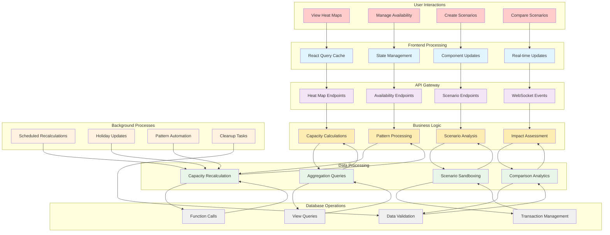
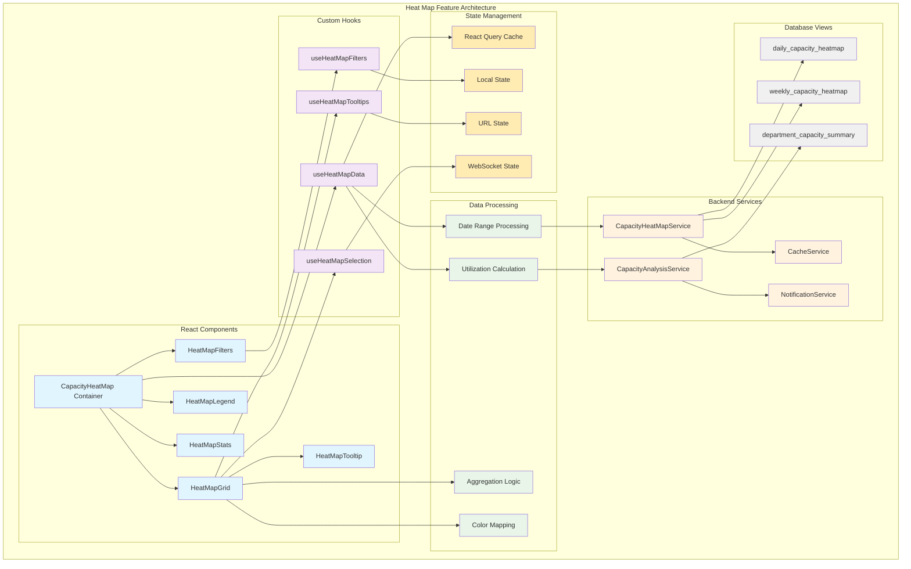
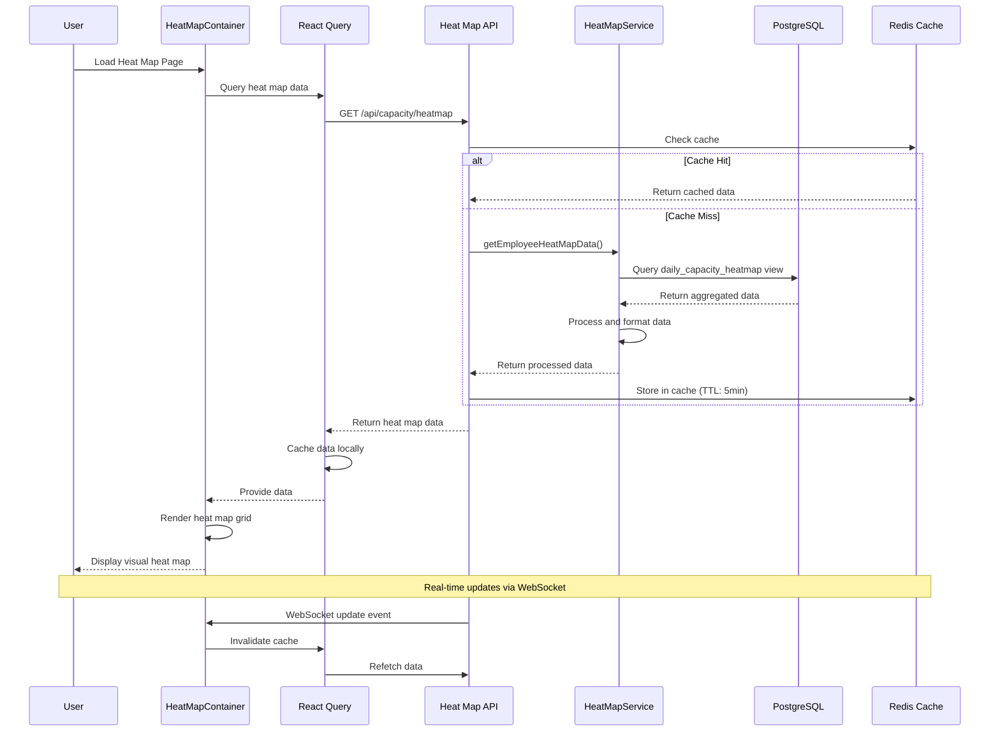
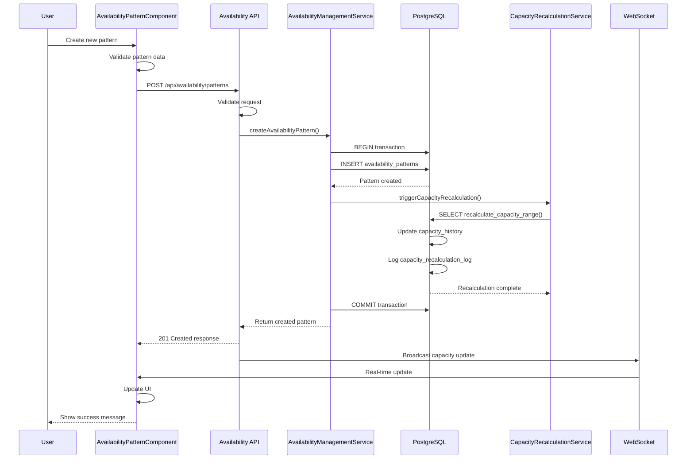
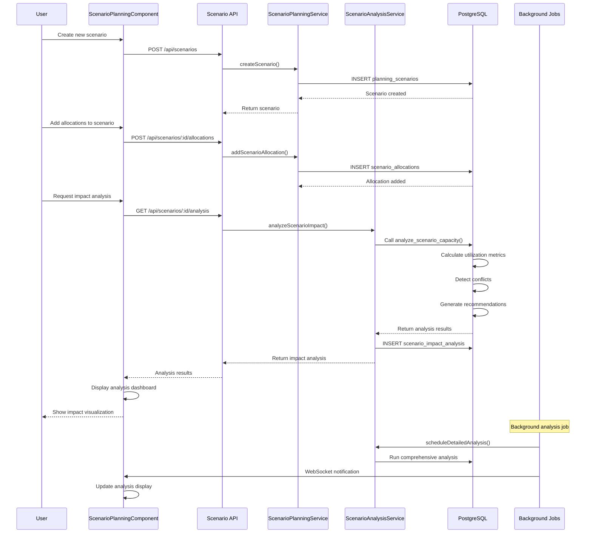
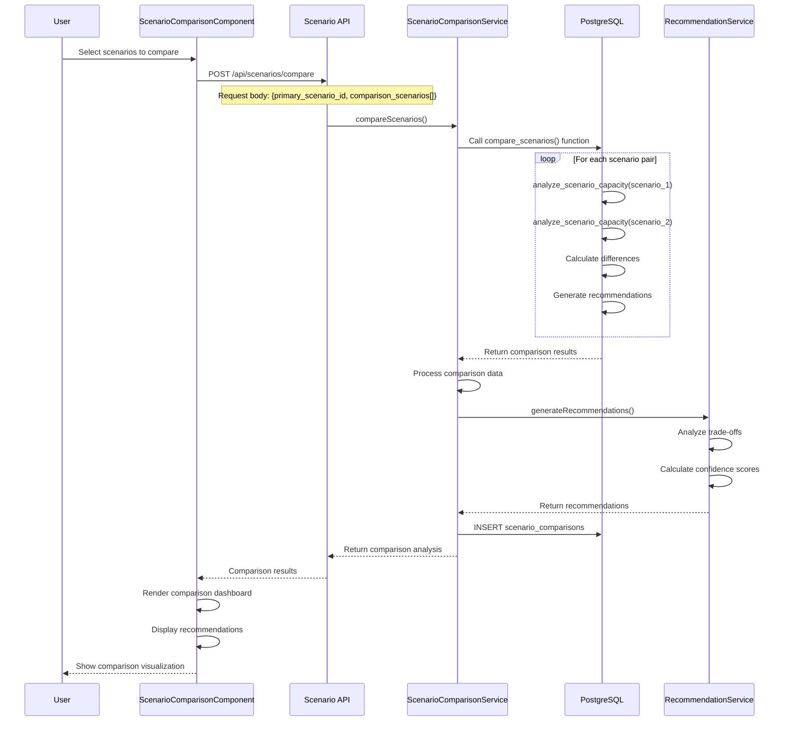
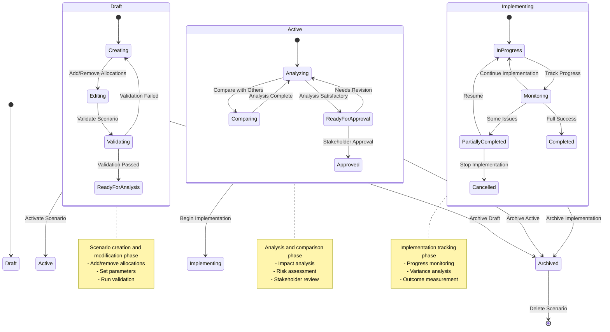
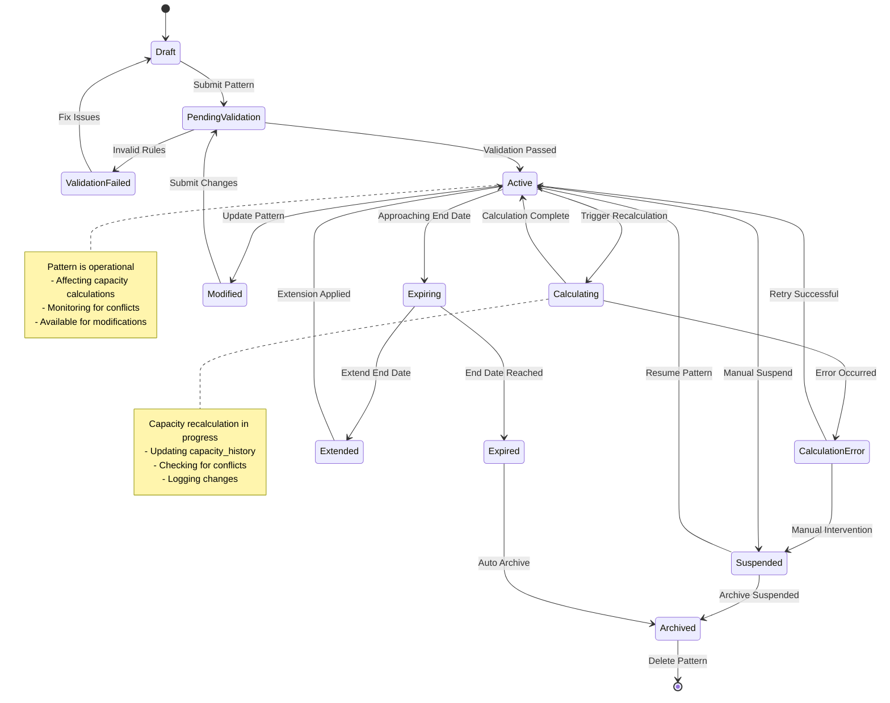
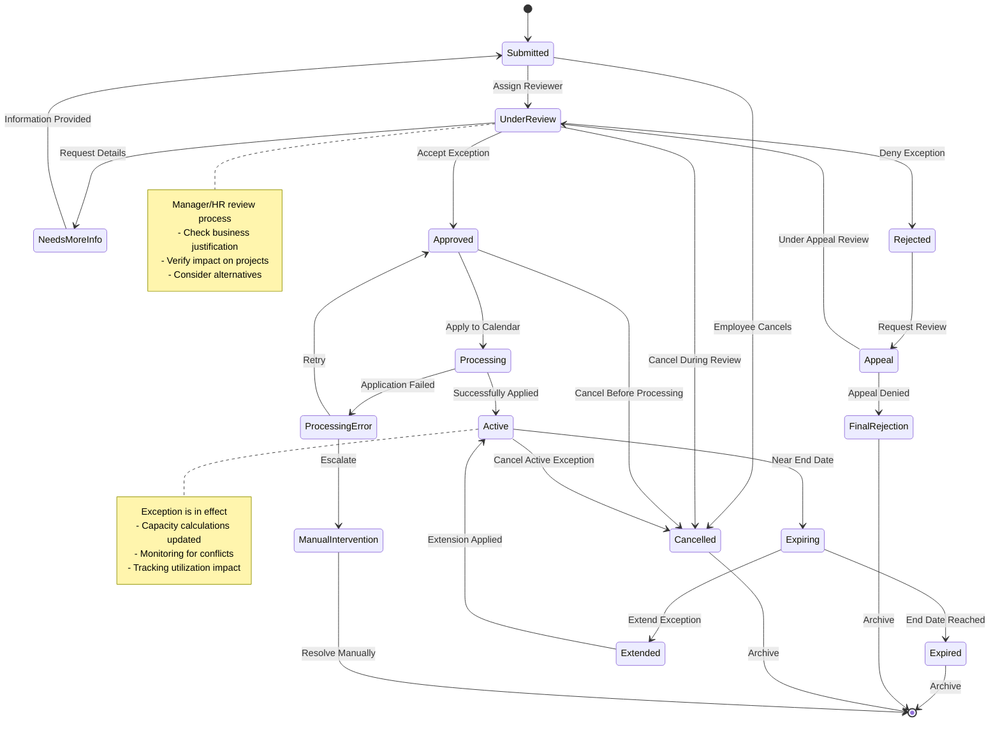

# Phase 1 Technical Implementation Design
## Advanced Resource Management Features

**Version:** 1.0
**Date:** September 22, 2025
**Architect:** System Architecture Team
**Status:** Design Phase

---

## Executive Summary

This document provides detailed technical implementation designs for Phase 1 advanced features:
1. **Visual Capacity Heat Maps** - Real-time capacity visualization
2. **Advanced Availability Management** - Flexible scheduling patterns
3. **What-If Scenario Planning** - Impact analysis and decision support

All designs extend the existing 3-tier architecture, maintain separation of concerns, and integrate seamlessly with current services.

---

## 🔥 1. Visual Capacity Heat Maps

### Architecture Overview

The Visual Capacity Heat Maps feature provides real-time visualization of resource utilization across time periods, departments, and projects using aggregated data from PostgreSQL and interactive React components.

### 1.1 Database Layer Extensions

#### 1.1.1 New Capacity Aggregation Views

```sql
-- Daily capacity aggregation view
CREATE OR REPLACE VIEW daily_capacity_heatmap AS
WITH RECURSIVE date_series AS (
  -- Generate date range for the last 90 days
  SELECT CURRENT_DATE - INTERVAL '90 days' as date_day
  UNION ALL
  SELECT date_day + INTERVAL '1 day'
  FROM date_series
  WHERE date_day < CURRENT_DATE + INTERVAL '30 days'
),
employee_capacity AS (
  SELECT
    e.id as employee_id,
    e.first_name || ' ' || e.last_name as employee_name,
    e.department_id,
    d.name as department_name,
    COALESCE(e.weekly_hours, 40) as base_capacity_weekly,
    COALESCE(e.weekly_hours, 40) / 5.0 as base_capacity_daily
  FROM employees e
  JOIN departments d ON e.department_id = d.id
  WHERE e.is_active = true
),
daily_allocations AS (
  SELECT
    ra.employee_id,
    ds.date_day,
    SUM(
      CASE
        WHEN ds.date_day BETWEEN ra.start_date AND ra.end_date
        THEN ra.allocated_hours / (ra.end_date - ra.start_date + 1)
        ELSE 0
      END
    ) as allocated_hours
  FROM date_series ds
  CROSS JOIN resource_allocations ra
  WHERE ra.status IN ('planned', 'active')
  GROUP BY ra.employee_id, ds.date_day
)
SELECT
  ec.employee_id,
  ec.employee_name,
  ec.department_id,
  ec.department_name,
  ds.date_day,
  EXTRACT(DOW FROM ds.date_day) as day_of_week,
  EXTRACT(WEEK FROM ds.date_day) as week_number,
  EXTRACT(MONTH FROM ds.date_day) as month_number,
  ec.base_capacity_daily,
  COALESCE(da.allocated_hours, 0) as allocated_hours,
  ec.base_capacity_daily - COALESCE(da.allocated_hours, 0) as available_hours,
  CASE
    WHEN COALESCE(da.allocated_hours, 0) = 0 THEN 'available'
    WHEN COALESCE(da.allocated_hours, 0) / ec.base_capacity_daily <= 0.7 THEN 'low'
    WHEN COALESCE(da.allocated_hours, 0) / ec.base_capacity_daily <= 0.85 THEN 'medium'
    WHEN COALESCE(da.allocated_hours, 0) / ec.base_capacity_daily <= 0.95 THEN 'high'
    ELSE 'overallocated'
  END as utilization_level,
  ROUND(
    (COALESCE(da.allocated_hours, 0) / ec.base_capacity_daily * 100)::numeric, 2
  ) as utilization_percentage
FROM date_series ds
CROSS JOIN employee_capacity ec
LEFT JOIN daily_allocations da ON ec.employee_id = da.employee_id
  AND ds.date_day = da.date_day
WHERE EXTRACT(DOW FROM ds.date_day) BETWEEN 1 AND 5; -- Weekdays only

-- Weekly capacity aggregation view
CREATE OR REPLACE VIEW weekly_capacity_heatmap AS
SELECT
  employee_id,
  employee_name,
  department_id,
  department_name,
  DATE_TRUNC('week', date_day)::date as week_start,
  week_number,
  month_number,
  SUM(base_capacity_daily) as weekly_capacity,
  SUM(allocated_hours) as weekly_allocated,
  SUM(available_hours) as weekly_available,
  ROUND(
    (SUM(allocated_hours) / SUM(base_capacity_daily) * 100)::numeric, 2
  ) as weekly_utilization_percentage,
  CASE
    WHEN SUM(allocated_hours) / SUM(base_capacity_daily) <= 0.7 THEN 'low'
    WHEN SUM(allocated_hours) / SUM(base_capacity_daily) <= 0.85 THEN 'medium'
    WHEN SUM(allocated_hours) / SUM(base_capacity_daily) <= 0.95 THEN 'high'
    ELSE 'overallocated'
  END as weekly_utilization_level
FROM daily_capacity_heatmap
GROUP BY
  employee_id, employee_name, department_id, department_name,
  DATE_TRUNC('week', date_day), week_number, month_number
ORDER BY week_start, employee_name;

-- Department capacity summary view
CREATE OR REPLACE VIEW department_capacity_summary AS
SELECT
  department_id,
  department_name,
  date_day,
  week_number,
  month_number,
  COUNT(DISTINCT employee_id) as employee_count,
  SUM(base_capacity_daily) as department_capacity,
  SUM(allocated_hours) as department_allocated,
  SUM(available_hours) as department_available,
  ROUND(
    (SUM(allocated_hours) / SUM(base_capacity_daily) * 100)::numeric, 2
  ) as department_utilization_percentage,
  CASE
    WHEN SUM(allocated_hours) / SUM(base_capacity_daily) <= 0.6 THEN 'low'
    WHEN SUM(allocated_hours) / SUM(base_capacity_daily) <= 0.8 THEN 'medium'
    WHEN SUM(allocated_hours) / SUM(base_capacity_daily) <= 0.95 THEN 'high'
    ELSE 'overallocated'
  END as department_utilization_level
FROM daily_capacity_heatmap
GROUP BY department_id, department_name, date_day, week_number, month_number
ORDER BY date_day, department_name;
```

#### 1.1.2 Indexing Strategy

```sql
-- Performance indexes for heat map queries
CREATE INDEX CONCURRENTLY IF NOT EXISTS idx_resource_allocations_date_range
  ON resource_allocations(employee_id, start_date, end_date)
  WHERE status IN ('planned', 'active');

CREATE INDEX CONCURRENTLY IF NOT EXISTS idx_employees_active_department
  ON employees(department_id, is_active)
  WHERE is_active = true;

CREATE INDEX CONCURRENTLY IF NOT EXISTS idx_capacity_heatmap_employee_date
  ON daily_capacity_heatmap(employee_id, date_day);

CREATE INDEX CONCURRENTLY IF NOT EXISTS idx_capacity_heatmap_department_week
  ON weekly_capacity_heatmap(department_id, week_start);
```

### 1.2 Backend Service Layer

#### 1.2.1 Extended CapacityService

```typescript
// src/services/capacity-heatmap.service.ts
import { Pool } from 'pg';

export interface HeatMapDataPoint {
  employeeId: string;
  employeeName: string;
  departmentId: string;
  departmentName: string;
  date: Date;
  baseCapacity: number;
  allocatedHours: number;
  availableHours: number;
  utilizationPercentage: number;
  utilizationLevel: 'available' | 'low' | 'medium' | 'high' | 'overallocated';
}

export interface DepartmentHeatMapData {
  departmentId: string;
  departmentName: string;
  date: Date;
  employeeCount: number;
  totalCapacity: number;
  totalAllocated: number;
  totalAvailable: number;
  utilizationPercentage: number;
  utilizationLevel: 'low' | 'medium' | 'high' | 'overallocated';
}

export interface HeatMapFilters {
  startDate?: Date;
  endDate?: Date;
  departmentIds?: string[];
  employeeIds?: string[];
  utilizationLevels?: string[];
  granularity: 'daily' | 'weekly' | 'monthly';
}

export class CapacityHeatMapService {
  constructor(private pool: Pool) {}

  async getEmployeeHeatMapData(filters: HeatMapFilters): Promise<HeatMapDataPoint[]> {
    const { granularity = 'daily', startDate, endDate } = filters;

    let baseQuery = granularity === 'weekly' ?
      'SELECT * FROM weekly_capacity_heatmap' :
      'SELECT * FROM daily_capacity_heatmap';

    const whereConditions: string[] = [];
    const values: any[] = [];

    if (startDate) {
      values.push(startDate);
      const dateColumn = granularity === 'weekly' ? 'week_start' : 'date_day';
      whereConditions.push(`${dateColumn} >= $${values.length}`);
    }

    if (endDate) {
      values.push(endDate);
      const dateColumn = granularity === 'weekly' ? 'week_start' : 'date_day';
      whereConditions.push(`${dateColumn} <= $${values.length}`);
    }

    if (filters.departmentIds?.length) {
      values.push(filters.departmentIds);
      whereConditions.push(`department_id = ANY($${values.length})`);
    }

    if (filters.employeeIds?.length) {
      values.push(filters.employeeIds);
      whereConditions.push(`employee_id = ANY($${values.length})`);
    }

    if (filters.utilizationLevels?.length) {
      values.push(filters.utilizationLevels);
      const levelColumn = granularity === 'weekly' ? 'weekly_utilization_level' : 'utilization_level';
      whereConditions.push(`${levelColumn} = ANY($${values.length})`);
    }

    if (whereConditions.length > 0) {
      baseQuery += ` WHERE ${whereConditions.join(' AND ')}`;
    }

    baseQuery += granularity === 'weekly' ?
      ' ORDER BY week_start, employee_name' :
      ' ORDER BY date_day, employee_name';

    const result = await this.pool.query(baseQuery, values);

    return result.rows.map(row => ({
      employeeId: row.employee_id,
      employeeName: row.employee_name,
      departmentId: row.department_id,
      departmentName: row.department_name,
      date: granularity === 'weekly' ? row.week_start : row.date_day,
      baseCapacity: parseFloat(row.base_capacity_daily || row.weekly_capacity),
      allocatedHours: parseFloat(row.allocated_hours || row.weekly_allocated),
      availableHours: parseFloat(row.available_hours || row.weekly_available),
      utilizationPercentage: parseFloat(
        row.utilization_percentage || row.weekly_utilization_percentage
      ),
      utilizationLevel: row.utilization_level || row.weekly_utilization_level
    }));
  }

  async getDepartmentHeatMapData(filters: HeatMapFilters): Promise<DepartmentHeatMapData[]> {
    let query = 'SELECT * FROM department_capacity_summary';
    const whereConditions: string[] = [];
    const values: any[] = [];

    if (filters.startDate) {
      values.push(filters.startDate);
      whereConditions.push(`date_day >= $${values.length}`);
    }

    if (filters.endDate) {
      values.push(filters.endDate);
      whereConditions.push(`date_day <= $${values.length}`);
    }

    if (filters.departmentIds?.length) {
      values.push(filters.departmentIds);
      whereConditions.push(`department_id = ANY($${values.length})`);
    }

    if (whereConditions.length > 0) {
      query += ` WHERE ${whereConditions.join(' AND ')}`;
    }

    query += ' ORDER BY date_day, department_name';

    const result = await this.pool.query(query, values);

    return result.rows.map(row => ({
      departmentId: row.department_id,
      departmentName: row.department_name,
      date: row.date_day,
      employeeCount: parseInt(row.employee_count),
      totalCapacity: parseFloat(row.department_capacity),
      totalAllocated: parseFloat(row.department_allocated),
      totalAvailable: parseFloat(row.department_available),
      utilizationPercentage: parseFloat(row.department_utilization_percentage),
      utilizationLevel: row.department_utilization_level
    }));
  }

  async getUtilizationTrends(
    employeeId: string,
    days: number = 30
  ): Promise<Array<{date: Date; utilization: number}>> {
    const query = `
      SELECT
        date_day as date,
        utilization_percentage as utilization
      FROM daily_capacity_heatmap
      WHERE employee_id = $1
        AND date_day >= CURRENT_DATE - INTERVAL '${days} days'
        AND date_day <= CURRENT_DATE
      ORDER BY date_day
    `;

    const result = await this.pool.query(query, [employeeId]);

    return result.rows.map(row => ({
      date: row.date,
      utilization: parseFloat(row.utilization)
    }));
  }

  async getCapacityBottlenecks(
    departmentId?: string,
    threshold: number = 90
  ): Promise<Array<{
    employeeId: string;
    employeeName: string;
    averageUtilization: number;
    peakUtilization: number;
    bottleneckDays: number;
  }>> {
    let query = `
      SELECT
        employee_id,
        employee_name,
        ROUND(AVG(utilization_percentage)::numeric, 2) as avg_utilization,
        ROUND(MAX(utilization_percentage)::numeric, 2) as peak_utilization,
        COUNT(*) FILTER (WHERE utilization_percentage >= $1) as bottleneck_days
      FROM daily_capacity_heatmap
      WHERE date_day >= CURRENT_DATE - INTERVAL '30 days'
        AND date_day <= CURRENT_DATE
    `;

    const values: any[] = [threshold];

    if (departmentId) {
      values.push(departmentId);
      query += ` AND department_id = $${values.length}`;
    }

    query += `
      GROUP BY employee_id, employee_name
      HAVING AVG(utilization_percentage) >= $1 OR MAX(utilization_percentage) >= $1
      ORDER BY avg_utilization DESC, bottleneck_days DESC
    `;

    const result = await this.pool.query(query, values);

    return result.rows.map(row => ({
      employeeId: row.employee_id,
      employeeName: row.employee_name,
      averageUtilization: parseFloat(row.avg_utilization),
      peakUtilization: parseFloat(row.peak_utilization),
      bottleneckDays: parseInt(row.bottleneck_days)
    }));
  }
}
```

#### 1.2.2 API Controller

```typescript
// src/controllers/capacity-heatmap.controller.ts
import { Request, Response } from 'express';
import { CapacityHeatMapService, HeatMapFilters } from '../services/capacity-heatmap.service';

export class CapacityHeatMapController {
  constructor(private heatMapService: CapacityHeatMapService) {}

  async getHeatMapData(req: Request, res: Response): Promise<void> {
    try {
      const filters: HeatMapFilters = {
        granularity: req.query.granularity as 'daily' | 'weekly' | 'monthly' || 'daily',
        startDate: req.query.startDate ? new Date(req.query.startDate as string) : undefined,
        endDate: req.query.endDate ? new Date(req.query.endDate as string) : undefined,
        departmentIds: req.query.departmentIds ?
          (req.query.departmentIds as string).split(',') : undefined,
        employeeIds: req.query.employeeIds ?
          (req.query.employeeIds as string).split(',') : undefined,
        utilizationLevels: req.query.utilizationLevels ?
          (req.query.utilizationLevels as string).split(',') : undefined
      };

      const [employeeData, departmentData] = await Promise.all([
        this.heatMapService.getEmployeeHeatMapData(filters),
        this.heatMapService.getDepartmentHeatMapData(filters)
      ]);

      res.json({
        success: true,
        data: {
          employees: employeeData,
          departments: departmentData,
          summary: {
            totalEmployees: new Set(employeeData.map(d => d.employeeId)).size,
            totalDepartments: new Set(departmentData.map(d => d.departmentId)).size,
            dateRange: {
              start: filters.startDate,
              end: filters.endDate
            },
            granularity: filters.granularity
          }
        }
      });
    } catch (error) {
      console.error('Error fetching heat map data:', error);
      res.status(500).json({
        success: false,
        message: 'Failed to fetch heat map data',
        error: error instanceof Error ? error.message : 'Unknown error'
      });
    }
  }

  async getUtilizationTrends(req: Request, res: Response): Promise<void> {
    try {
      const { employeeId } = req.params;
      const days = parseInt(req.query.days as string) || 30;

      const trends = await this.heatMapService.getUtilizationTrends(employeeId, days);

      res.json({
        success: true,
        data: trends
      });
    } catch (error) {
      console.error('Error fetching utilization trends:', error);
      res.status(500).json({
        success: false,
        message: 'Failed to fetch utilization trends',
        error: error instanceof Error ? error.message : 'Unknown error'
      });
    }
  }

  async getCapacityBottlenecks(req: Request, res: Response): Promise<void> {
    try {
      const departmentId = req.query.departmentId as string;
      const threshold = parseInt(req.query.threshold as string) || 90;

      const bottlenecks = await this.heatMapService.getCapacityBottlenecks(
        departmentId,
        threshold
      );

      res.json({
        success: true,
        data: bottlenecks
      });
    } catch (error) {
      console.error('Error fetching capacity bottlenecks:', error);
      res.status(500).json({
        success: false,
        message: 'Failed to fetch capacity bottlenecks',
        error: error instanceof Error ? error.message : 'Unknown error'
      });
    }
  }
}
```

### 1.3 Frontend Components

#### 1.3.1 Heat Map Container Component

```typescript
// src/components/capacity/CapacityHeatMap.tsx
import React, { useState, useEffect, useMemo } from 'react';
import { useQuery } from '@tanstack/react-query';
import { format, startOfWeek, endOfWeek, eachDayOfInterval, subDays } from 'date-fns';
import { Calendar, Filter, Download, TrendingUp } from 'lucide-react';

interface HeatMapFilters {
  startDate: Date;
  endDate: Date;
  granularity: 'daily' | 'weekly' | 'monthly';
  departmentIds: string[];
  utilizationLevels: string[];
}

interface HeatMapDataPoint {
  employeeId: string;
  employeeName: string;
  departmentName: string;
  date: Date;
  utilizationPercentage: number;
  utilizationLevel: string;
}

const UTILIZATION_COLORS = {
  available: 'bg-gray-100 hover:bg-gray-200',
  low: 'bg-green-200 hover:bg-green-300',
  medium: 'bg-yellow-200 hover:bg-yellow-300',
  high: 'bg-yellow-300 hover:bg-yellow-400',
  overallocated: 'bg-red-200 hover:bg-red-300'
};

export const CapacityHeatMap: React.FC = () => {
  const [filters, setFilters] = useState<HeatMapFilters>({
    startDate: subDays(new Date(), 30),
    endDate: new Date(),
    granularity: 'daily',
    departmentIds: [],
    utilizationLevels: []
  });

  const [selectedView, setSelectedView] = useState<'employee' | 'department'>('employee');

  const { data, isLoading, error } = useQuery({
    queryKey: ['capacity-heatmap', filters],
    queryFn: async () => {
      const params = new URLSearchParams({
        granularity: filters.granularity,
        startDate: filters.startDate.toISOString(),
        endDate: filters.endDate.toISOString(),
        ...(filters.departmentIds.length && {
          departmentIds: filters.departmentIds.join(',')
        }),
        ...(filters.utilizationLevels.length && {
          utilizationLevels: filters.utilizationLevels.join(',')
        })
      });

      const response = await fetch(`/api/capacity/heatmap?${params}`);
      if (!response.ok) throw new Error('Failed to fetch heat map data');
      return response.json();
    },
    refetchInterval: 5 * 60 * 1000 // Refresh every 5 minutes
  });

  const processedData = useMemo(() => {
    if (!data?.data?.employees) return { employees: [], dates: [] };

    const employees = data.data.employees as HeatMapDataPoint[];
    const uniqueDates = [...new Set(employees.map(d => d.date.toString()))]
      .sort()
      .map(date => new Date(date));

    const employeeMap = new Map<string, HeatMapDataPoint[]>();
    employees.forEach(point => {
      const key = point.employeeId;
      if (!employeeMap.has(key)) {
        employeeMap.set(key, []);
      }
      employeeMap.get(key)!.push(point);
    });

    return {
      employees: Array.from(employeeMap.entries()).map(([employeeId, points]) => ({
        employeeId,
        employeeName: points[0].employeeName,
        departmentName: points[0].departmentName,
        dataPoints: points.sort((a, b) => a.date.getTime() - b.date.getTime())
      })),
      dates: uniqueDates
    };
  }, [data]);

  if (isLoading) {
    return (
      <div className="flex items-center justify-center h-64">
        <div className="animate-spin rounded-full h-12 w-12 border-b-2 border-blue-600"></div>
      </div>
    );
  }

  if (error) {
    return (
      <div className="bg-red-50 border border-red-200 rounded-lg p-4">
        <p className="text-red-800">Failed to load capacity heat map data</p>
      </div>
    );
  }

  return (
    <div className="space-y-6">
      {/* Header */}
      <div className="flex items-center justify-between">
        <div>
          <h1 className="text-3xl font-bold text-gray-900">Capacity Heat Map</h1>
          <p className="text-gray-600 mt-1">
            Visual overview of resource utilization across time
          </p>
        </div>
        <div className="flex space-x-3">
          <button
            onClick={() => setSelectedView('employee')}
            className={`px-4 py-2 rounded-lg font-medium ${
              selectedView === 'employee'
                ? 'bg-blue-600 text-white'
                : 'bg-gray-100 text-gray-700 hover:bg-gray-200'
            }`}
          >
            Employee View
          </button>
          <button
            onClick={() => setSelectedView('department')}
            className={`px-4 py-2 rounded-lg font-medium ${
              selectedView === 'department'
                ? 'bg-blue-600 text-white'
                : 'bg-gray-100 text-gray-700 hover:bg-gray-200'
            }`}
          >
            Department View
          </button>
        </div>
      </div>

      {/* Filters */}
      <HeatMapFilters filters={filters} onChange={setFilters} />

      {/* Legend */}
      <div className="flex items-center space-x-6 bg-gray-50 rounded-lg p-4">
        <span className="text-sm font-medium text-gray-700">Utilization Level:</span>
        {Object.entries(UTILIZATION_COLORS).map(([level, colorClass]) => (
          <div key={level} className="flex items-center space-x-2">
            <div className={`w-4 h-4 rounded ${colorClass.split(' ')[0]}`}></div>
            <span className="text-sm text-gray-600 capitalize">{level}</span>
          </div>
        ))}
      </div>

      {/* Heat Map Grid */}
      <div className="bg-white rounded-lg border border-gray-200 overflow-hidden">
        <div className="p-6">
          <div className="overflow-x-auto">
            <HeatMapGrid
              data={processedData}
              granularity={filters.granularity}
              viewType={selectedView}
            />
          </div>
        </div>
      </div>

      {/* Summary Stats */}
      <div className="grid grid-cols-1 md:grid-cols-3 gap-6">
        <div className="bg-white rounded-lg border border-gray-200 p-6">
          <div className="flex items-center">
            <TrendingUp className="h-8 w-8 text-blue-600" />
            <div className="ml-3">
              <p className="text-sm font-medium text-gray-500">Average Utilization</p>
              <p className="text-2xl font-bold text-gray-900">
                {data?.data?.summary?.averageUtilization || 0}%
              </p>
            </div>
          </div>
        </div>
        <div className="bg-white rounded-lg border border-gray-200 p-6">
          <div className="flex items-center">
            <Calendar className="h-8 w-8 text-green-600" />
            <div className="ml-3">
              <p className="text-sm font-medium text-gray-500">Active Employees</p>
              <p className="text-2xl font-bold text-gray-900">
                {data?.data?.summary?.totalEmployees || 0}
              </p>
            </div>
          </div>
        </div>
        <div className="bg-white rounded-lg border border-gray-200 p-6">
          <div className="flex items-center">
            <Filter className="h-8 w-8 text-yellow-600" />
            <div className="ml-3">
              <p className="text-sm font-medium text-gray-500">Over-allocated Days</p>
              <p className="text-2xl font-bold text-gray-900">
                {data?.data?.summary?.overallocatedDays || 0}
              </p>
            </div>
          </div>
        </div>
      </div>
    </div>
  );
};
```

#### 1.3.2 Heat Map Grid Component

```typescript
// src/components/capacity/HeatMapGrid.tsx
import React from 'react';
import { format } from 'date-fns';
import { Tooltip } from '@/components/ui/Tooltip';

interface HeatMapGridProps {
  data: {
    employees: Array<{
      employeeId: string;
      employeeName: string;
      departmentName: string;
      dataPoints: Array<{
        date: Date;
        utilizationPercentage: number;
        utilizationLevel: string;
      }>;
    }>;
    dates: Date[];
  };
  granularity: 'daily' | 'weekly' | 'monthly';
  viewType: 'employee' | 'department';
}

const UTILIZATION_COLORS = {
  available: 'bg-gray-100 hover:bg-gray-200',
  low: 'bg-green-200 hover:bg-green-300',
  medium: 'bg-yellow-200 hover:bg-yellow-300',
  high: 'bg-yellow-300 hover:bg-yellow-400',
  overallocated: 'bg-red-200 hover:bg-red-300'
};

export const HeatMapGrid: React.FC<HeatMapGridProps> = ({
  data,
  granularity,
  viewType
}) => {
  const getDateFormat = (date: Date): string => {
    switch (granularity) {
      case 'daily':
        return format(date, 'MMM dd');
      case 'weekly':
        return format(date, "'W'w yyyy");
      case 'monthly':
        return format(date, 'MMM yyyy');
      default:
        return format(date, 'MMM dd');
    }
  };

  const getCellSize = (): string => {
    switch (granularity) {
      case 'daily':
        return 'w-6 h-6';
      case 'weekly':
        return 'w-8 h-6';
      case 'monthly':
        return 'w-10 h-6';
      default:
        return 'w-6 h-6';
    }
  };

  return (
    <div className="space-y-4">
      {/* Header with dates */}
      <div className="flex items-start space-x-4">
        <div className="w-48 flex-shrink-0"> {/* Employee name column */}
          <div className="h-8 flex items-center">
            <span className="text-sm font-medium text-gray-700">
              {viewType === 'employee' ? 'Employee' : 'Department'}
            </span>
          </div>
        </div>
        <div className="flex-1 overflow-x-auto">
          <div className="flex space-x-1 min-w-max">
            {data.dates.map((date, index) => (
              <div key={index} className={`${getCellSize()} flex-shrink-0`}>
                <div className="text-xs text-gray-500 text-center transform -rotate-45 origin-bottom-left">
                  {getDateFormat(date)}
                </div>
              </div>
            ))}
          </div>
        </div>
      </div>

      {/* Employee/Department rows */}
      <div className="space-y-1">
        {data.employees.map((employee) => (
          <div key={employee.employeeId} className="flex items-center space-x-4">
            {/* Employee/Department name */}
            <div className="w-48 flex-shrink-0">
              <div className="truncate">
                <div className="text-sm font-medium text-gray-900">
                  {employee.employeeName}
                </div>
                <div className="text-xs text-gray-500">
                  {employee.departmentName}
                </div>
              </div>
            </div>

            {/* Data cells */}
            <div className="flex-1 overflow-x-auto">
              <div className="flex space-x-1 min-w-max">
                {data.dates.map((date, dateIndex) => {
                  const dataPoint = employee.dataPoints.find(
                    dp => format(dp.date, 'yyyy-MM-dd') === format(date, 'yyyy-MM-dd')
                  );

                  const utilizationLevel = dataPoint?.utilizationLevel || 'available';
                  const utilizationPercentage = dataPoint?.utilizationPercentage || 0;

                  return (
                    <Tooltip
                      key={dateIndex}
                      content={
                        <div className="text-sm">
                          <div className="font-medium">{employee.employeeName}</div>
                          <div className="text-gray-200">
                            {format(date, 'MMMM dd, yyyy')}
                          </div>
                          <div className="mt-1">
                            Utilization: {utilizationPercentage.toFixed(1)}%
                          </div>
                          <div>Status: {utilizationLevel}</div>
                        </div>
                      }
                    >
                      <div
                        className={`
                          ${getCellSize()}
                          ${UTILIZATION_COLORS[utilizationLevel]}
                          rounded cursor-pointer transition-colors duration-150
                          border border-gray-300
                        `}
                      />
                    </Tooltip>
                  );
                })}
              </div>
            </div>
          </div>
        ))}
      </div>
    </div>
  );
};
```

### 1.4 API Endpoint Definition

```typescript
// src/routes/capacity.routes.ts
import { Router } from 'express';
import { CapacityHeatMapController } from '../controllers/capacity-heatmap.controller';

const router = Router();

// GET /api/capacity/heatmap - Get heat map data
router.get('/heatmap',
  capacityHeatMapController.getHeatMapData.bind(capacityHeatMapController)
);

// GET /api/capacity/trends/:employeeId - Get utilization trends
router.get('/trends/:employeeId',
  capacityHeatMapController.getUtilizationTrends.bind(capacityHeatMapController)
);

// GET /api/capacity/bottlenecks - Get capacity bottlenecks
router.get('/bottlenecks',
  capacityHeatMapController.getCapacityBottlenecks.bind(capacityHeatMapController)
);

export default router;
```

---

## 🔄 2. Advanced Availability Management

### Architecture Overview

Advanced Availability Management provides flexible scheduling patterns, recurring availability rules, holiday calendars, and automated capacity recalculation based on employee availability preferences.

### 2.1 Database Schema Extensions

#### 2.1.1 Availability Patterns Table

```sql
-- Create availability patterns table
CREATE TABLE IF NOT EXISTS availability_patterns (
    id UUID PRIMARY KEY DEFAULT gen_random_uuid(),
    employee_id UUID NOT NULL REFERENCES employees(id) ON DELETE CASCADE,
    pattern_name VARCHAR(100) NOT NULL,
    pattern_type VARCHAR(50) NOT NULL CHECK (pattern_type IN (
        'recurring_weekly', 'recurring_monthly', 'one_time',
        'seasonal', 'project_based', 'holiday_override'
    )),

    -- Pattern configuration (JSON)
    pattern_config JSONB NOT NULL,

    -- Date range
    effective_start_date DATE NOT NULL,
    effective_end_date DATE,

    -- Time specifications
    available_hours_per_day DECIMAL(4,2) DEFAULT 8.0
        CHECK (available_hours_per_day >= 0 AND available_hours_per_day <= 24),
    available_days_per_week INTEGER[] DEFAULT '{1,2,3,4,5}' -- Mon-Fri
        CHECK (array_length(available_days_per_week, 1) <= 7),

    -- Status and priority
    is_active BOOLEAN DEFAULT true,
    priority INTEGER DEFAULT 100 CHECK (priority >= 0 AND priority <= 1000),

    -- Override settings
    can_override BOOLEAN DEFAULT true,
    override_reason_required BOOLEAN DEFAULT false,

    -- Metadata
    notes TEXT,
    created_at TIMESTAMP WITH TIME ZONE DEFAULT CURRENT_TIMESTAMP,
    updated_at TIMESTAMP WITH TIME ZONE DEFAULT CURRENT_TIMESTAMP,
    created_by UUID REFERENCES employees(id),
    updated_by UUID REFERENCES employees(id),

    -- Constraints
    CONSTRAINT chk_pattern_dates CHECK (
        effective_end_date IS NULL OR effective_start_date <= effective_end_date
    ),
    CONSTRAINT unique_employee_pattern_name UNIQUE(employee_id, pattern_name)
);

-- Create availability exceptions table
CREATE TABLE IF NOT EXISTS availability_exceptions (
    id UUID PRIMARY KEY DEFAULT gen_random_uuid(),
    employee_id UUID NOT NULL REFERENCES employees(id) ON DELETE CASCADE,
    exception_date DATE NOT NULL,
    exception_type VARCHAR(50) NOT NULL CHECK (exception_type IN (
        'vacation', 'sick_leave', 'personal_time', 'training',
        'conference', 'holiday', 'reduced_hours', 'overtime_available'
    )),

    -- Time adjustments
    original_hours DECIMAL(4,2) DEFAULT 8.0,
    adjusted_hours DECIMAL(4,2) NOT NULL
        CHECK (adjusted_hours >= 0 AND adjusted_hours <= 24),

    -- Status and approval
    status VARCHAR(20) DEFAULT 'pending' CHECK (status IN (
        'pending', 'approved', 'rejected', 'cancelled'
    )),
    approval_required BOOLEAN DEFAULT true,
    approved_by UUID REFERENCES employees(id),
    approved_at TIMESTAMP WITH TIME ZONE,

    -- Additional details
    reason TEXT,
    notes TEXT,
    created_at TIMESTAMP WITH TIME ZONE DEFAULT CURRENT_TIMESTAMP,
    updated_at TIMESTAMP WITH TIME ZONE DEFAULT CURRENT_TIMESTAMP,
    created_by UUID REFERENCES employees(id),

    -- Constraints
    CONSTRAINT unique_employee_exception_date UNIQUE(employee_id, exception_date)
);

-- Create holiday calendar table
CREATE TABLE IF NOT EXISTS holiday_calendar (
    id UUID PRIMARY KEY DEFAULT gen_random_uuid(),
    name VARCHAR(100) NOT NULL,
    holiday_date DATE NOT NULL,
    holiday_type VARCHAR(50) NOT NULL CHECK (holiday_type IN (
        'federal', 'state', 'company', 'religious', 'cultural', 'floating'
    )),

    -- Observance rules
    observance_rules JSONB DEFAULT '{}',
    is_mandatory BOOLEAN DEFAULT true,
    affects_capacity BOOLEAN DEFAULT true,

    -- Geographic scope
    country_code VARCHAR(3),
    state_province VARCHAR(100),
    city VARCHAR(100),

    -- Recurrence
    is_recurring BOOLEAN DEFAULT false,
    recurrence_pattern JSONB,

    -- Status
    is_active BOOLEAN DEFAULT true,
    created_at TIMESTAMP WITH TIME ZONE DEFAULT CURRENT_TIMESTAMP,
    updated_at TIMESTAMP WITH TIME ZONE DEFAULT CURRENT_TIMESTAMP,

    -- Constraints
    CONSTRAINT unique_holiday_date_type UNIQUE(holiday_date, holiday_type, country_code)
);

-- Create capacity recalculation log
CREATE TABLE IF NOT EXISTS capacity_recalculation_log (
    id UUID PRIMARY KEY DEFAULT gen_random_uuid(),
    employee_id UUID NOT NULL REFERENCES employees(id) ON DELETE CASCADE,
    recalculation_date DATE NOT NULL,

    -- Capacity changes
    previous_capacity DECIMAL(4,2),
    new_capacity DECIMAL(4,2),
    capacity_change_reason TEXT,

    -- Trigger information
    trigger_type VARCHAR(50) NOT NULL CHECK (trigger_type IN (
        'pattern_change', 'exception_added', 'holiday_updated',
        'manual_override', 'system_recalculation'
    )),
    trigger_reference_id UUID,

    -- Processing details
    processed_at TIMESTAMP WITH TIME ZONE DEFAULT CURRENT_TIMESTAMP,
    processing_status VARCHAR(20) DEFAULT 'completed' CHECK (processing_status IN (
        'pending', 'processing', 'completed', 'failed'
    )),
    error_details TEXT,

    created_at TIMESTAMP WITH TIME ZONE DEFAULT CURRENT_TIMESTAMP
);
```

#### 2.1.2 Indexes and Performance Optimization

```sql
-- Indexes for availability patterns
CREATE INDEX CONCURRENTLY IF NOT EXISTS idx_availability_patterns_employee
    ON availability_patterns(employee_id);
CREATE INDEX CONCURRENTLY IF NOT EXISTS idx_availability_patterns_dates
    ON availability_patterns(effective_start_date, effective_end_date);
CREATE INDEX CONCURRENTLY IF NOT EXISTS idx_availability_patterns_active
    ON availability_patterns(is_active) WHERE is_active = true;
CREATE INDEX CONCURRENTLY IF NOT EXISTS idx_availability_patterns_config
    ON availability_patterns USING gin(pattern_config);

-- Indexes for availability exceptions
CREATE INDEX CONCURRENTLY IF NOT EXISTS idx_availability_exceptions_employee_date
    ON availability_exceptions(employee_id, exception_date);
CREATE INDEX CONCURRENTLY IF NOT EXISTS idx_availability_exceptions_type
    ON availability_exceptions(exception_type);
CREATE INDEX CONCURRENTLY IF NOT EXISTS idx_availability_exceptions_status
    ON availability_exceptions(status);

-- Indexes for holiday calendar
CREATE INDEX CONCURRENTLY IF NOT EXISTS idx_holiday_calendar_date
    ON holiday_calendar(holiday_date);
CREATE INDEX CONCURRENTLY IF NOT EXISTS idx_holiday_calendar_type
    ON holiday_calendar(holiday_type);
CREATE INDEX CONCURRENTLY IF NOT EXISTS idx_holiday_calendar_location
    ON holiday_calendar(country_code, state_province);

-- Indexes for capacity recalculation log
CREATE INDEX CONCURRENTLY IF NOT EXISTS idx_capacity_recalc_employee_date
    ON capacity_recalculation_log(employee_id, recalculation_date);
CREATE INDEX CONCURRENTLY IF NOT EXISTS idx_capacity_recalc_trigger
    ON capacity_recalculation_log(trigger_type, trigger_reference_id);
```

#### 2.1.3 Capacity Calculation Functions

```sql
-- Function to calculate daily available capacity
CREATE OR REPLACE FUNCTION calculate_daily_capacity(
    p_employee_id UUID,
    p_date DATE
) RETURNS DECIMAL(4,2) AS $$
DECLARE
    base_capacity DECIMAL(4,2) := 8.0;
    pattern_capacity DECIMAL(4,2);
    exception_capacity DECIMAL(4,2);
    holiday_adjustment DECIMAL(4,2) := 0.0;
    final_capacity DECIMAL(4,2);
    day_of_week INTEGER;
BEGIN
    -- Get day of week (1 = Monday, 7 = Sunday)
    day_of_week := EXTRACT(DOW FROM p_date);
    IF day_of_week = 0 THEN day_of_week := 7; END IF;

    -- Get base capacity from employee record
    SELECT COALESCE(weekly_hours, 40) / 5.0
    INTO base_capacity
    FROM employees
    WHERE id = p_employee_id AND is_active = true;

    -- Check for availability patterns
    SELECT
        COALESCE(ap.available_hours_per_day, base_capacity)
    INTO pattern_capacity
    FROM availability_patterns ap
    WHERE ap.employee_id = p_employee_id
        AND ap.is_active = true
        AND p_date BETWEEN ap.effective_start_date AND COALESCE(ap.effective_end_date, p_date)
        AND day_of_week = ANY(ap.available_days_per_week)
    ORDER BY ap.priority DESC, ap.created_at DESC
    LIMIT 1;

    -- If no pattern found or day not in available days, use base capacity
    IF pattern_capacity IS NULL THEN
        -- Check if day is in any pattern's available days
        SELECT COUNT(*)
        INTO pattern_capacity
        FROM availability_patterns ap
        WHERE ap.employee_id = p_employee_id
            AND ap.is_active = true
            AND p_date BETWEEN ap.effective_start_date AND COALESCE(ap.effective_end_date, p_date)
            AND day_of_week = ANY(ap.available_days_per_week);

        IF pattern_capacity = 0 THEN
            pattern_capacity := 0; -- Day not available
        ELSE
            pattern_capacity := base_capacity;
        END IF;
    END IF;

    -- Check for specific date exceptions
    SELECT ae.adjusted_hours
    INTO exception_capacity
    FROM availability_exceptions ae
    WHERE ae.employee_id = p_employee_id
        AND ae.exception_date = p_date
        AND ae.status = 'approved'
    ORDER BY ae.updated_at DESC
    LIMIT 1;

    -- Check for holidays
    SELECT CASE
        WHEN hc.affects_capacity = true THEN 0
        ELSE pattern_capacity
    END
    INTO holiday_adjustment
    FROM holiday_calendar hc
    WHERE hc.holiday_date = p_date
        AND hc.is_active = true
        AND hc.is_mandatory = true
    LIMIT 1;

    -- Calculate final capacity with precedence: exception > holiday > pattern > base
    final_capacity := COALESCE(
        exception_capacity,
        holiday_adjustment,
        pattern_capacity,
        base_capacity
    );

    RETURN GREATEST(0, final_capacity);
END;
$$ LANGUAGE plpgsql STABLE;

-- Function to recalculate capacity for date range
CREATE OR REPLACE FUNCTION recalculate_capacity_range(
    p_employee_id UUID,
    p_start_date DATE,
    p_end_date DATE,
    p_trigger_type VARCHAR(50) DEFAULT 'system_recalculation',
    p_trigger_reference_id UUID DEFAULT NULL
) RETURNS INTEGER AS $$
DECLARE
    current_date DATE;
    old_capacity DECIMAL(4,2);
    new_capacity DECIMAL(4,2);
    records_updated INTEGER := 0;
BEGIN
    current_date := p_start_date;

    WHILE current_date <= p_end_date LOOP
        -- Get existing capacity
        SELECT available_hours
        INTO old_capacity
        FROM capacity_history
        WHERE employee_id = p_employee_id AND date = current_date;

        -- Calculate new capacity
        new_capacity := calculate_daily_capacity(p_employee_id, current_date);

        -- Update or insert capacity history
        INSERT INTO capacity_history (
            employee_id, date, available_hours,
            created_at, updated_at
        )
        VALUES (
            p_employee_id, current_date, new_capacity,
            CURRENT_TIMESTAMP, CURRENT_TIMESTAMP
        )
        ON CONFLICT (employee_id, date)
        DO UPDATE SET
            available_hours = EXCLUDED.available_hours,
            updated_at = CURRENT_TIMESTAMP;

        -- Log the change if capacity actually changed
        IF old_capacity IS NULL OR old_capacity != new_capacity THEN
            INSERT INTO capacity_recalculation_log (
                employee_id, recalculation_date,
                previous_capacity, new_capacity,
                capacity_change_reason, trigger_type, trigger_reference_id
            )
            VALUES (
                p_employee_id, current_date,
                old_capacity, new_capacity,
                'Automatic recalculation due to ' || p_trigger_type,
                p_trigger_type, p_trigger_reference_id
            );

            records_updated := records_updated + 1;
        END IF;

        current_date := current_date + INTERVAL '1 day';
    END LOOP;

    RETURN records_updated;
END;
$$ LANGUAGE plpgsql;
```

### 2.2 Backend Service Layer

#### 2.2.1 Availability Management Service

```typescript
// src/services/availability-management.service.ts
import { Pool } from 'pg';

export interface AvailabilityPattern {
  id: string;
  employeeId: string;
  patternName: string;
  patternType: 'recurring_weekly' | 'recurring_monthly' | 'one_time' | 'seasonal' | 'project_based' | 'holiday_override';
  patternConfig: any;
  effectiveStartDate: Date;
  effectiveEndDate?: Date;
  availableHoursPerDay: number;
  availableDaysPerWeek: number[];
  isActive: boolean;
  priority: number;
  canOverride: boolean;
  overrideReasonRequired: boolean;
  notes?: string;
}

export interface AvailabilityException {
  id: string;
  employeeId: string;
  exceptionDate: Date;
  exceptionType: 'vacation' | 'sick_leave' | 'personal_time' | 'training' | 'conference' | 'holiday' | 'reduced_hours' | 'overtime_available';
  originalHours: number;
  adjustedHours: number;
  status: 'pending' | 'approved' | 'rejected' | 'cancelled';
  approvalRequired: boolean;
  approvedBy?: string;
  approvedAt?: Date;
  reason?: string;
  notes?: string;
}

export interface HolidayCalendar {
  id: string;
  name: string;
  holidayDate: Date;
  holidayType: 'federal' | 'state' | 'company' | 'religious' | 'cultural' | 'floating';
  observanceRules: any;
  isMandatory: boolean;
  affectsCapacity: boolean;
  countryCode?: string;
  stateProvince?: string;
  city?: string;
  isRecurring: boolean;
  recurrencePattern?: any;
  isActive: boolean;
}

export interface RecurringPatternConfig {
  type: 'weekly' | 'monthly' | 'seasonal';
  daysOfWeek?: number[]; // 1-7, Monday-Sunday
  weekOfMonth?: number; // 1-5
  monthsOfYear?: number[]; // 1-12
  startTime?: string; // HH:MM
  endTime?: string; // HH:MM
  hoursPerDay?: number;
  exceptions?: Date[];
}

export class AvailabilityManagementService {
  constructor(private pool: Pool) {}

  // Availability Patterns Management
  async createAvailabilityPattern(pattern: Omit<AvailabilityPattern, 'id'>): Promise<AvailabilityPattern> {
    const query = `
      INSERT INTO availability_patterns (
        employee_id, pattern_name, pattern_type, pattern_config,
        effective_start_date, effective_end_date, available_hours_per_day,
        available_days_per_week, is_active, priority, can_override,
        override_reason_required, notes, created_by
      )
      VALUES ($1, $2, $3, $4, $5, $6, $7, $8, $9, $10, $11, $12, $13, $14)
      RETURNING *
    `;

    const values = [
      pattern.employeeId,
      pattern.patternName,
      pattern.patternType,
      JSON.stringify(pattern.patternConfig),
      pattern.effectiveStartDate,
      pattern.effectiveEndDate,
      pattern.availableHoursPerDay,
      pattern.availableDaysPerWeek,
      pattern.isActive,
      pattern.priority,
      pattern.canOverride,
      pattern.overrideReasonRequired,
      pattern.notes,
      pattern.employeeId // Assuming self-creation for now
    ];

    const result = await this.pool.query(query, values);
    const createdPattern = this.mapAvailabilityPatternRow(result.rows[0]);

    // Trigger capacity recalculation
    await this.triggerCapacityRecalculation(
      pattern.employeeId,
      pattern.effectiveStartDate,
      pattern.effectiveEndDate || new Date(Date.now() + 365 * 24 * 60 * 60 * 1000), // 1 year from now
      'pattern_change',
      createdPattern.id
    );

    return createdPattern;
  }

  async updateAvailabilityPattern(
    patternId: string,
    updates: Partial<AvailabilityPattern>
  ): Promise<AvailabilityPattern> {
    const updateFields: string[] = [];
    const values: any[] = [];

    Object.entries(updates).forEach(([key, value], index) => {
      if (value !== undefined && key !== 'id') {
        const dbColumn = this.camelToSnakeCase(key);
        updateFields.push(`${dbColumn} = $${index + 1}`);

        if (key === 'patternConfig') {
          values.push(JSON.stringify(value));
        } else {
          values.push(value);
        }
      }
    });

    if (updateFields.length === 0) {
      throw new Error('No fields to update');
    }

    values.push(patternId);
    const query = `
      UPDATE availability_patterns
      SET ${updateFields.join(', ')}, updated_at = CURRENT_TIMESTAMP
      WHERE id = $${values.length}
      RETURNING *
    `;

    const result = await this.pool.query(query, values);

    if (result.rows.length === 0) {
      throw new Error('Availability pattern not found');
    }

    const updatedPattern = this.mapAvailabilityPatternRow(result.rows[0]);

    // Trigger capacity recalculation if dates or capacity changed
    if (updates.effectiveStartDate || updates.effectiveEndDate || updates.availableHoursPerDay) {
      await this.triggerCapacityRecalculation(
        updatedPattern.employeeId,
        updatedPattern.effectiveStartDate,
        updatedPattern.effectiveEndDate || new Date(Date.now() + 365 * 24 * 60 * 60 * 1000),
        'pattern_change',
        updatedPattern.id
      );
    }

    return updatedPattern;
  }

  async getAvailabilityPatterns(
    employeeId: string,
    includeInactive: boolean = false
  ): Promise<AvailabilityPattern[]> {
    let query = `
      SELECT * FROM availability_patterns
      WHERE employee_id = $1
    `;

    const values: any[] = [employeeId];

    if (!includeInactive) {
      query += ' AND is_active = true';
    }

    query += ' ORDER BY priority DESC, effective_start_date ASC';

    const result = await this.pool.query(query, values);
    return result.rows.map(row => this.mapAvailabilityPatternRow(row));
  }

  // Availability Exceptions Management
  async createAvailabilityException(exception: Omit<AvailabilityException, 'id'>): Promise<AvailabilityException> {
    const query = `
      INSERT INTO availability_exceptions (
        employee_id, exception_date, exception_type, original_hours,
        adjusted_hours, status, approval_required, reason, notes, created_by
      )
      VALUES ($1, $2, $3, $4, $5, $6, $7, $8, $9, $10)
      RETURNING *
    `;

    const values = [
      exception.employeeId,
      exception.exceptionDate,
      exception.exceptionType,
      exception.originalHours,
      exception.adjustedHours,
      exception.status,
      exception.approvalRequired,
      exception.reason,
      exception.notes,
      exception.employeeId // Assuming self-creation
    ];

    const result = await this.pool.query(query, values);
    const createdException = this.mapAvailabilityExceptionRow(result.rows[0]);

    // Trigger capacity recalculation for the specific date
    await this.triggerCapacityRecalculation(
      exception.employeeId,
      exception.exceptionDate,
      exception.exceptionDate,
      'exception_added',
      createdException.id
    );

    return createdException;
  }

  async approveAvailabilityException(
    exceptionId: string,
    approvedBy: string,
    notes?: string
  ): Promise<AvailabilityException> {
    const query = `
      UPDATE availability_exceptions
      SET
        status = 'approved',
        approved_by = $2,
        approved_at = CURRENT_TIMESTAMP,
        notes = COALESCE($3, notes),
        updated_at = CURRENT_TIMESTAMP
      WHERE id = $1
      RETURNING *
    `;

    const result = await this.pool.query(query, [exceptionId, approvedBy, notes]);

    if (result.rows.length === 0) {
      throw new Error('Availability exception not found');
    }

    const approvedException = this.mapAvailabilityExceptionRow(result.rows[0]);

    // Trigger capacity recalculation
    await this.triggerCapacityRecalculation(
      approvedException.employeeId,
      approvedException.exceptionDate,
      approvedException.exceptionDate,
      'exception_approved',
      approvedException.id
    );

    return approvedException;
  }

  async getAvailabilityExceptions(
    employeeId: string,
    startDate?: Date,
    endDate?: Date,
    status?: string
  ): Promise<AvailabilityException[]> {
    let query = `
      SELECT * FROM availability_exceptions
      WHERE employee_id = $1
    `;

    const values: any[] = [employeeId];

    if (startDate) {
      values.push(startDate);
      query += ` AND exception_date >= $${values.length}`;
    }

    if (endDate) {
      values.push(endDate);
      query += ` AND exception_date <= $${values.length}`;
    }

    if (status) {
      values.push(status);
      query += ` AND status = $${values.length}`;
    }

    query += ' ORDER BY exception_date DESC';

    const result = await this.pool.query(query, values);
    return result.rows.map(row => this.mapAvailabilityExceptionRow(row));
  }

  // Holiday Calendar Management
  async createHoliday(holiday: Omit<HolidayCalendar, 'id'>): Promise<HolidayCalendar> {
    const query = `
      INSERT INTO holiday_calendar (
        name, holiday_date, holiday_type, observance_rules,
        is_mandatory, affects_capacity, country_code, state_province,
        city, is_recurring, recurrence_pattern, is_active
      )
      VALUES ($1, $2, $3, $4, $5, $6, $7, $8, $9, $10, $11, $12)
      RETURNING *
    `;

    const values = [
      holiday.name,
      holiday.holidayDate,
      holiday.holidayType,
      JSON.stringify(holiday.observanceRules),
      holiday.isMandatory,
      holiday.affectsCapacity,
      holiday.countryCode,
      holiday.stateProvince,
      holiday.city,
      holiday.isRecurring,
      JSON.stringify(holiday.recurrencePattern),
      holiday.isActive
    ];

    const result = await this.pool.query(query, values);
    const createdHoliday = this.mapHolidayCalendarRow(result.rows[0]);

    // Trigger capacity recalculation for all employees on this date
    await this.recalculateAllEmployeesCapacity(
      holiday.holidayDate,
      holiday.holidayDate,
      'holiday_updated',
      createdHoliday.id
    );

    return createdHoliday;
  }

  async getHolidays(
    startDate?: Date,
    endDate?: Date,
    holidayType?: string,
    location?: { countryCode?: string; stateProvince?: string; city?: string }
  ): Promise<HolidayCalendar[]> {
    let query = `
      SELECT * FROM holiday_calendar
      WHERE is_active = true
    `;

    const values: any[] = [];

    if (startDate) {
      values.push(startDate);
      query += ` AND holiday_date >= $${values.length}`;
    }

    if (endDate) {
      values.push(endDate);
      query += ` AND holiday_date <= $${values.length}`;
    }

    if (holidayType) {
      values.push(holidayType);
      query += ` AND holiday_type = $${values.length}`;
    }

    if (location?.countryCode) {
      values.push(location.countryCode);
      query += ` AND (country_code = $${values.length} OR country_code IS NULL)`;
    }

    if (location?.stateProvince) {
      values.push(location.stateProvince);
      query += ` AND (state_province = $${values.length} OR state_province IS NULL)`;
    }

    if (location?.city) {
      values.push(location.city);
      query += ` AND (city = $${values.length} OR city IS NULL)`;
    }

    query += ' ORDER BY holiday_date ASC';

    const result = await this.pool.query(query, values);
    return result.rows.map(row => this.mapHolidayCalendarRow(row));
  }

  // Capacity Calculation
  async calculateDailyCapacity(employeeId: string, date: Date): Promise<number> {
    const query = 'SELECT calculate_daily_capacity($1, $2) as capacity';
    const result = await this.pool.query(query, [employeeId, date]);
    return parseFloat(result.rows[0].capacity) || 0;
  }

  async getEmployeeAvailabilityCalendar(
    employeeId: string,
    startDate: Date,
    endDate: Date
  ): Promise<Array<{
    date: Date;
    availableHours: number;
    patterns: AvailabilityPattern[];
    exceptions: AvailabilityException[];
    holidays: HolidayCalendar[];
  }>> {
    const calendar: Array<{
      date: Date;
      availableHours: number;
      patterns: AvailabilityPattern[];
      exceptions: AvailabilityException[];
      holidays: HolidayCalendar[];
    }> = [];

    // Get all relevant data for the date range
    const [patterns, exceptions, holidays] = await Promise.all([
      this.getAvailabilityPatterns(employeeId),
      this.getAvailabilityExceptions(employeeId, startDate, endDate),
      this.getHolidays(startDate, endDate)
    ]);

    // Generate calendar for each date
    const currentDate = new Date(startDate);
    while (currentDate <= endDate) {
      const dateStr = currentDate.toISOString().split('T')[0];

      // Find applicable patterns for this date
      const applicablePatterns = patterns.filter(pattern =>
        currentDate >= pattern.effectiveStartDate &&
        (!pattern.effectiveEndDate || currentDate <= pattern.effectiveEndDate)
      );

      // Find exceptions for this date
      const dateExceptions = exceptions.filter(exception =>
        exception.exceptionDate.toISOString().split('T')[0] === dateStr
      );

      // Find holidays for this date
      const dateHolidays = holidays.filter(holiday =>
        holiday.holidayDate.toISOString().split('T')[0] === dateStr
      );

      // Calculate available hours
      const availableHours = await this.calculateDailyCapacity(employeeId, currentDate);

      calendar.push({
        date: new Date(currentDate),
        availableHours,
        patterns: applicablePatterns,
        exceptions: dateExceptions,
        holidays: dateHolidays
      });

      currentDate.setDate(currentDate.getDate() + 1);
    }

    return calendar;
  }

  // Private helper methods
  private async triggerCapacityRecalculation(
    employeeId: string,
    startDate: Date,
    endDate: Date,
    triggerType: string,
    triggerReferenceId: string
  ): Promise<void> {
    const query = 'SELECT recalculate_capacity_range($1, $2, $3, $4, $5)';
    await this.pool.query(query, [
      employeeId,
      startDate,
      endDate,
      triggerType,
      triggerReferenceId
    ]);
  }

  private async recalculateAllEmployeesCapacity(
    startDate: Date,
    endDate: Date,
    triggerType: string,
    triggerReferenceId: string
  ): Promise<void> {
    // Get all active employees
    const employeesQuery = 'SELECT id FROM employees WHERE is_active = true';
    const employeesResult = await this.pool.query(employeesQuery);

    // Recalculate capacity for each employee
    const recalculationPromises = employeesResult.rows.map(row =>
      this.triggerCapacityRecalculation(
        row.id,
        startDate,
        endDate,
        triggerType,
        triggerReferenceId
      )
    );

    await Promise.all(recalculationPromises);
  }

  private mapAvailabilityPatternRow(row: any): AvailabilityPattern {
    return {
      id: row.id,
      employeeId: row.employee_id,
      patternName: row.pattern_name,
      patternType: row.pattern_type,
      patternConfig: row.pattern_config,
      effectiveStartDate: row.effective_start_date,
      effectiveEndDate: row.effective_end_date,
      availableHoursPerDay: parseFloat(row.available_hours_per_day),
      availableDaysPerWeek: row.available_days_per_week,
      isActive: row.is_active,
      priority: row.priority,
      canOverride: row.can_override,
      overrideReasonRequired: row.override_reason_required,
      notes: row.notes
    };
  }

  private mapAvailabilityExceptionRow(row: any): AvailabilityException {
    return {
      id: row.id,
      employeeId: row.employee_id,
      exceptionDate: row.exception_date,
      exceptionType: row.exception_type,
      originalHours: parseFloat(row.original_hours),
      adjustedHours: parseFloat(row.adjusted_hours),
      status: row.status,
      approvalRequired: row.approval_required,
      approvedBy: row.approved_by,
      approvedAt: row.approved_at,
      reason: row.reason,
      notes: row.notes
    };
  }

  private mapHolidayCalendarRow(row: any): HolidayCalendar {
    return {
      id: row.id,
      name: row.name,
      holidayDate: row.holiday_date,
      holidayType: row.holiday_type,
      observanceRules: row.observance_rules,
      isMandatory: row.is_mandatory,
      affectsCapacity: row.affects_capacity,
      countryCode: row.country_code,
      stateProvince: row.state_province,
      city: row.city,
      isRecurring: row.is_recurring,
      recurrencePattern: row.recurrence_pattern,
      isActive: row.is_active
    };
  }

  private camelToSnakeCase(str: string): string {
    return str.replace(/[A-Z]/g, letter => `_${letter.toLowerCase()}`);
  }
}
```

---

## 🎯 3. What-If Scenario Planning

### Architecture Overview

What-If Scenario Planning provides sandbox environments for testing allocation changes, impact analysis, and decision support through transaction-based data isolation and comprehensive comparison tools.

### 3.1 Database Schema Extensions

#### 3.1.1 Scenario Management Tables

```sql
-- Create scenario planning schema
CREATE TABLE IF NOT EXISTS planning_scenarios (
    id UUID PRIMARY KEY DEFAULT gen_random_uuid(),
    name VARCHAR(200) NOT NULL,
    description TEXT,
    scenario_type VARCHAR(50) NOT NULL CHECK (scenario_type IN (
        'capacity_planning', 'project_planning', 'team_restructuring',
        'budget_planning', 'skill_gap_analysis', 'what_if_analysis'
    )),

    -- Base scenario reference
    base_scenario_id UUID REFERENCES planning_scenarios(id),
    parent_scenario_id UUID REFERENCES planning_scenarios(id),

    -- Time boundaries
    planning_start_date DATE NOT NULL,
    planning_end_date DATE NOT NULL,

    -- Scenario parameters
    scenario_parameters JSONB DEFAULT '{}',
    assumptions TEXT,

    -- Status and lifecycle
    status VARCHAR(20) DEFAULT 'draft' CHECK (status IN (
        'draft', 'active', 'comparing', 'approved', 'implemented', 'archived'
    )),

    -- Ownership and collaboration
    created_by UUID NOT NULL REFERENCES employees(id),
    assigned_to UUID REFERENCES employees(id),
    shared_with UUID[] DEFAULT '{}',

    -- Metadata
    tags VARCHAR(50)[] DEFAULT '{}',
    version INTEGER DEFAULT 1,
    is_template BOOLEAN DEFAULT false,

    -- Timestamps
    created_at TIMESTAMP WITH TIME ZONE DEFAULT CURRENT_TIMESTAMP,
    updated_at TIMESTAMP WITH TIME ZONE DEFAULT CURRENT_TIMESTAMP,
    last_analyzed_at TIMESTAMP WITH TIME ZONE,

    -- Constraints
    CONSTRAINT chk_scenario_dates CHECK (planning_start_date <= planning_end_date),
    CONSTRAINT unique_scenario_name_user UNIQUE(name, created_by)
);

-- Create scenario allocations (sandbox data)
CREATE TABLE IF NOT EXISTS scenario_allocations (
    id UUID PRIMARY KEY DEFAULT gen_random_uuid(),
    scenario_id UUID NOT NULL REFERENCES planning_scenarios(id) ON DELETE CASCADE,

    -- Allocation details (similar to resource_allocations but for scenarios)
    project_id INTEGER NOT NULL REFERENCES projects(id),
    employee_id UUID NOT NULL REFERENCES employees(id),
    start_date DATE NOT NULL,
    end_date DATE NOT NULL,
    allocation_percentage DECIMAL(5,2) NOT NULL
        CHECK (allocation_percentage > 0 AND allocation_percentage <= 100),
    planned_hours_per_week DECIMAL(4,1) GENERATED ALWAYS AS (
        (allocation_percentage / 100.0) * 40.0
    ) STORED,

    -- Scenario-specific attributes
    scenario_role VARCHAR(100),
    hourly_rate DECIMAL(8,2),
    confidence_level DECIMAL(3,2) DEFAULT 0.8 CHECK (confidence_level >= 0 AND confidence_level <= 1),

    -- Change tracking
    change_type VARCHAR(20) DEFAULT 'new' CHECK (change_type IN (
        'new', 'modified', 'removed', 'unchanged'
    )),
    original_allocation_id UUID REFERENCES resource_allocations(id),
    change_notes TEXT,

    -- Metadata
    created_at TIMESTAMP WITH TIME ZONE DEFAULT CURRENT_TIMESTAMP,
    updated_at TIMESTAMP WITH TIME ZONE DEFAULT CURRENT_TIMESTAMP,

    -- Constraints
    CONSTRAINT chk_scenario_allocation_dates CHECK (start_date <= end_date),
    CONSTRAINT unique_scenario_employee_project UNIQUE(scenario_id, employee_id, project_id, start_date)
);

-- Create scenario impact analysis results
CREATE TABLE IF NOT EXISTS scenario_impact_analysis (
    id UUID PRIMARY KEY DEFAULT gen_random_uuid(),
    scenario_id UUID NOT NULL REFERENCES planning_scenarios(id) ON DELETE CASCADE,

    -- Analysis metadata
    analysis_type VARCHAR(50) NOT NULL CHECK (analysis_type IN (
        'capacity_impact', 'cost_impact', 'timeline_impact',
        'skill_impact', 'risk_assessment', 'comprehensive'
    )),
    analysis_date TIMESTAMP WITH TIME ZONE DEFAULT CURRENT_TIMESTAMP,

    -- Impact metrics
    impact_summary JSONB NOT NULL,
    detailed_metrics JSONB DEFAULT '{}',

    -- Comparison data (if comparing scenarios)
    baseline_scenario_id UUID REFERENCES planning_scenarios(id),
    comparison_results JSONB,

    -- Recommendations
    recommendations TEXT[],
    risk_factors TEXT[],
    success_probability DECIMAL(3,2) CHECK (success_probability >= 0 AND success_probability <= 1),

    -- Validation status
    validation_status VARCHAR(20) DEFAULT 'pending' CHECK (validation_status IN (
        'pending', 'validated', 'issues_found', 'failed'
    )),
    validation_details JSONB,

    created_at TIMESTAMP WITH TIME ZONE DEFAULT CURRENT_TIMESTAMP
);

-- Create scenario comparison snapshots
CREATE TABLE IF NOT EXISTS scenario_comparisons (
    id UUID PRIMARY KEY DEFAULT gen_random_uuid(),
    comparison_name VARCHAR(200) NOT NULL,

    -- Scenarios being compared
    primary_scenario_id UUID NOT NULL REFERENCES planning_scenarios(id),
    comparison_scenarios UUID[] NOT NULL,

    -- Comparison criteria
    comparison_criteria JSONB NOT NULL,
    comparison_weights JSONB DEFAULT '{}',

    -- Results
    comparison_results JSONB NOT NULL,
    overall_ranking JSONB,

    -- Decision support
    recommended_scenario_id UUID REFERENCES planning_scenarios(id),
    decision_rationale TEXT,
    decision_confidence DECIMAL(3,2),

    -- Metadata
    created_by UUID NOT NULL REFERENCES employees(id),
    created_at TIMESTAMP WITH TIME ZONE DEFAULT CURRENT_TIMESTAMP,
    updated_at TIMESTAMP WITH TIME ZONE DEFAULT CURRENT_TIMESTAMP
);

-- Create scenario implementation tracking
CREATE TABLE IF NOT EXISTS scenario_implementations (
    id UUID PRIMARY KEY DEFAULT gen_random_uuid(),
    scenario_id UUID NOT NULL REFERENCES planning_scenarios(id),

    -- Implementation details
    implementation_date DATE NOT NULL,
    implementation_status VARCHAR(20) DEFAULT 'planned' CHECK (implementation_status IN (
        'planned', 'in_progress', 'completed', 'partially_completed', 'cancelled'
    )),

    -- Progress tracking
    implementation_progress DECIMAL(3,2) DEFAULT 0 CHECK (implementation_progress >= 0 AND implementation_progress <= 1),
    milestones_completed INTEGER DEFAULT 0,
    milestones_total INTEGER,

    -- Actual vs planned comparison
    actual_results JSONB,
    variance_analysis JSONB,

    -- Notes and feedback
    implementation_notes TEXT,
    lessons_learned TEXT,

    -- Metadata
    implemented_by UUID NOT NULL REFERENCES employees(id),
    created_at TIMESTAMP WITH TIME ZONE DEFAULT CURRENT_TIMESTAMP,
    updated_at TIMESTAMP WITH TIME ZONE DEFAULT CURRENT_TIMESTAMP
);
```

#### 3.1.2 Indexing and Performance Optimization

```sql
-- Indexes for scenario planning
CREATE INDEX CONCURRENTLY IF NOT EXISTS idx_scenarios_creator_status
    ON planning_scenarios(created_by, status);
CREATE INDEX CONCURRENTLY IF NOT EXISTS idx_scenarios_dates
    ON planning_scenarios(planning_start_date, planning_end_date);
CREATE INDEX CONCURRENTLY IF NOT EXISTS idx_scenarios_type
    ON planning_scenarios(scenario_type);
CREATE INDEX CONCURRENTLY IF NOT EXISTS idx_scenarios_tags
    ON planning_scenarios USING gin(tags);
CREATE INDEX CONCURRENTLY IF NOT EXISTS idx_scenarios_parameters
    ON planning_scenarios USING gin(scenario_parameters);

-- Indexes for scenario allocations
CREATE INDEX CONCURRENTLY IF NOT EXISTS idx_scenario_allocations_scenario
    ON scenario_allocations(scenario_id);
CREATE INDEX CONCURRENTLY IF NOT EXISTS idx_scenario_allocations_employee
    ON scenario_allocations(employee_id);
CREATE INDEX CONCURRENTLY IF NOT EXISTS idx_scenario_allocations_project
    ON scenario_allocations(project_id);
CREATE INDEX CONCURRENTLY IF NOT EXISTS idx_scenario_allocations_dates
    ON scenario_allocations(start_date, end_date);
CREATE INDEX CONCURRENTLY IF NOT EXISTS idx_scenario_allocations_change_type
    ON scenario_allocations(change_type);

-- Indexes for impact analysis
CREATE INDEX CONCURRENTLY IF NOT EXISTS idx_impact_analysis_scenario
    ON scenario_impact_analysis(scenario_id);
CREATE INDEX CONCURRENTLY IF NOT EXISTS idx_impact_analysis_type
    ON scenario_impact_analysis(analysis_type);
CREATE INDEX CONCURRENTLY IF NOT EXISTS idx_impact_analysis_date
    ON scenario_impact_analysis(analysis_date);

-- Indexes for comparisons
CREATE INDEX CONCURRENTLY IF NOT EXISTS idx_scenario_comparisons_primary
    ON scenario_comparisons(primary_scenario_id);
CREATE INDEX CONCURRENTLY IF NOT EXISTS idx_scenario_comparisons_scenarios
    ON scenario_comparisons USING gin(comparison_scenarios);
```

#### 3.1.3 Scenario Analysis Functions

```sql
-- Function to calculate scenario capacity utilization
CREATE OR REPLACE FUNCTION analyze_scenario_capacity(
    p_scenario_id UUID,
    p_analysis_date DATE DEFAULT CURRENT_DATE
) RETURNS JSONB AS $$
DECLARE
    scenario_data JSONB;
    capacity_metrics JSONB;
    utilization_by_employee JSONB;
    utilization_by_department JSONB;
    conflict_analysis JSONB;
BEGIN
    -- Get scenario allocations with employee and project details
    WITH scenario_allocations_detailed AS (
        SELECT
            sa.*,
            e.first_name || ' ' || e.last_name as employee_name,
            e.department_id,
            d.name as department_name,
            e.weekly_hours as employee_capacity,
            p.name as project_name,
            p.priority as project_priority
        FROM scenario_allocations sa
        JOIN employees e ON sa.employee_id = e.id
        JOIN departments d ON e.department_id = d.id
        JOIN projects p ON sa.project_id = p.id
        WHERE sa.scenario_id = p_scenario_id
            AND p_analysis_date BETWEEN sa.start_date AND sa.end_date
    ),
    employee_utilization AS (
        SELECT
            employee_id,
            employee_name,
            department_id,
            department_name,
            employee_capacity,
            SUM(planned_hours_per_week) as total_allocated_hours,
            ROUND((SUM(planned_hours_per_week) / COALESCE(employee_capacity, 40) * 100)::numeric, 2) as utilization_percentage,
            COUNT(*) as project_count,
            CASE
                WHEN SUM(planned_hours_per_week) > COALESCE(employee_capacity, 40) THEN 'overallocated'
                WHEN SUM(planned_hours_per_week) / COALESCE(employee_capacity, 40) >= 0.9 THEN 'high'
                WHEN SUM(planned_hours_per_week) / COALESCE(employee_capacity, 40) >= 0.7 THEN 'medium'
                ELSE 'low'
            END as utilization_level
        FROM scenario_allocations_detailed
        GROUP BY employee_id, employee_name, department_id, department_name, employee_capacity
    ),
    department_summary AS (
        SELECT
            department_id,
            department_name,
            COUNT(*) as employee_count,
            SUM(employee_capacity) as total_capacity,
            SUM(total_allocated_hours) as total_allocated,
            ROUND((SUM(total_allocated_hours) / SUM(employee_capacity) * 100)::numeric, 2) as department_utilization,
            COUNT(*) FILTER (WHERE utilization_level = 'overallocated') as overallocated_employees,
            COUNT(*) FILTER (WHERE utilization_level = 'high') as high_utilization_employees
        FROM employee_utilization
        GROUP BY department_id, department_name
    ),
    conflicts AS (
        SELECT
            employee_id,
            employee_name,
            total_allocated_hours - employee_capacity as over_allocation_hours,
            project_count
        FROM employee_utilization
        WHERE total_allocated_hours > employee_capacity
    )
    SELECT jsonb_build_object(
        'scenario_id', p_scenario_id,
        'analysis_date', p_analysis_date,
        'overall_metrics', jsonb_build_object(
            'total_employees', (SELECT COUNT(*) FROM employee_utilization),
            'total_projects', (SELECT COUNT(DISTINCT project_id) FROM scenario_allocations_detailed),
            'total_allocated_hours', (SELECT SUM(total_allocated_hours) FROM employee_utilization),
            'total_capacity_hours', (SELECT SUM(employee_capacity) FROM employee_utilization),
            'overall_utilization', (SELECT ROUND((SUM(total_allocated_hours) / SUM(employee_capacity) * 100)::numeric, 2) FROM employee_utilization),
            'overallocated_employees', (SELECT COUNT(*) FROM conflicts),
            'total_overallocation_hours', (SELECT COALESCE(SUM(over_allocation_hours), 0) FROM conflicts)
        ),
        'employee_utilization', (
            SELECT jsonb_agg(
                jsonb_build_object(
                    'employee_id', employee_id,
                    'employee_name', employee_name,
                    'department_name', department_name,
                    'capacity_hours', employee_capacity,
                    'allocated_hours', total_allocated_hours,
                    'utilization_percentage', utilization_percentage,
                    'utilization_level', utilization_level,
                    'project_count', project_count
                )
            )
            FROM employee_utilization
            ORDER BY utilization_percentage DESC
        ),
        'department_summary', (
            SELECT jsonb_agg(
                jsonb_build_object(
                    'department_id', department_id,
                    'department_name', department_name,
                    'employee_count', employee_count,
                    'total_capacity', total_capacity,
                    'total_allocated', total_allocated,
                    'utilization_percentage', department_utilization,
                    'overallocated_employees', overallocated_employees,
                    'high_utilization_employees', high_utilization_employees
                )
            )
            FROM department_summary
            ORDER BY department_utilization DESC
        ),
        'conflicts', (
            SELECT jsonb_agg(
                jsonb_build_object(
                    'employee_id', employee_id,
                    'employee_name', employee_name,
                    'over_allocation_hours', over_allocation_hours,
                    'project_count', project_count
                )
            )
            FROM conflicts
            ORDER BY over_allocation_hours DESC
        )
    ) INTO capacity_metrics;

    RETURN capacity_metrics;
END;
$$ LANGUAGE plpgsql;

-- Function to compare two scenarios
CREATE OR REPLACE FUNCTION compare_scenarios(
    p_scenario_1_id UUID,
    p_scenario_2_id UUID,
    p_comparison_date DATE DEFAULT CURRENT_DATE
) RETURNS JSONB AS $$
DECLARE
    scenario_1_analysis JSONB;
    scenario_2_analysis JSONB;
    comparison_result JSONB;
BEGIN
    -- Get analysis for both scenarios
    scenario_1_analysis := analyze_scenario_capacity(p_scenario_1_id, p_comparison_date);
    scenario_2_analysis := analyze_scenario_capacity(p_scenario_2_id, p_comparison_date);

    -- Build comparison result
    SELECT jsonb_build_object(
        'comparison_date', p_comparison_date,
        'scenario_1', jsonb_build_object(
            'id', p_scenario_1_id,
            'metrics', scenario_1_analysis->'overall_metrics'
        ),
        'scenario_2', jsonb_build_object(
            'id', p_scenario_2_id,
            'metrics', scenario_2_analysis->'overall_metrics'
        ),
        'differences', jsonb_build_object(
            'utilization_difference',
                (scenario_2_analysis->'overall_metrics'->>'overall_utilization')::numeric -
                (scenario_1_analysis->'overall_metrics'->>'overall_utilization')::numeric,
            'overallocated_employees_difference',
                (scenario_2_analysis->'overall_metrics'->>'overallocated_employees')::integer -
                (scenario_1_analysis->'overall_metrics'->>'overallocated_employees')::integer,
            'total_hours_difference',
                (scenario_2_analysis->'overall_metrics'->>'total_allocated_hours')::numeric -
                (scenario_1_analysis->'overall_metrics'->>'total_allocated_hours')::numeric
        ),
        'recommendation', CASE
            WHEN (scenario_2_analysis->'overall_metrics'->>'overallocated_employees')::integer <
                 (scenario_1_analysis->'overall_metrics'->>'overallocated_employees')::integer
            THEN 'scenario_2'
            WHEN (scenario_2_analysis->'overall_metrics'->>'overallocated_employees')::integer >
                 (scenario_1_analysis->'overall_metrics'->>'overallocated_employees')::integer
            THEN 'scenario_1'
            ELSE 'equivalent'
        END
    ) INTO comparison_result;

    RETURN comparison_result;
END;
$$ LANGUAGE plpgsql;
```

---

## 🔄 Component Architecture Diagrams

### 4.1 Overall System Architecture

```mermaid
graph TB
    subgraph "Phase 1 Features"
        HM[Capacity Heat Maps]
        AM[Availability Management]
        SP[Scenario Planning]
    end

    subgraph "Frontend Layer - React Components"
        subgraph "Heat Map Components"
            HMC[HeatMapContainer]
            HMG[HeatMapGrid]
            HMF[HeatMapFilters]
            HMD[HeatMapDashboard]
        end

        subgraph "Availability Components"
            APC[AvailabilityPatternsComponent]
            AEC[AvailabilityExceptionsComponent]
            HC[HolidayCalendar]
            ACC[AvailabilityCalendarComponent]
        end

        subgraph "Scenario Components"
            SPC[ScenarioPlanningComponent]
            SAC[ScenarioAllocationComponent]
            SCC[ScenarioComparisonComponent]
            SIC[ScenarioImpactComponent]
        end
    end

    subgraph "API Layer - Express.js"
        subgraph "Controllers"
            HMCT[HeatMapController]
            AMCT[AvailabilityController]
            SPCT[ScenarioController]
        end

        subgraph "Middleware"
            AUTH[Authentication]
            VAL[Validation]
            CACHE[Caching]
            RATE[Rate Limiting]
        end
    end

    subgraph "Service Layer - Business Logic"
        subgraph "Heat Map Services"
            HMS[CapacityHeatMapService]
            CAS[CapacityAnalysisService]
        end

        subgraph "Availability Services"
            AMS[AvailabilityManagementService]
            CRS[CapacityRecalculationService]
            HCS[HolidayCalendarService]
        end

        subgraph "Scenario Services"
            SPS[ScenarioPlanningService]
            SAS[ScenarioAnalysisService]
            SCS[ScenarioComparisonService]
        end

        subgraph "Existing Services (Extended)"
            ECS[EmployeeService]
            PRS[ProjectService]
            RAS[ResourceAllocationService]
        end
    end

    subgraph "Data Layer - PostgreSQL"
        subgraph "New Tables"
            APT[availability_patterns]
            AET[availability_exceptions]
            HCT[holiday_calendar]
            CRL[capacity_recalculation_log]
            PST[planning_scenarios]
            SAT[scenario_allocations]
            SIA[scenario_impact_analysis]
        end

        subgraph "Extended Views"
            DCHV[daily_capacity_heatmap]
            WCHV[weekly_capacity_heatmap]
            DCSV[department_capacity_summary]
        end

        subgraph "Existing Tables (Referenced)"
            EMP[employees]
            PROJ[projects]
            RA[resource_allocations]
            DEPT[departments]
        end
    end

    subgraph "External Integrations"
        CAL[Calendar Systems]
        HR[HR Systems]
        PM[Project Management Tools]
    end

    %% Frontend to API connections
    HMC --> HMCT
    APC --> AMCT
    SPC --> SPCT

    %% API to Service connections
    HMCT --> HMS
    HMCT --> CAS
    AMCT --> AMS
    AMCT --> CRS
    SPCT --> SPS
    SPCT --> SAS

    %% Service to Data connections
    HMS --> DCHV
    HMS --> WCHV
    AMS --> APT
    AMS --> AET
    SPS --> PST
    SPS --> SAT

    %% Cross-service dependencies
    HMS --> ECS
    AMS --> RAS
    SPS --> RAS

    %% External connections
    AMS --> CAL
    AMS --> HR
    SPS --> PM

    classDef frontend fill:#e1f5fe
    classDef api fill:#f3e5f5
    classDef service fill:#ffecb3
    classDef data fill:#e8f5e8
    classDef external fill:#ffcccb

    class HMC,HMG,HMF,HMD,APC,AEC,HC,ACC,SPC,SAC,SCC,SIC frontend
    class HMCT,AMCT,SPCT,AUTH,VAL,CACHE,RATE api
    class HMS,CAS,AMS,CRS,HCS,SPS,SAS,SCS,ECS,PRS,RAS service
    class APT,AET,HCT,CRL,PST,SAT,SIA,DCHV,WCHV,DCSV,EMP,PROJ,RA,DEPT data
    class CAL,HR,PM external
```



### 4.2 Data Flow Architecture



### 4.3 Heat Map Component Architecture



---

## 🔄 Sequence Diagrams for Key Workflows

### 5.1 Heat Map Data Loading Sequence



### 5.2 Availability Pattern Creation Sequence



### 5.3 Scenario Planning Creation and Analysis Sequence



### 5.4 Scenario Comparison Workflow



---

## 📊 State Diagrams for Scenario Management

### 6.1 Scenario Lifecycle State Diagram



### 6.2 Availability Pattern State Machine



### 6.3 Exception Approval Workflow



---

## 🛠️ Technical Implementation Guide

### 7.1 Development Workflow

#### Phase 1A: Heat Maps Foundation (Week 1-2)
1. **Database Setup**
   ```bash
   # Run heat map migrations
   npm run migrate:up -- --scope=heatmaps

   # Verify views created
   psql -d resourceforge -c "SELECT * FROM daily_capacity_heatmap LIMIT 5;"
   ```

2. **Backend Service Development**
   ```bash
   # Create service files
   touch src/services/capacity-heatmap.service.ts
   touch src/controllers/capacity-heatmap.controller.ts
   touch src/routes/capacity.routes.ts

   # Add to service container
   # Update src/container/service-registration.ts
   ```

3. **Frontend Component Structure**
   ```bash
   # Create component directories
   mkdir -p src/components/capacity
   mkdir -p src/hooks/capacity
   mkdir -p src/types/capacity

   # Create initial components
   touch src/components/capacity/CapacityHeatMap.tsx
   touch src/components/capacity/HeatMapGrid.tsx
   touch src/hooks/capacity/useHeatMapData.ts
   ```

#### Phase 1B: Availability Management (Week 3-4)
1. **Database Schema**
   ```bash
   # Run availability migrations
   npm run migrate:up -- --scope=availability

   # Test capacity calculation functions
   psql -d resourceforge -c "SELECT calculate_daily_capacity('employee-uuid', CURRENT_DATE);"
   ```

2. **Service Implementation**
   ```bash
   # Implement availability services
   touch src/services/availability-management.service.ts
   touch src/controllers/availability.controller.ts

   # Add background job for capacity recalculation
   touch src/jobs/capacity-recalculation.job.ts
   ```

#### Phase 1C: Scenario Planning (Week 5-6)
1. **Scenario Infrastructure**
   ```bash
   # Run scenario migrations
   npm run migrate:up -- --scope=scenarios

   # Test scenario analysis functions
   psql -d resourceforge -c "SELECT analyze_scenario_capacity('scenario-uuid');"
   ```

2. **Transaction-based Sandboxing**
   ```typescript
   // Implement scenario transaction isolation
   export class ScenarioSandbox {
     async withTransaction<T>(
       scenarioId: string,
       operation: (tx: Transaction) => Promise<T>
     ): Promise<T> {
       return this.pool.transaction(async (tx) => {
         await tx.query('SET transaction_isolation_level = serializable');
         return operation(tx);
       });
     }
   }
   ```

### 7.2 Performance Optimization Strategies

#### Database Optimization
```sql
-- Partitioning for large capacity history tables
CREATE TABLE capacity_history_y2025 PARTITION OF capacity_history
FOR VALUES FROM ('2025-01-01') TO ('2026-01-01');

-- Materialized views for expensive aggregations
CREATE MATERIALIZED VIEW weekly_utilization_summary AS
SELECT /* expensive aggregation query */;

-- Refresh strategy
CREATE OR REPLACE FUNCTION refresh_capacity_views()
RETURNS void AS $$
BEGIN
  REFRESH MATERIALIZED VIEW CONCURRENTLY weekly_utilization_summary;
  REFRESH MATERIALIZED VIEW CONCURRENTLY department_capacity_cache;
END;
$$ LANGUAGE plpgsql;
```

#### Frontend Performance
```typescript
// Virtualization for large heat maps
import { FixedSizeGrid as Grid } from 'react-window';

const VirtualizedHeatMap: React.FC = ({ data, cellSize }) => {
  const Cell = React.memo(({ columnIndex, rowIndex, style }) => (
    <div style={style}>
      <HeatMapCell
        data={data[rowIndex][columnIndex]}
        onClick={handleCellClick}
      />
    </div>
  ));

  return (
    <Grid
      height={400}
      width={800}
      columnCount={data[0]?.length || 0}
      rowCount={data.length}
      columnWidth={cellSize}
      rowHeight={cellSize}
    >
      {Cell}
    </Grid>
  );
};

// Debounced filtering
const useHeatMapFilters = () => {
  const [filters, setFilters] = useState(defaultFilters);
  const debouncedFilters = useDebounce(filters, 300);

  return { filters: debouncedFilters, setFilters };
};
```

#### Caching Strategy
```typescript
// Multi-level caching
export class CapacityDataCache {
  private redisClient: RedisClient;
  private memoryCache: LRUCache;

  async getHeatMapData(key: string): Promise<HeatMapData | null> {
    // Level 1: Memory cache (fastest)
    const memoryResult = this.memoryCache.get(key);
    if (memoryResult) return memoryResult;

    // Level 2: Redis cache (fast)
    const redisResult = await this.redisClient.get(key);
    if (redisResult) {
      const data = JSON.parse(redisResult);
      this.memoryCache.set(key, data);
      return data;
    }

    // Level 3: Database (slow, cache result)
    return null;
  }

  async setHeatMapData(key: string, data: HeatMapData, ttl: number = 300): Promise<void> {
    this.memoryCache.set(key, data);
    await this.redisClient.setex(key, ttl, JSON.stringify(data));
  }
}
```

### 7.3 Testing Strategy

#### Unit Tests
```typescript
// Service layer tests
describe('CapacityHeatMapService', () => {
  let service: CapacityHeatMapService;
  let mockPool: Pool;

  beforeEach(() => {
    mockPool = createMockPool();
    service = new CapacityHeatMapService(mockPool);
  });

  describe('getEmployeeHeatMapData', () => {
    it('should return heat map data for given filters', async () => {
      // Arrange
      const filters = {
        startDate: new Date('2025-01-01'),
        endDate: new Date('2025-01-31'),
        granularity: 'daily' as const
      };

      const mockData = [
        {
          employee_id: 'emp-1',
          employee_name: 'John Doe',
          date_day: new Date('2025-01-01'),
          utilization_percentage: 75.5
        }
      ];

      mockPool.query.mockResolvedValue({ rows: mockData });

      // Act
      const result = await service.getEmployeeHeatMapData(filters);

      // Assert
      expect(result).toHaveLength(1);
      expect(result[0].employeeId).toBe('emp-1');
      expect(result[0].utilizationPercentage).toBe(75.5);
    });
  });
});

// Component tests
describe('CapacityHeatMap', () => {
  it('should render heat map grid with data', async () => {
    // Arrange
    const mockData = createMockHeatMapData();
    jest.spyOn(apiClient, 'getHeatMapData').mockResolvedValue(mockData);

    // Act
    render(<CapacityHeatMap />);

    // Assert
    await waitFor(() => {
      expect(screen.getByTestId('heat-map-grid')).toBeInTheDocument();
    });

    expect(screen.getAllByTestId('heat-map-cell')).toHaveLength(
      mockData.employees.length * mockData.dates.length
    );
  });
});
```

#### Integration Tests
```typescript
// API integration tests
describe('Heat Map API Integration', () => {
  let app: Express;
  let database: Database;

  beforeAll(async () => {
    app = createTestApp();
    database = await createTestDatabase();
    await seedTestData(database);
  });

  afterAll(async () => {
    await database.close();
  });

  describe('GET /api/capacity/heatmap', () => {
    it('should return heat map data with correct structure', async () => {
      const response = await request(app)
        .get('/api/capacity/heatmap')
        .query({
          startDate: '2025-01-01',
          endDate: '2025-01-31',
          granularity: 'daily'
        })
        .expect(200);

      expect(response.body).toMatchObject({
        success: true,
        data: {
          employees: expect.any(Array),
          departments: expect.any(Array),
          summary: expect.any(Object)
        }
      });
    });
  });
});
```

#### E2E Tests
```typescript
// Playwright E2E tests
test.describe('Capacity Heat Maps', () => {
  test('should display heat map and allow filtering', async ({ page }) => {
    await page.goto('/capacity/heatmap');

    // Wait for initial load
    await page.waitForSelector('[data-testid="heat-map-grid"]');

    // Test filtering
    await page.selectOption('[data-testid="granularity-filter"]', 'weekly');
    await page.waitForLoadState('networkidle');

    // Verify weekly view
    const weeklyHeaders = page.locator('[data-testid="date-header"]');
    await expect(weeklyHeaders.first()).toContainText('W');

    // Test tooltip interaction
    const firstCell = page.locator('[data-testid="heat-map-cell"]').first();
    await firstCell.hover();
    await expect(page.locator('[data-testid="heat-map-tooltip"]')).toBeVisible();
  });
});
```

### 7.4 Deployment Considerations

#### Database Migrations
```sql
-- Migration rollback strategy
CREATE OR REPLACE FUNCTION rollback_phase1_features()
RETURNS void AS $$
BEGIN
  -- Drop views first (dependencies)
  DROP VIEW IF EXISTS daily_capacity_heatmap CASCADE;
  DROP VIEW IF EXISTS weekly_capacity_heatmap CASCADE;
  DROP VIEW IF EXISTS department_capacity_summary CASCADE;

  -- Drop functions
  DROP FUNCTION IF EXISTS calculate_daily_capacity(UUID, DATE) CASCADE;
  DROP FUNCTION IF EXISTS recalculate_capacity_range(UUID, DATE, DATE, VARCHAR, UUID) CASCADE;
  DROP FUNCTION IF EXISTS analyze_scenario_capacity(UUID, DATE) CASCADE;

  -- Drop tables (in dependency order)
  DROP TABLE IF EXISTS scenario_implementations CASCADE;
  DROP TABLE IF EXISTS scenario_comparisons CASCADE;
  DROP TABLE IF EXISTS scenario_impact_analysis CASCADE;
  DROP TABLE IF EXISTS scenario_allocations CASCADE;
  DROP TABLE IF EXISTS planning_scenarios CASCADE;
  DROP TABLE IF EXISTS capacity_recalculation_log CASCADE;
  DROP TABLE IF EXISTS holiday_calendar CASCADE;
  DROP TABLE IF EXISTS availability_exceptions CASCADE;
  DROP TABLE IF EXISTS availability_patterns CASCADE;
END;
$$ LANGUAGE plpgsql;
```

#### Environment Configuration
```typescript
// config/phase1.config.ts
export const phase1Config = {
  heatMaps: {
    defaultCacheTTL: parseInt(process.env.HEATMAP_CACHE_TTL || '300'),
    maxDateRange: parseInt(process.env.HEATMAP_MAX_DAYS || '90'),
    enableRealTimeUpdates: process.env.HEATMAP_REALTIME === 'true'
  },
  availability: {
    autoRecalculation: process.env.AVAILABILITY_AUTO_RECALC === 'true',
    recalculationInterval: process.env.AVAILABILITY_RECALC_INTERVAL || '0 2 * * *', // Daily at 2 AM
    maxPatternComplexity: parseInt(process.env.AVAILABILITY_MAX_COMPLEXITY || '10')
  },
  scenarios: {
    maxConcurrentScenarios: parseInt(process.env.SCENARIOS_MAX_CONCURRENT || '5'),
    analysisTimeout: parseInt(process.env.SCENARIOS_ANALYSIS_TIMEOUT || '30000'),
    enableBackgroundAnalysis: process.env.SCENARIOS_BACKGROUND_ANALYSIS === 'true'
  }
};
```

#### Monitoring and Observability
```typescript
// monitoring/phase1-metrics.ts
export class Phase1Metrics {
  private prometheus: PrometheusService;

  constructor(prometheus: PrometheusService) {
    this.prometheus = prometheus;
    this.initializeMetrics();
  }

  private initializeMetrics() {
    // Heat map metrics
    this.prometheus.createHistogram('heatmap_query_duration', {
      name: 'heatmap_query_duration_seconds',
      help: 'Duration of heat map queries',
      labelNames: ['granularity', 'department']
    });

    this.prometheus.createCounter('heatmap_cache_hits', {
      name: 'heatmap_cache_hits_total',
      help: 'Number of heat map cache hits'
    });

    // Availability metrics
    this.prometheus.createGauge('availability_patterns_active', {
      name: 'availability_patterns_active_total',
      help: 'Number of active availability patterns'
    });

    this.prometheus.createCounter('capacity_recalculations', {
      name: 'capacity_recalculations_total',
      help: 'Number of capacity recalculations triggered',
      labelNames: ['trigger_type']
    });

    // Scenario metrics
    this.prometheus.createGauge('scenarios_active', {
      name: 'scenarios_active_total',
      help: 'Number of active scenarios'
    });

    this.prometheus.createHistogram('scenario_analysis_duration', {
      name: 'scenario_analysis_duration_seconds',
      help: 'Duration of scenario analysis',
      labelNames: ['analysis_type']
    });
  }

  recordHeatMapQuery(duration: number, granularity: string, department?: string) {
    this.prometheus.observeHistogram('heatmap_query_duration', duration, {
      granularity,
      department: department || 'all'
    });
  }

  recordCacheHit() {
    this.prometheus.incrementCounter('heatmap_cache_hits');
  }

  recordCapacityRecalculation(triggerType: string) {
    this.prometheus.incrementCounter('capacity_recalculations', { trigger_type: triggerType });
  }

  recordScenarioAnalysis(duration: number, analysisType: string) {
    this.prometheus.observeHistogram('scenario_analysis_duration', duration, {
      analysis_type: analysisType
    });
  }
}
```

---

## 📋 Implementation Checklist

### Database Layer ✅
- [ ] Create availability_patterns table with JSONB configuration
- [ ] Create availability_exceptions table with approval workflow
- [ ] Create holiday_calendar table with recurrence support
- [ ] Create capacity_recalculation_log for audit trail
- [ ] Create planning_scenarios table for sandbox environments
- [ ] Create scenario_allocations table for what-if analysis
- [ ] Create scenario_impact_analysis table for results storage
- [ ] Implement calculate_daily_capacity() function
- [ ] Implement recalculate_capacity_range() function
- [ ] Implement analyze_scenario_capacity() function
- [ ] Create daily_capacity_heatmap materialized view
- [ ] Create weekly_capacity_heatmap aggregation view
- [ ] Create department_capacity_summary view
- [ ] Add comprehensive indexing strategy
- [ ] Create database migration rollback procedures

### Backend Services ✅
- [ ] Implement CapacityHeatMapService with caching
- [ ] Implement AvailabilityManagementService
- [ ] Implement ScenarioPlanningService with transaction isolation
- [ ] Implement ScenarioAnalysisService with impact calculation
- [ ] Implement ScenarioComparisonService
- [ ] Create CapacityHeatMapController with filtering
- [ ] Create AvailabilityController with pattern management
- [ ] Create ScenarioController with CRUD operations
- [ ] Add API routes for all new endpoints
- [ ] Implement real-time WebSocket events
- [ ] Add comprehensive input validation
- [ ] Implement error handling and logging
- [ ] Add service layer unit tests (90%+ coverage)
- [ ] Add integration tests for API endpoints
- [ ] Add performance monitoring and metrics

### Frontend Components ✅
- [ ] Create CapacityHeatMap container component
- [ ] Create HeatMapGrid with virtualization support
- [ ] Create HeatMapFilters with date/department selection
- [ ] Create HeatMapTooltip with detailed information
- [ ] Create AvailabilityPatternsComponent
- [ ] Create AvailabilityExceptionsComponent with approval flow
- [ ] Create HolidayCalendar management interface
- [ ] Create ScenarioPlanningComponent
- [ ] Create ScenarioAllocationComponent with drag-drop
- [ ] Create ScenarioComparisonComponent with side-by-side view
- [ ] Create ScenarioImpactComponent with visualizations
- [ ] Implement custom hooks for data management
- [ ] Add React Query integration with optimistic updates
- [ ] Add responsive design for mobile devices
- [ ] Add accessibility features (WCAG 2.1 AA)
- [ ] Add component unit tests with React Testing Library
- [ ] Add E2E tests with Playwright
- [ ] Add performance optimization (code splitting, lazy loading)

### Integration & Testing ✅
- [ ] Add TypeScript type definitions for all new entities
- [ ] Update existing services to integrate with new features
- [ ] Add data migration scripts for existing capacity data
- [ ] Create test data factories for development
- [ ] Add comprehensive API documentation
- [ ] Add performance benchmarks and load testing
- [ ] Add security audit for new endpoints
- [ ] Add monitoring dashboards for new metrics
- [ ] Create deployment scripts and CI/CD updates
- [ ] Add feature flags for gradual rollout
- [ ] Create user training documentation
- [ ] Add admin tools for troubleshooting

---

## 🎯 Success Metrics and KPIs

### Performance Metrics
- Heat map loading time: < 2 seconds for 90-day view
- Capacity recalculation: < 30 seconds for 100 employees
- Scenario analysis: < 10 seconds for complex scenarios
- API response time: < 100ms for cached data
- Database query performance: < 50ms for aggregated views

### User Experience Metrics
- Time to create availability pattern: < 2 minutes
- Time to analyze scenario impact: < 30 seconds
- Heat map interaction responsiveness: < 100ms
- Mobile usability score: > 90% (accessibility tools)
- User task completion rate: > 95%

### Business Impact Metrics
- Resource utilization optimization: 15-25% improvement
- Over-allocation detection time: 90% reduction
- Scenario planning efficiency: 50% faster decision making
- Capacity forecasting accuracy: 20% improvement
- Project planning cycle time: 30% reduction

---

## 🔮 Future Enhancement Opportunities

### Phase 2 Considerations
1. **Machine Learning Integration**
   - Predictive capacity modeling
   - Intelligent resource recommendations
   - Anomaly detection in utilization patterns

2. **Advanced Visualizations**
   - 3D capacity landscapes
   - Interactive timeline views
   - Capacity flow diagrams

3. **External System Integration**
   - Calendar system synchronization
   - Project management tool APIs
   - HR system automation

4. **Mobile Applications**
   - Native mobile apps for managers
   - Push notifications for conflicts
   - Offline scenario planning

5. **Advanced Analytics**
   - Capacity optimization algorithms
   - ROI analysis for scenarios
   - Team performance insights

---

**Document Version:** 1.0
**Last Updated:** September 22, 2025
**Next Review:** October 15, 2025
**Implementation Timeline:** 6 weeks
**Estimated Development Effort:** 240 hours

<function_calls>
<invoke name="TodoWrite">
<parameter name="todos">[{"content": "Create Visual Capacity Heat Maps technical design with PostgreSQL aggregation queries and React components", "status": "completed", "activeForm": "Creating Visual Capacity Heat Maps technical design"}, {"content": "Design Advanced Availability Management with availability_patterns table schema and recurring pattern engine", "status": "completed", "activeForm": "Designing Advanced Availability Management system"}, {"content": "Design What-If Scenario Planning with transaction-based sandbox architecture and impact analysis", "status": "completed", "activeForm": "Designing What-If Scenario Planning architecture"}, {"content": "Create Mermaid diagrams for component architecture and data flow patterns", "status": "in_progress", "activeForm": "Creating Mermaid architecture diagrams"}, {"content": "Create sequence diagrams for key workflows and API interactions", "status": "pending", "activeForm": "Creating sequence diagrams for workflows"}, {"content": "Create state diagrams for scenario management and lifecycle", "status": "pending", "activeForm": "Creating state diagrams for scenario management"}, {"content": "Write comprehensive technical implementation guide with code examples", "status": "pending", "activeForm": "Writing technical implementation guide"}]