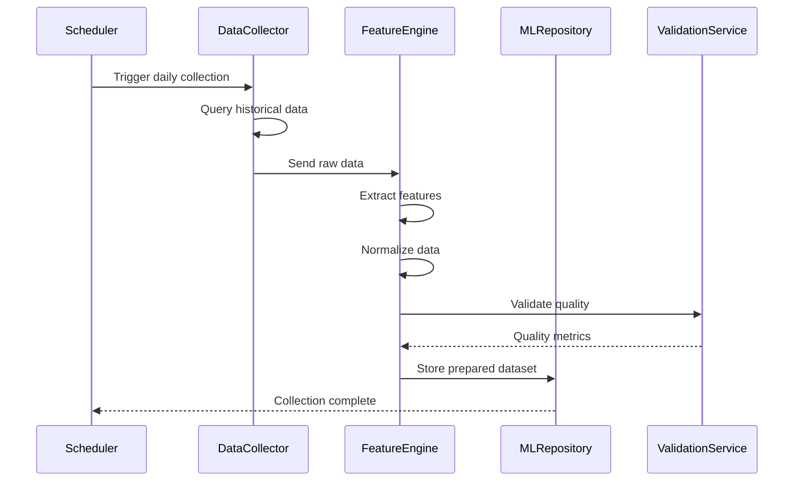
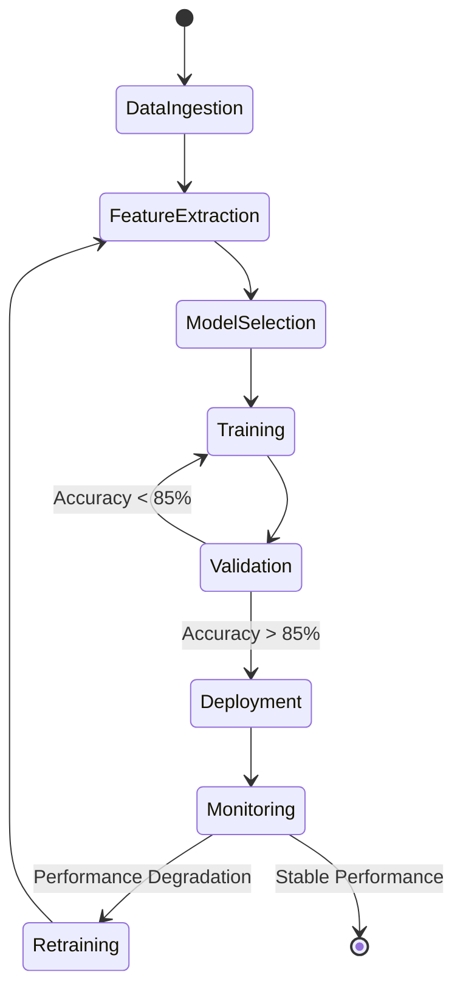
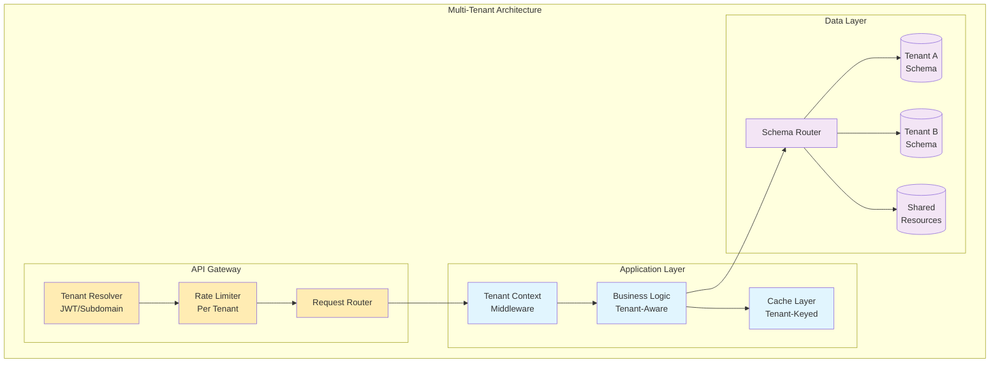
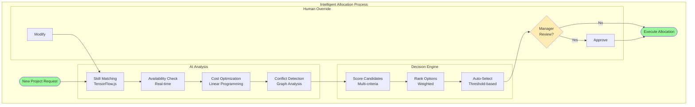
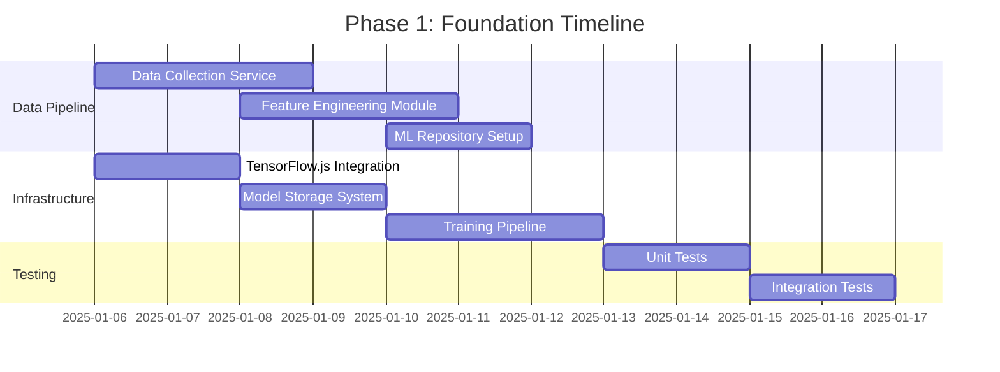
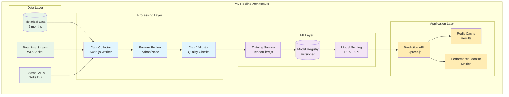
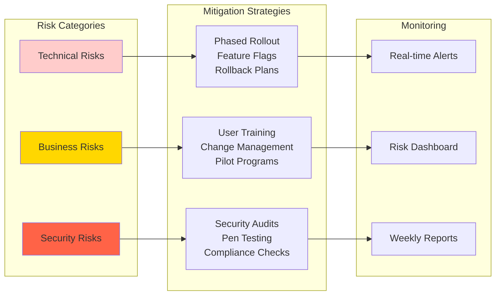
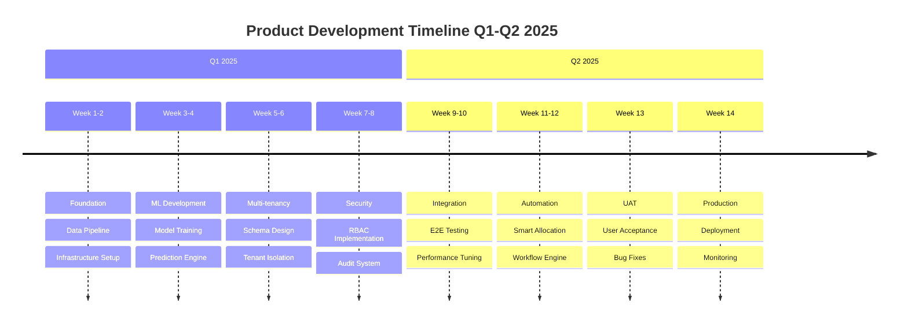

# 🎯 Product Development Roadmap 2025
## Employee Resource Management System - Next Generation

### 📊 Executive Summary
Based on the current system architecture analysis, we are transitioning from Phase 2 (Advanced Features) to Phase 3 (Intelligence Layer) with preparation for Phase 4 (Enterprise Features). This roadmap outlines the strategic approach to evolve our Employee Management System into an AI-powered, enterprise-ready resource optimization platform.

### 🏗️ Current System State
- **Completed**: Core CRUD operations, Resource allocation, Capacity planning, Skill matching
- **In Progress**: AI-powered forecasting, Real-time notifications
- **Tech Stack**: React/TypeScript (Frontend), Express.js/TypeScript (Backend), PostgreSQL (Database)
- **Test Coverage**: 99.94% Backend

---

## 📋 Epic 1: Machine Learning Pipeline Completion (Phase 3)
**Timeline**: Q1 2025 (4 weeks)
**Business Value**: Enable predictive resource optimization and intelligent decision-making

### Feature 1.1: ML Model Training Infrastructure

#### User Story 1.1.1: Data Collection Pipeline
**As a** System Administrator
**I want to** automatically collect and prepare historical data
**So that** ML models can be trained on quality datasets

```gherkin
Feature: Historical Data Collection
  Scenario: Automatic data collection for ML training
    Given the system has 6 months of historical allocation data
    When the ML pipeline initiates
    Then it should extract employee performance metrics
    And aggregate project completion rates
    And normalize skill utilization data
    And store prepared datasets in the ML repository
```



#### User Story 1.1.2: Model Training Pipeline
**As a** Data Scientist
**I want to** train and validate ML models
**So that** we can predict resource needs accurately

```gherkin
Feature: Model Training and Validation
  Scenario: Train resource prediction model
    Given prepared training datasets exist
    When a new training job is initiated
    Then the system should split data 80/20 for training/validation
    And train multiple model architectures in parallel
    And evaluate performance metrics
    And select the best performing model
    And deploy it to production
```

### Feature 1.2: Predictive Resource Optimization

#### User Story 1.2.1: Demand Forecasting
**As a** Resource Manager
**I want to** see predicted resource demands
**So that** I can proactively plan allocations



---

## 📋 Epic 2: Enterprise Features Foundation (Phase 4 Initiation)
**Timeline**: Q1-Q2 2025 (8 weeks)
**Business Value**: Enable multi-organization support and advanced security

### Feature 2.1: Multi-Tenant Architecture

#### User Story 2.1.1: Tenant Isolation
**As a** Enterprise Customer
**I want to** have complete data isolation
**So that** our data remains secure and separate

```gherkin
Feature: Multi-Tenant Data Isolation
  Scenario: Create isolated tenant environment
    Given I am a new enterprise customer
    When my organization is onboarded
    Then a dedicated schema should be created
    And all queries should be tenant-scoped
    And cross-tenant data access should be impossible
    And audit logs should track tenant context
```



### Feature 2.2: Advanced Security & Compliance

#### User Story 2.2.1: Role-Based Access Control (RBAC)
**As a** Security Administrator
**I want to** define granular permissions
**So that** users only access authorized resources

```gherkin
Feature: Granular RBAC Implementation
  Scenario: Configure role permissions
    Given I am a security administrator
    When I create a new role "Project Viewer"
    And assign permissions ["view_projects", "view_allocations"]
    And assign the role to user "john.doe@company.com"
    Then the user should only see project and allocation data
    And all write operations should be denied
    And access attempts should be logged
```

---

## 📋 Epic 3: Intelligent Automation Suite
**Timeline**: Q2 2025 (6 weeks)
**Business Value**: Reduce manual effort by 60% through intelligent automation

### Feature 3.1: Smart Allocation Engine



---

## 🚀 Implementation Phases

### Phase 1: Foundation (Weeks 1-2)
**Focus**: Infrastructure and Data Pipeline



### Phase 2: ML Implementation (Weeks 3-4)
**Focus**: Model Development and Training

#### Technical Architecture for ML Pipeline



### Phase 3: Enterprise Features (Weeks 5-8)
**Focus**: Multi-tenancy and Security

### Phase 4: Integration & Testing (Weeks 9-10)
**Focus**: End-to-end testing and performance optimization

---

## 📊 Success Metrics

### Technical KPIs
- **ML Model Accuracy**: >85% prediction accuracy
- **API Response Time**: <200ms p95
- **System Uptime**: 99.9% availability
- **Test Coverage**: Maintain >95% coverage

### Business KPIs
- **Resource Utilization**: Increase by 25%
- **Allocation Time**: Reduce by 60%
- **Cost Savings**: 20% reduction in over-allocation
- **User Satisfaction**: NPS >40

---

## 🔒 Risk Mitigation Strategy



---

## 🛠️ Technical Implementation Details

### Database Schema Evolution

```sql
-- Multi-tenant schema additions
CREATE SCHEMA IF NOT EXISTS tenant_template;

-- ML Pipeline tables
CREATE TABLE ml_training_jobs (
    id UUID PRIMARY KEY DEFAULT gen_random_uuid(),
    model_type VARCHAR(50) NOT NULL,
    training_status VARCHAR(20) NOT NULL,
    accuracy_score DECIMAL(5,4),
    training_data JSONB,
    created_at TIMESTAMP DEFAULT CURRENT_TIMESTAMP,
    completed_at TIMESTAMP
);

CREATE TABLE ml_predictions (
    id UUID PRIMARY KEY DEFAULT gen_random_uuid(),
    model_id UUID REFERENCES ml_models(id),
    prediction_type VARCHAR(50),
    input_data JSONB,
    prediction_result JSONB,
    confidence_score DECIMAL(5,4),
    created_at TIMESTAMP DEFAULT CURRENT_TIMESTAMP
);

-- Tenant management
CREATE TABLE tenants (
    id UUID PRIMARY KEY DEFAULT gen_random_uuid(),
    name VARCHAR(255) NOT NULL,
    schema_name VARCHAR(63) UNIQUE NOT NULL,
    settings JSONB DEFAULT '{}',
    created_at TIMESTAMP DEFAULT CURRENT_TIMESTAMP,
    is_active BOOLEAN DEFAULT true
);
```

### API Endpoints Structure

```typescript
// ML Pipeline Endpoints
POST   /api/v2/ml/training/jobs          // Initiate training
GET    /api/v2/ml/training/jobs/:id      // Get training status
POST   /api/v2/ml/predictions            // Get predictions
GET    /api/v2/ml/models                 // List available models
PUT    /api/v2/ml/models/:id/deploy      // Deploy model

// Multi-tenant Endpoints
POST   /api/v2/tenants                   // Create tenant
GET    /api/v2/tenants/:id               // Get tenant info
PUT    /api/v2/tenants/:id/settings      // Update settings
DELETE /api/v2/tenants/:id               // Deactivate tenant

// Enterprise Features
POST   /api/v2/rbac/roles                // Create role
PUT    /api/v2/rbac/roles/:id/permissions // Update permissions
POST   /api/v2/audit/query                // Query audit logs
GET    /api/v2/compliance/report          // Generate compliance report
```

---

## 📅 Delivery Timeline



---

## 👥 Team Allocation

### Development Teams
- **ML Team** (2 engineers): ML pipeline, model development
- **Platform Team** (3 engineers): Multi-tenancy, infrastructure
- **Security Team** (1 engineer): RBAC, compliance
- **QA Team** (2 engineers): Testing, automation
- **DevOps** (1 engineer): CI/CD, deployment

### Stakeholders
- **Product Owner**: Overall vision and priorities
- **Technical Architect**: System design and integration
- **Project Manager**: Timeline and resource management
- **Security Officer**: Compliance and security review

---

## ✅ Definition of Done

### Code Quality
- [ ] Code review completed by 2+ developers
- [ ] Unit test coverage >90%
- [ ] Integration tests passing
- [ ] No critical security vulnerabilities
- [ ] Performance benchmarks met

### Documentation
- [ ] API documentation updated
- [ ] Architecture diagrams current
- [ ] User guides written
- [ ] Deployment procedures documented

### Deployment
- [ ] Deployed to staging environment
- [ ] E2E tests passing in staging
- [ ] Performance testing completed
- [ ] Security scan passed
- [ ] Rollback plan tested

---

## 🎯 Next Actions

1. **Immediate (Week 1)**
   - Set up ML development environment
   - Create database migration scripts
   - Initialize feature branches
   - Schedule team kick-off meeting

2. **Short-term (Weeks 2-4)**
   - Implement data collection pipeline
   - Develop first ML model prototype
   - Design multi-tenant architecture
   - Create security framework

3. **Mid-term (Weeks 5-8)**
   - Complete ML pipeline
   - Implement tenant isolation
   - Deploy RBAC system
   - Conduct security audit

---

**Document Version**: 1.0
**Created**: January 2025
**Last Updated**: January 2025
**Status**: APPROVED FOR IMPLEMENTATION
**Next Review**: End of Q1 2025