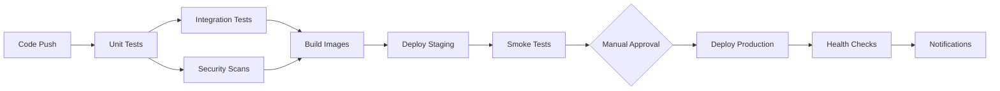

# CI/CD Pipeline Documentation

## Overview
The Employee Management System uses GitHub Actions for continuous integration and deployment. This document covers the complete pipeline architecture, workflows, and best practices.

## Pipeline Architecture

### Workflow Trigger Matrix
| Event | Branch | Environment | Action |
|-------|---------|-------------|--------|
| Push | `main` | Production | Build → Test → Deploy |
| Push | `develop` | Staging | Build → Test → Deploy |
| Pull Request | `main` | Test | Build → Test Only |
| Release | Any | Production | Build → Test → Deploy |
| Schedule | `main` | Security | Security Scans |

### Pipeline Stages



## Main CI/CD Workflow

### File: `.github/workflows/ci-cd.yml`

#### Test Job
```yaml
test:
  runs-on: ubuntu-latest
  strategy:
    matrix:
      node-version: [18.x, 20.x]
```

**Features:**
- Matrix testing across Node.js versions
- Parallel frontend/backend testing
- Code coverage reporting
- Codecov integration
- Lint and type checking

#### Integration Tests
```yaml
integration-tests:
  needs: test
  runs-on: ubuntu-latest
```

**Features:**
- Docker Compose test environment
- End-to-end testing with Cypress
- Database integration testing
- API contract testing
- Test result artifacts

#### Security Scanning
```yaml
security-scan:
  needs: test
  runs-on: ubuntu-latest
```

**Features:**
- Trivy container scanning
- Snyk dependency scanning
- SARIF format results
- GitHub Security tab integration
- High severity threshold

#### Build and Push
```yaml
build-and-push:
  needs: [test, integration-tests, security-scan]
  if: github.event_name != 'pull_request'
```

**Features:**
- Multi-platform builds (amd64, arm64)
- Docker BuildKit optimization
- GitHub Container Registry
- Image caching
- Semantic versioning

#### Deployment Jobs
```yaml
deploy-staging:
  if: github.ref == 'refs/heads/develop'
  environment: staging

deploy-production:
  if: github.event_name == 'release'
  environment: production
```

**Features:**
- Environment protection rules
- SSH-based deployment
- Health check validation
- Slack notifications
- Rollback on failure

## Security Scanning Workflow

### File: `.github/workflows/security-scan.yml`

#### Scheduled Security Scans
```yaml
on:
  schedule:
    - cron: '0 2 * * *'  # Daily at 2 AM
```

#### Scan Types

1. **Dependency Vulnerability Scan**
   - npm audit (both frontend/backend)
   - Snyk comprehensive scanning
   - All projects analysis
   - License compliance checking

2. **Container Security Scan**
   - Trivy vulnerability scanner
   - Multi-dockerfile scanning
   - SARIF format output
   - Critical/high severity focus

3. **Static Code Analysis**
   - GitHub CodeQL analysis
   - JavaScript/TypeScript scanning
   - Security vulnerability detection
   - Code quality metrics

4. **Secret Detection**
   - GitLeaks secret scanning
   - Credential pattern matching
   - Historical commit scanning
   - Prevention of secret commits

5. **License Compliance**
   - License-checker analysis
   - Production dependency scanning
   - Compliance reporting
   - Legal risk assessment

## Environment Configuration

### GitHub Secrets
Required secrets for pipeline operation:

#### Database & Security
```bash
DB_PASSWORD=secure_database_password
JWT_SECRET=secure_jwt_signing_key
```

#### External Services
```bash
SNYK_TOKEN=snyk_api_token
CODECOV_TOKEN=codecov_api_token
SLACK_WEBHOOK=slack_webhook_url
```

#### Deployment Credentials
```bash
STAGING_HOST=staging.example.com
STAGING_USER=deploy_user
STAGING_SSH_KEY=staging_private_key
PRODUCTION_HOST=production.example.com
PRODUCTION_USER=deploy_user
PRODUCTION_SSH_KEY=production_private_key
```

### Environment Protection Rules

#### Staging Environment
- **Auto-deploy**: On push to `develop`
- **Reviewers**: Optional
- **Wait timer**: None
- **Deployment branches**: `develop` only

#### Production Environment
- **Auto-deploy**: On release creation
- **Reviewers**: Required (minimum 1)
- **Wait timer**: None
- **Deployment branches**: `main` only

## Deployment Process

### Staging Deployment
1. **Trigger**: Push to `develop` branch
2. **Process**:
   - SSH to staging server
   - Pull latest code
   - Stop current services
   - Pull/build new images
   - Start updated services
   - Run smoke tests
3. **Validation**: Health endpoint checks
4. **Notification**: Slack notification

### Production Deployment
1. **Trigger**: GitHub release creation
2. **Process**:
   - SSH to production server
   - Create database backup
   - Pull latest code with version tag
   - Run deployment script
   - Zero-downtime rolling update
   - Database migrations
   - Health validation
3. **Rollback**: Automatic on failure
4. **Notification**: Slack notification

## Pipeline Optimizations

### Build Optimization
1. **Docker Layer Caching**: GitHub Actions cache
2. **Dependency Caching**: npm cache between builds
3. **Parallel Jobs**: Matrix and parallel execution
4. **Early Termination**: Fail fast on critical issues

### Security Integration
1. **SARIF Integration**: Security findings in GitHub
2. **Pull Request Checks**: Security status required
3. **Scheduled Scans**: Daily vulnerability assessment
4. **Compliance Reporting**: License and security reports

### Performance Monitoring
1. **Build Time Tracking**: Job duration monitoring
2. **Test Performance**: Execution time analysis
3. **Deploy Time**: Deployment duration tracking
4. **Success Rates**: Pipeline reliability metrics

## Monitoring and Alerts

### Pipeline Monitoring
- **GitHub Actions insights**: Built-in monitoring
- **Slack notifications**: Success/failure alerts
- **Email alerts**: Critical failure notifications
- **Metrics collection**: Custom pipeline metrics

### Alert Conditions
- Build failures on main/develop
- Security scan failures
- Deployment failures
- Long-running jobs (>30 minutes)
- Repeated failures (3+ consecutive)

## Best Practices

### Workflow Design
1. **Fail Fast**: Run quick tests first
2. **Parallel Execution**: Maximize concurrency
3. **Conditional Logic**: Skip unnecessary steps
4. **Resource Management**: Optimize runner usage
5. **Error Handling**: Proper cleanup on failure

### Security Practices
1. **Secret Management**: GitHub Secrets only
2. **Minimal Permissions**: Least privilege access
3. **Audit Trails**: Full deployment logging
4. **Vulnerability Response**: Immediate fixes
5. **Compliance Checking**: Regular assessments

### Deployment Practices
1. **Blue/Green Deployments**: Zero-downtime updates
2. **Health Checks**: Service validation
3. **Rollback Strategy**: Automatic failure recovery
4. **Database Migrations**: Backward compatible
5. **Monitoring Integration**: Post-deploy validation

## Troubleshooting Guide

### Common Issues

#### Build Failures
```bash
# Check workflow logs
gh run view [run_id]

# Re-run failed jobs
gh run rerun [run_id]

# Debug with SSH
# Add to workflow step:
- name: Setup tmate session
  uses: mxschmitt/action-tmate@v3
```

#### Test Failures
```bash
# Local test reproduction
npm test
cd backend && npm test

# Docker test environment
docker-compose -f docker-compose.test.yml up --build
```

#### Deployment Failures
```bash
# Check deployment logs
ssh deploy@server 'journalctl -u docker'

# Manual deployment
ssh deploy@server
cd /opt/employee-management
./deployment/scripts/deploy-production.sh
```

#### Security Scan Failures
```bash
# Local security scanning
npm audit
npm audit fix

# Snyk CLI scanning
npx snyk test
npx snyk monitor
```

### Performance Issues

#### Slow Builds
1. **Review dependencies**: Remove unused packages
2. **Optimize Dockerfile**: Better layer caching
3. **Parallel jobs**: Increase concurrency
4. **Cache optimization**: Improve cache hit rates

#### Failed Deployments
1. **Check logs**: Application and system logs
2. **Verify resources**: Server capacity and availability
3. **Database issues**: Connection and migration problems
4. **Network problems**: Connectivity and DNS issues

## Maintenance

### Regular Tasks
1. **Update base images**: Monthly security updates
2. **Review dependencies**: Weekly vulnerability checks
3. **Performance analysis**: Monthly pipeline optimization
4. **Cost optimization**: Quarterly resource review

### Automation Improvements
1. **Enhanced testing**: Additional test coverage
2. **Better monitoring**: More comprehensive metrics
3. **Security hardening**: Additional security checks
4. **Performance tuning**: Continuous optimization

## Support and Contact

### Team Responsibilities
- **DevOps Team**: Pipeline maintenance and optimization
- **Security Team**: Security scanning and compliance
- **Development Team**: Test writing and maintenance
- **Platform Team**: Infrastructure and deployment

### Emergency Contacts
- **Pipeline Issues**: devops@company.com
- **Security Alerts**: security@company.com
- **Production Issues**: on-call@company.com

## References
- [GitHub Actions Documentation](https://docs.github.com/en/actions)
- [Docker Best Practices](https://docs.docker.com/develop/dev-best-practices/)
- [Security Scanning Guide](https://docs.github.com/en/code-security)
- [Deployment Strategies](https://martinfowler.com/bliki/BlueGreenDeployment.html)